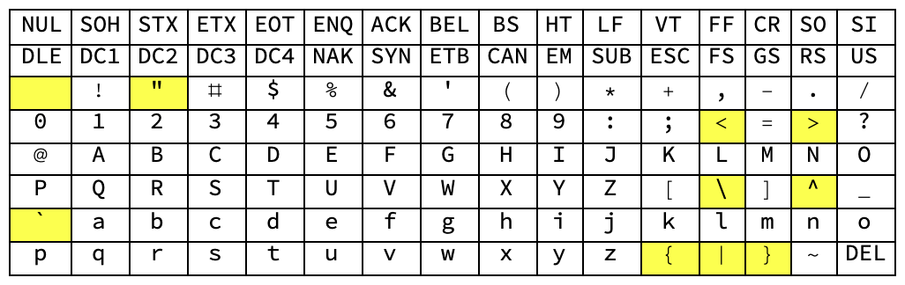
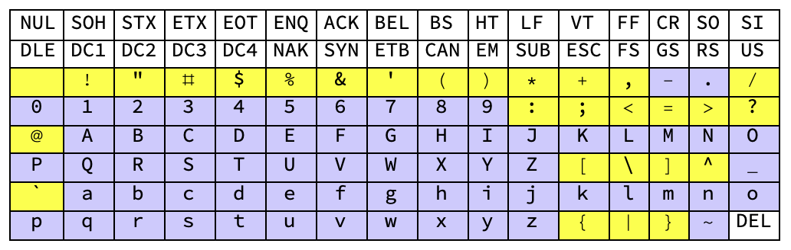
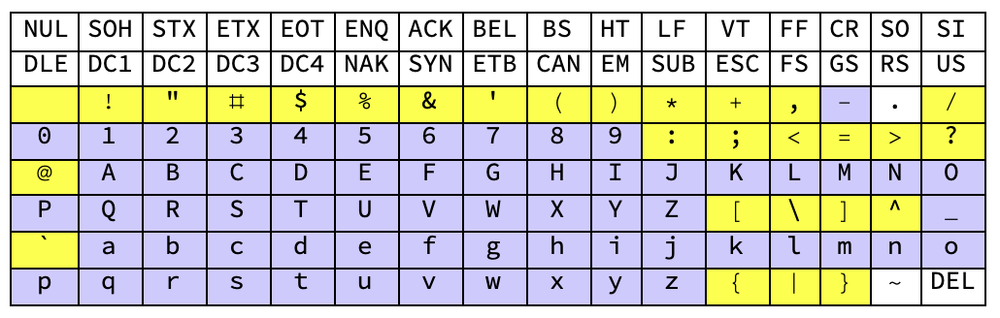
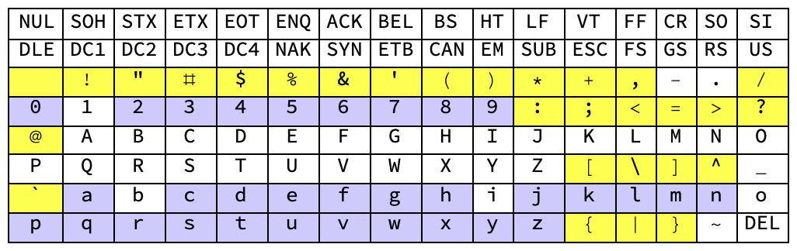

# Encoding Binary Compatibly with URI Reserved Characters
## BCR-0003

**© 2020 Blockchain Commons**

Author: Wolf McNally<br/>
Date: April 23, 2020

---

### Introduction

The goal of this paper is to identify a method for encoding arbitrary binary blobs to text that is also suitable for embedding within a well-formed URI string.

### URI Reserved and Unreserved Characters

[RFC3986] defines a subset of printable ASCII as "reserved characters" whose purpose is to "provide a set of delimiting characters that are distinguishable from other data within a URI." Characters in the reserved set are protected from normalization and are therefore safe to be used by scheme-specific and producer-specific algorithms for delimiting data subcomponents within a URI:

```
:/?#[]@!$&'()*+,;=
```

In addition, the "%" character is use to introduce escape sequences allowing other characters to be encoded. This produces the URI reserved subset:


[RFC3986] also defines another subset of printable ASCII as "unreserved characters" that are allowed in a URI but do not have a reserved purpose:

```
ALPHA DIGIT -._~
```


The remaining printable ASCII codepoints are neither "reserved" nor "unreserved" by [RFC3986] and the implication is that these codepoints should be avoided in URIs because they are often used in operating system commands and scripts.

```
SP "<>\^`{|}
```



The union of all the reserved or to-be-avoided codepoints with the unreserved codepoints shows that every printable codepoint in the ASCII space is disposed.



### Base64 Characters

[RFC4648] defines the Base64 encoding standard. The character set of Base64 collides with the URI reserved character set in three places:

```
+/=
```


To allow binary data to be efficiently encoded in URIs, [RFC4648] also defines the Base64URL variant, which moves the "+" codepoint to "-", moves the "/" codepoint to "_", and drops the use of padding with "=". This removes all the collisions with the URI reserved subset.



### Hexadecimal

Encoding binary payloads in hexadecimal is compatible with URIs, but only results in 50% efficiency as opposed to Base64URL, which achieves 75%, as described in [BinaryToText].


### Base58

[Base58] is similar to Base64 but has been modified to avoid both non-alphanumeric characters and letters which might look ambiguous when printed. Base58 achieves 73% efficiency.

Base58Check is a Base58 encoding format that unambiguously encodes the type of data in the first few characters and includes an error detection code in the last few characters. Base58Check also includes a leading metadata byte that is 0 for Bitcoin addresses.
 


### Bech32

The [Bech32] encoding standard encodes its payload using 32 alphanumeric characters omitting:

```
1bio
```



[Bech32] also defines "1" as the separator between the human-readable part (HRP) and the payload.


So far, all of the characters that Bech32 use come from the "unreserved" subset of URI characters. Unfortunately, [Bech32] defines the HRP as consisting of 1-83 characters in the ASCII range 33-126, which heavily collides with the URI reserved subset.


### QR Code Alphanumeric Encoding

The QR Code Alphanumeric Encoding Mode listed at [QRCodeAlphaNum] defines 45 codepoints that if used exclusively result in a lower-density QR code. Unfortunately these codepoints collide significantly with the URI reserved subset.


### Conclusions

Base64URL, Base58, Base58Check, and Hexadecimal are the only binary to text encoding methods reviewed here that do not conflict with the URI reserved subset.

We reject Hexadecimal due to its low efficiency.

We reject Base58 and Base58Check due to their lack of widespread adoption. In addition, Base58Check's addition of its own metadata byte may conflict with type information in the enclosing URI.

We reject Bech32 due to its HRP conflicting with the URI reserved subset, and it's relatively low efficiency.

We reject QR Code alphanumeric encoding due to its incompatibility with the URI reserved subset.

It is therefore recommended that any URI scheme definition that requires the encoding of arbitrary binary data choose to encode it exclusively in Base64URL format.

If the payload must include data in other formats, it should be enclosed in a structured binary format such as [CBOR] and then subsequently encoded in Base64URL. Specifying this format is beyond the scope of this paper.

If error detection or correction is desired, it should be included as part of the Base64URL encoded packet. Defining the format for this error detection is beyond the scope of this paper.

### References

* [RFC3986] [Uniform Resource Identifier (URI): Generic Syntax](https://tools.ietf.org/html/rfc3986)
* [RFC4648] [The Base16, Base32, and Base64 Data Encodings](https://tools.ietf.org/html/rfc4648)
* [CBOR] [Concise Binary Object Representation (CBOR)](https://tools.ietf.org/html/rfc7049)
* [Bech32] [BIP-173: Base32 address format for native v0-16 witness outputs](https://github.com/bitcoin/bips/blob/master/bip-0173.mediawiki)
* [QRCodeAlphaNum] [Table of Alphanumeric Values](https://www.thonky.com/qr-code-tutorial/alphanumeric-table)
* [BinaryToText] [Binary-to-text Encoding](https://en.wikipedia.org/wiki/Binary-to-text_encoding)
* [Base58] [Base58](https://en.wikipedia.org/wiki/Base58)