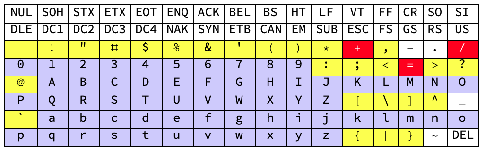
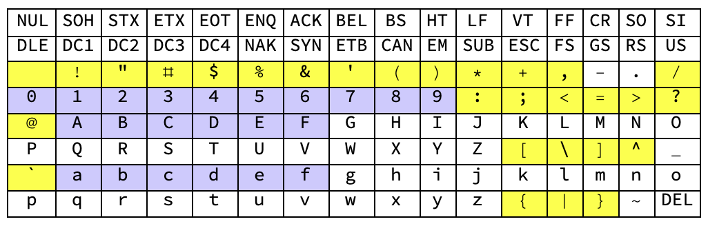
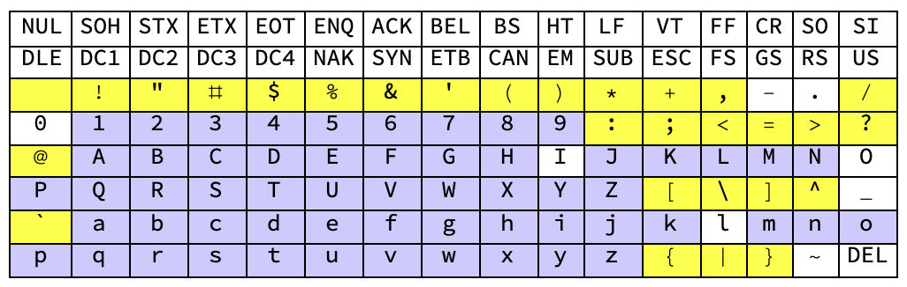
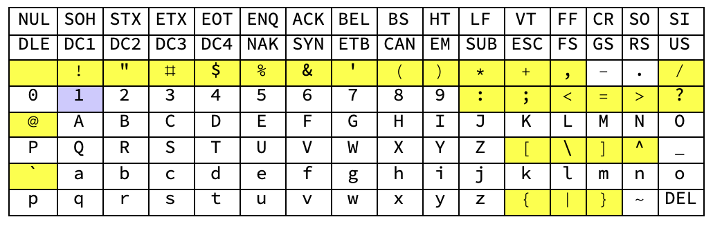
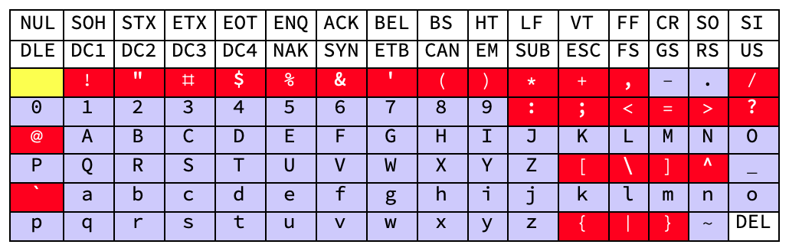
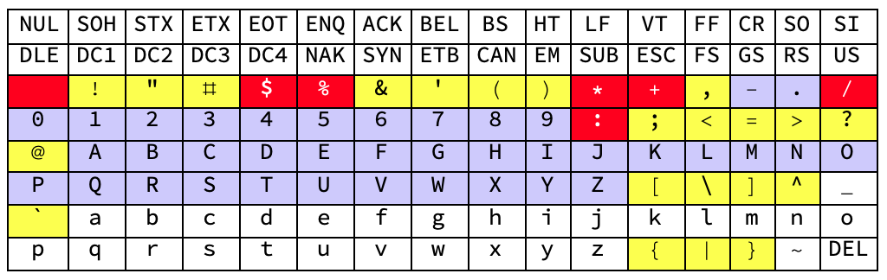

# Encoding Binary Compatibly with URI Reserved Characters
## BCR-2020-003

**© 2020 Blockchain Commons**

Author: Wolf McNally<br/>
Date: April 23, 2020<br/>
Revised: June 25, 2020

---

### Introduction

The goal of this paper is to identify a method for encoding arbitrary binary blobs to text that is also suitable for embedding within a well-formed URI string.

### URI Reserved and Unreserved Characters

[RFC3986] defines a subset of printable ASCII as "reserved characters" whose purpose is to "provide a set of delimiting characters that are distinguishable from other data within a URI." Characters in the reserved set are protected from normalization and are therefore safe to be used by scheme-specific and producer-specific algorithms for delimiting data sub-components within a URI:

```
:/?#[]@!$&'()*+,;=
```

In addition, the "%" character is use to introduce escape sequences allowing other characters to be encoded. This produces the URI reserved subset:


[RFC3986] also defines another subset of printable ASCII as "unreserved characters" that are allowed in a URI but do not have a reserved purpose:

```
ALPHA DIGIT -._~
```


The remaining printable ASCII codepoints are neither "reserved" nor "unreserved" by [RFC3986] and the implication is that these codepoints should be avoided in URIs because they are often used in operating system commands and scripts.

```
SP "<>\^`{|}
```


The union of all the reserved or to-be-avoided codepoints with the unreserved codepoints shows that every printable codepoint in the ASCII space is disposed.


### Base64 Characters

[RFC4648] defines the Base64 encoding standard. The character set of Base64 collides with the URI reserved character set in three places:

```
+/=
```



To allow binary data to be efficiently encoded in URIs, [RFC4648] also defines the Base64URL variant, which moves the "+" codepoint to "-", moves the "/" codepoint to "_", and drops the use of padding with "=". This removes all the collisions with the URI reserved subset.


### Hexadecimal

Encoding binary payloads in hexadecimal is compatible with URIs, but only results in 50% efficiency as opposed to Base64URL, which achieves 75%, as described in [BinaryToText].



### Base58

[Base58] is similar to Base64 but has been modified to avoid both non-alphanumeric characters and letters which might look ambiguous when printed. Base58 achieves 73% efficiency.

Base58Check is a Base58 encoding format that unambiguously encodes the type of data in the first few characters and includes an error detection code in the last few characters. Base58Check also includes a leading metadata byte that is 0 for Bitcoin addresses.



### Bech32

The [Bech32] encoding standard encodes its payload using 32 alphanumeric characters omitting:

```
1bio
```


[Bech32] also defines "1" as the separator between the human-readable part (HRP) and the payload.



So far, all of the characters that Bech32 use come from the "unreserved" subset of URI characters. Unfortunately, [Bech32] defines the HRP as consisting of 1-83 characters in the ASCII range 33-126, which heavily collides with the URI reserved subset.



### QR Code Alphanumeric Encoding

The QR Code Alphanumeric Encoding Mode listed at [QRCodeAlphaNum] defines 45 codepoints that if used exclusively result in a lower-density QR code. Unfortunately these codepoints collide significantly with the URI reserved subset.



### BC32

The [BC32] encoding method uses the same character set as Bech32 and uses the same checksum, but drops the human readable part. This makes the BC32 encoding method compatible with both QR code alphanumeric encoding (when translated to upper case letters) and the URI non-reserved character set.

### Bytewords

The Bytewords [BYTEWORDS] encoding method uses only ASCII letters, is not case sensitive, and encodes each byte as either a four-letter English word, or minimally as the first and last letters of that word. It also appends a 32-bit (4 byte, 4 word) CRC32 checksum. Setting aside the checksum, from an efficiency perspective this it is the same as hexadecimal, using two ASCII characters to encode each byte. Unlike hexadecimal, where any pair of hexadecimal digits represents a valid byte, only 256 specific pairings of English letters represent valid bytes, making catching transcription errors more likely. Bytewords also specifies two encoding modes: "normal" and "brutal." In normal mode the encoded data must be a self-describing CBOR structure and in brutal mode it can be any string of bytes. Both modes include the four-word checksum at the end.

### Comparison

| Method | Bits/char | URI-Friendly | QR-Friendly | Human-Friendly | Self-Describing | Checksum (bits) | Multi-Part |
|-|-|-|-|-|-|--|--|
| Base64 | 6
| Base64URL | 6 |🟢
| Base58 | 5.86 |🟢|🟢||🟢
| Base58Check | 5.86 |🟢|🟢||🟢| 32
| Bech32 | 5 ||||🟢| 30
| BC32 | 5 |🟢|🟢||| 30
| UR-BC32 | 5 |🟢|🟢||🟢| 30 |🟢
| Hexadecimal | 4 |🟢|🟢
| Bytewords | 4 |🟢|🟢|🟢|🟢| 32
| Bytewords-brutal | 4 |🟢|🟢|🟢|| 32
| UR-Bytewords | 4 |🟢|🟢|🟢|🟢| 32 |🟢 + Fountain Codes

* **Method**: The name of the encoding method.
* **Bits/char**: The number of bits encoded per encoding output character, without considering other structural elements.
* **URI-Friendly**: Does this method output characters only in the URI unreserved character set?
* **QR-Friendly**: Does this method output characters only in the QR Code alphanumeric encoding character set or translatable to that set via capitalization?
* **Human-Friendly**: Does this method output English words or mnemonics that can be easily remembered or transcribed onto permanent media such as metal tags?
* **Self-Describing**: Does this method include structural elements to allow a decoder to determine type or other structural aspects of the encoded data?
* **Checksum**: How many bits of checksum are included in the encoded output?
* **Multi-Part**: Does this method provide for the breaking of large amounts of data (too much to fit into a single QR code) into smaller parts?

### References

* [RFC3986] [Uniform Resource Identifier (URI): Generic Syntax](https://tools.ietf.org/html/rfc3986)
* [RFC4648] [The Base16, Base32, and Base64 Data Encodings](https://tools.ietf.org/html/rfc4648)
* [CBOR] [Concise Binary Object Representation (CBOR)](https://tools.ietf.org/html/rfc7049)
* [Bech32] [BIP-173: Base32 address format for native v0-16 witness outputs](https://github.com/bitcoin/bips/blob/master/bip-0173.mediawiki)
* [QRCodeAlphaNum] [Table of Alphanumeric Values](https://www.thonky.com/qr-code-tutorial/alphanumeric-table)
* [BinaryToText] [Binary-to-text Encoding](https://en.wikipedia.org/wiki/Binary-to-text_encoding)
* [Base58] [Base58](https://en.wikipedia.org/wiki/Base58)
* [BC32] [BCR-2020-004: The BC32 Data Encoding Format](bcr-2020-004-bc32.md)
* [UR] [BCR-2020-005: Uniform Resources (UR)](bcr-2020-005-ur.md)
* [BYTEWORDS] [BCR-2020-012: Bytewords: Encoding binary data as English words](bcr-2020-012-bytewords.md)
