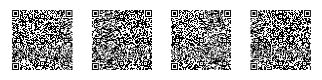

# Uniform Resources (UR)

Encoding Structured Binary Data for Transport in URIs and QR Codes

## BCR-2020-005

**© 2020 Blockchain Commons**

Authors: Wolf McNally, Christopher Allen<br/>
Date: May 5, 2020<br/>
Revised: July 1, 2020

---

### Introduction

In order to increase security, developers of hardware cryptocurrency wallets deliberately elide wireless networking capability from their devices. Nonetheless, such devices must send and receive data through some channel to function, and the quantity of data can easily exceed human patience for manual transcription. Many device makers have settled on QR codes [QRCode] as a way of optically sending data from their device displays to network-connected devices. Unconnected devices that include a camera can also read QR codes. Exclusively using QR codes for the transmission of data has the advantages of transparency and the reduction of the attack surface.

While QR codes have built-in error correction and several different encoding modes optimized for different forms of data, they do not impose an internal structure on the data they convey. They do however limit the maximum amount of data that can be conveyed in a single QR code. Ultimately this limitation is due to the inherent limitations of optical readers to resolve a captured image. The largest QR code ("version 40") consists of 177x177 "modules" (pixels). Version 40 QR codes, using the binary encoding mode and the lowest level of error correction have a capacity of 2,953 bytes [QRCodeCapacity]. This maximum capacity on QR codes becomes an issue when one wishes to convey data payloads longer than the maximum supported by the standard. In addition, since the assumed use case of QR codes is usually to convey human-readable text (the canonical example being a URL) the native binary encoding mode of QR codes is not consistently supported by readers [QRBinaryProblems].

QR Codes support an "alphanumeric" mode optimized for efficiently conveying a subset of ASCII consisting of 45 characters:

```
0123456789ABCDEFGHIJKLMNOPQRSTUVWXYZ $%*+-./:
```

This character set is optimized for industrial applications, not general text (e.g., lower case letters are not included) or even URL encoding (symbols used in URIs such as `?`, `=`, and `#` are not included). It is also impossible to convey binary data encoded as Base64 or Base64URL [RFC4648] using this character set as these formats require the use of both upper case and lower case letters [URIBinary].

Developers of cryptocurrency wallets currently all have their own bespoke ways of breaking a binary message into several parts suitable for display as a series of QR codes, and reassembling them on the destination device. This lack of standardization is one of several problems hampering interoperability between such devices.

### The Uniform Resource (UR) Encoding

This document proposes a method of encoding binary data of arbitrary content and length so that it is suitable for transport in either URIs *or* QR codes with little or no reformatting necessary.

The name of the URI scheme for this encoding is "UR" and is intended to be analogous to existing names such as "URL" ("Uniform Resource Locator"), "URI" ("Uniform Resource Identifier") and URN ("Uniform Resource Name"). As this encoding method is intended for self-contained resources themselves, we have chosen "UR" ("Uniform Resource").

This proposed method has the following goals:

* Transport binary data of arbitrary content and length using a sequence of one or more URIs or QR codes.
* Remain agnostic about whether QR codes are displayed together or time-sequenced (animated).
* Avoid the use of QR code binary mode to support transparency and wide compatibility with QR code reader libraries.
* Use the alphanumeric QR code mode for efficiency.
* Be case agnostic, allowing use of all upper case letters (for QR code transport) or all lower case letters (canonical for display and URIs.)
* Include sequencing information so the receiver can be certain of arrival and order of all parts.
* Include a CRC32 checksum of the entire message in each part to tie them together and ensure the transmitted message has been reconstructed.
* Each single part should also be a valid URI and not require escaping (e.g. percent-encoding) of any of its characters.
* Combining a set of parts, which are separate URIs themselves, should involve simple textual manipulation, mostly concatenation, and should again result in a well-formed URI.
* Support the addition of structure in the binary data. Initially specify how binary data representing undifferentiated byte strings should be encoded.

### Requirements

The key words "MUST", "MUST NOT", "REQUIRED", "SHALL", "SHALL NOT", "SHOULD", "SHOULD NOT", "RECOMMENDED", "MAY", and "OPTIONAL" in this document are to be interpreted as described in [RFC2119].

### Terminology

fragment
: Refers to the subsequence of Bytewords-encoded characters contained in each part

part
: Refers to a well-formed URI as specified herein

payload
: The original binary sequence to be encoded and recovered through decoding.

### Bytewords

The method of encoding binary data as printable characters specified in this proposal is [BYTEWORDS].

#### Bytewords Example

* The following CBOR structure (in CBOR diagnostic notation):

```
"Hello, world"
```

* Encoded as binary using [CBOR-PLAYGROUND]:

```
6C                          # text(12)
   48656C6C6F2C20776F726C64 # "Hello, world"
```

* As a hex string:

```
6c48656c6c6f2c20776f726c64
```

In Bytewords minimal encoding is:

```
jzfdihjzjzjldwcxktjljpjziekbsageam
==========================--------
payload                   checksum

```

### CBOR

At the binary level, the goal of adding structure is accomplished by standardizing on the Concise Binary Object Representation [CBOR]. All payloads encoded according to this specification MUST be well-formed CBOR.

By specifying a standard for binary structure, users of this format can begin to standardize structures that go beyond undifferentiated byte strings. CBOR has many desirable traits, including being self-describing, fast to encode and decode, and having minimal implementation complexity. Encoding binary strings as CBOR according to this specification adds a single byte of overhead for payloads of 23 or fewer bytes, two bytes for payloads up to 255 bytes, and three bytes for payloads up to 65535 bytes, and lays the groundwork for encoding more complex structures in the future.

This specification does not require that a complete CBOR codec be used by implementors. It only specifies that a minimal canonical representation for encoding byte strings be used:

* If the encoded byte string has 23 or fewer bytes, it is preceded by the single byte (`0x40` + length).
* If the encoded byte string has 24..255 bytes, it is preceded by (`0x58`, length) where *length* is the length of the following byte string.
* If the encoded byte string has 256..65535 bytes, it is preceded by (`0x59`, h, l) where *h*, *l* is the big-endian two byte length of the following byte string.
* If the encoded byte string has 65536..2^32-1 bytes, it is preceded by (`0x60`, b1, b2, b3, b4) where *b(n)* is the big-endian four byte length of the following byte string.

Writers of this format MUST use the shortest encoding given the length of the payload. CBOR also supports an 8-byte length encoding for payloads longer than 2^32-1 bytes, and also encoding of "indefinite length" byte strings, but implementors of this specification MAY refuse to decode them. Implementors of this specification MAY also reject any other CBOR constructs.

**✳️ Note:** *The accompanying Wolfram Language (Mathematica) notebook includes a reference implementation of the minimal canonical codec for CBOR under this specification. It is not a complete CBOR implementation; only what is necessary to support this specification.*

#### CBOR Examples

A 16-byte cryptographic seed:

```
c3fb80bf2c80732f369225e20f7c7aed
```

The seed encoded as CBOR. It includes a one-byte header, 0x50, which is 0x40 + the length of 0x10 (16).

```
50c3fb80bf2c80732f369225e20f7c7aed
--================================
header
  payload
```

A 32-byte cryptographic seed:

```
3ab1b5980595a6e13112c5739283ff5286379e0beac4f3427352a254c40a39ff
```

The seed encoded as CBOR. It includes a two-byte header, (0x58, 0x20), which is 0x58 to identify a single-byte length, and 0x20, which is the length of the string (32).

```
58203ab1b5980595a6e13112c5739283ff5286379e0beac4f3427352a254c40a39ff
----================================================================
header
    payload
```

### Types

Each UR encoded object includes a `type` component as the first path component after the `UR` scheme. Types MUST consist only of characters from the English letters (ignoring case), Arabic numerals, and the hyphen `-`.

The only type this document specifies is `bytes` which represents an undifferentiated string of bytes of any length. It is intended that future specifications will register and document other types that will specify other forms of structured content intended to address various problem domains.

If the CBOR structure in the UR is tagged, its registered tag MUST match the UR type.

### Procedure for UR encoding

Given `payload` is an array of bytes.

#### 1. Encode payload as CBOR

```
cborPayload = CBOREncodeBytes[payload];
```

#### 2. Encode the CBOR-encoded payload as Bytewords

```
bytewordsPayload = BytewordsEncode[cborPayload];
```

#### 3. Compute the CRC32 checksum of the CBOR-encoded payload

This is the same checksum algorithm used for Bytewords.

```
checksum = CRC32Checksum[cborPayload];
```

#### 4. Encode the checksum as Bytewords

This is a Bytewords "brutal" encoding because it does not encode a CBOR structure.

```
bytewordsChecksum = BytewordsEncodeMinimal[checksum];
```

#### 5. Partition the encoded payload into a sequence of fragments

The number of characters in each fragment is `maximumFragmentCharacters` and depends on the desired density of the resultant QR Codes. There is no requirement that all the fragments be of equal size. In the simplest partitioning scheme, the last fragment MAY be shorter than the others. 1000 characters per fragment is suggested based on experimentation with smaller display sizes.

```
maximumFragmentCharacters=500;
nominalFragmentCharacters=FindEvenNominalFragmentLength[StringLength[bytewordsPayload],maximumFragmentCharacters]
```

#### 6. Prepend each fragment with a header that includes scheme, type, sequencing, checksum, and the fragment.

The URI scheme `ur` is separated from the rest by a colon. Forward slashes are used to delimit the `type`, optional `sequencing`, optional `checksum`, and the payload `fragment` using the following syntax:

```
ur:type[/sequencing][/checksum]/fragment
```

* If a complete resource is contained in a single fragment, then `sequencing` MAY be omitted.
* If a complete resource is contained in a single fragment and `sequencing` is present, it MUST be `1of1`.
* If `sequencing` is present, then `checksum` MUST also be present.
* If `sequencing` is omitted, then `checksum` MAY also be omitted.
* If `checksum` is present, it MUST match the CRC32 hash of the decoded CBOR payload.

```
parts = AddHeadersToFragments[fragments, type, bytewordsChecksum];
```

#### 7. Generate the QR Codes from the fragments

This step includes transforming the parts to upper case to take advantage of the QR Code alphanumeric encoding mode.

```
qrCodes = MakeQRCodes[parts];
```
 ---

### Example of UR encoding

**✳️ Note:** *The accompanying Wolfram Language (Mathematica) notebook includes a reference implementation of the methods needed to duplicate the example below.*

* Generate a random payload of 800 bytes.

```
:= payload = RandomBytes[800];
:= payload // ToHex // Short
c5d455c6a75135897bfedfab6b32066be155966440024b778f3f9...1156fb999633184b6d4ab71cf95982bf7bfe28c74d327111752bf
```

* Encode payload as CBOR

```
:= cborPayload = CBOREncodeBytes[payload];
:= cborPayload // ToHex // Short
590320c5d455c6a75135897bfedfab6b32066be155966440024b7...1156fb999633184b6d4ab71cf95982bf7bfe28c74d327111752bf
```

* Encode CBOR payload as Bytewords

```
:= bytewordsPayload = BytewordsEncodeMinimal[cborPayload];
:= bytewordsPayload // Short
hkaxcxsktygoswosgyecldkgzmurpyjeeyamjevygomtiefzaogrk...liaehlrrptypyjstkmdmkdnylrsvolkjytedibychgmrsjyrnaaay
```

* Compute the CRC32 checksum of the CBOR-encoded payload

```
:= checksum = CRC32Checksum[cborPayload];
:= checksum // ToHex
74be0408
```

* Encode checksum as Bytewords

```
:= bytewordsChecksum = BytewordsEncode[checksum];
:= bytewordsChecksum
jyrnaaayhnjtkozt
```

* Partition the Bytewords-encoded payload into a sequence of fragments

The length of each fragment must be even. This is ensured by `maximumFragmentCharacters` being even.

```
:= maximumFragmentCharacters=500;
nominalFragmentCharacters=FindEvenNominalFragmentLength[StringLength[bytewordsPayload],10,500]
404
:= fragments=StringPartition[bytewordsPayload,UpTo[nominalFragmentCharacters]];
:= StringLength/@fragments
{404,404,404,402}
:= First[fragments]
hkaxcxsktygoswosgyecldkgzmurpyjeeyamjevygomtiefzaogrktmyfhmkpkqddndlnljslngsfhrptolniybbwtlbbtcsdawyssregygldlhftsonrnwsreroyklknlgosbvewtylmhcppanlfzhskbcfhyfhetiolkjzbecpprmtkioxytskjlioldjodnuysbeejybdurhfvagugthfnboytkbnlaylwzielbisfmtneoeyreflbbmwrhgadnpteebsvdcfmwdnethspsjefnlkwpeyjnvtbzbzpfnevwvsmwaxmdcwlrlefhurtyfhzcprfswtfhkthfuoatntwtwpdihkjysrfesroytbbblpaocfkburwlmeneditntopyayyajytndawnki
```

* Prepend each fragment with a header that includes scheme, type, sequencing, and checksum

```
:= parts=AddHeadersToFragments[fragments,"bytes",bytewordsChecksum];
:= First[parts]
ur:bytes/1of4/jyrnaaayhnjtkozt/hkaxcxsktygoswosgyecldkgzmurpyjeeyamjevygomtiefzaogrktmyfhmkpkqddndlnljslngsfhrptolniybbwtlbbtcsdawyssregygldlhftsonrnwsreroyklknlgosbvewtylmhcppanlfzhskbcfhyfhetiolkjzbecpprmtkioxytskjlioldjodnuysbeejybdurhfvagugthfnboytkbnlaylwzielbisfmtneoeyreflbbmwrhgadnpteebsvdcfmwdnethspsjefnlkwpeyjnvtbzbzpfnevwvsmwaxmdcwlrlefhurtyfhzcprfswtfhkthfuoatntwtwpdihkjysrfesroytbbblpaocfkburwlmeneditntopyayyajytndawnki
```

* Generate the QR Codes from the fragments

```
:= qrCodes = MakeQRCodes[parts];
:= DisplayQRCodes[qrCodes]
```



---

Example decoding of the first QR code above:

```
:= BarcodeRecognize[First[qrCodes]]
UR:BYTES/1OF4/JYRNAAAYHNJTKOZT/HKAXCXSKTYGOSWOSGYECLDKGZMURPYJEEYAMJEVYGOMTIEFZAOGRKTMYFHMKPKQDDNDLNLJSLNGSFHRPTOLNIYBBWTLBBTCSDAWYSSREGYGLDLHFTSONRNWSREROYKLKNLGOSBVEWTYLMHCPPANLFZHSKBCFHYFHETIOLKJZBECPPRMTKIOXYTSKJLIOLDJODNUYSBEEJYBDURHFVAGUGTHFNBOYTKBNLAYLWZIELBISFMTNEOEYREFLBBMWRHGADNPTEEBSVDCFMWDNETHSPSJEFNLKWPEYJNVTBZBZPFNEVWVSMWAXMDCWLRLEFHURTYFHZCPRFSWTFHKTHFUOATNTWTWPDIHKJYSRFESROYTBBBLPAOCFKBURWLMENEDITNTOPYAYYAJYTNDAWNKI
```

### Combining Parts

Each individual UR part is a well-formed URI. UR parts can be combined into a single part that is also a well-formed URI by concatenating in-order the fragments of every part and preserving the overall syntactical structure:

```
ur:type[/1of1][/checksum]/concatenated-fragments
```

### References

* [QRCode] [Wikipedia: QR Code](https://en.wikipedia.org/wiki/QR_code)
* [QRCodeCapacity] [QRCode.com: Information Capacity and Versions of the QR Code](https://www.qrcode.com/en/about/version.html)
* [QRBinaryProblems] [StackOverflow: Storing binary data in QR codes](https://stackoverflow.com/questions/37996101/storing-binary-data-in-qr-codes)
* [RFC4648] [The Base16, Base32, and Base64 Data Encodings](https://tools.ietf.org/html/rfc4648)
* [RFC2119] [Key words for use in RFCs to Indicate Requirement Levels](https://tools.ietf.org/html/rfc2119)
* [Bytewords] [Bytewords: Encoding binary data as English words](https://github.com/BlockchainCommons/Research/blob/master/papers/bcr-0012-bytewords.md)
* [URIBinary] [Blockchain Commons: Encoding Binary Compatibly with URI Reserved Characters](https://github.com/BlockchainCommons/Research/blob/master/papers/bcr-0003-uri-binary-compatibility.md)
* [CBOR] [Concise Binary Object Representation (CBOR)](https://tools.ietf.org/html/rfc7049)
* [RFC3986] [Uniform Resource Identifier (URI): Generic Syntax](https://tools.ietf.org/html/rfc3986)
* [QRCodeAlphaNum] [QR Codes, Table of Alphanumeric Values](https://www.thonky.com/qr-code-tutorial/alphanumeric-table)
* [BinaryToText] [Encoding Standards for Binary-to-text Encoding](https://en.wikipedia.org/wiki/Binary-to-text_encoding#Encoding_standards)
