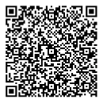

# Registry of Uniform Resource (UR) Types

## BCR-2020-006

**© 2020 Blockchain Commons**

Authors: Wolf McNally, Christopher Allen<br/>
Date: May 12, 2020<br/>
Revised: April 26, 2025

---

## Introduction

A limited, base-32 character set is required by Uniform Resources (UR) [BCR5] in order to be compatible with both URI syntax [RFC3986] and QR Code alphanumeric mode [QRCodeAlphaNum]. In addition, [BCR5] specifies:

> Each UR encoded object includes a `type` component as the first path component after the `UR` scheme. Types MUST consist only of characters from the English letters (ignoring case), Arabic numerals, and the hyphen `-`.

Because this namespace intersects with but does not enclose existing type namespace definitions such as [MIME] and because defined types like MIME do not uniformly specify CBOR encoding (required by [BCR5]) a new namespace is necessary to easily identify the type of data encoded in a UR.

This document is a registry of UR types and CBOR tags maintained by Blockchain Commons. Each entry in the registry records the type string, its associated CBOR tag, a brief description of the type, and either a link to the type definition or a reference to the type definition within this document. Additional types may be added by contacting this document's maintainers.

Types specified within this document are specified in [CDDL], the Concise Data Definition Language used as a human-readable notation for CBOR structures.

## User-Defined Types `x-*`

All types with the prefix `x-` are reserved for user-defined UR types.

## CBOR-Wrapped Types `cbor-*`

All types with the prefix `cbor-` are reserved for existing non-CBOR media types wrapped in a CBOR byte string. The only types currently specified in this registry are `cbor-png` for [PNG] images and `cbor-svg` for [SVG] images.

## Tags for Embedding

Each UR type defines a CBOR encoding. When a UR type is suitable for embedding within another CBOR structure, it MUST be tagged with a CBOR tag defined for this purpose. When a UR type is used as the top-level CBOR object encoded into a UR, the object MUST NOT be tagged, as this information is provided by the UR type component.

This document also lists the tag, if any, defined for the particular CBOR structure contained in the UR encoding. The tags listed here may or may not currently be listed in IANA's registry of CBOR tags [CBOR-TAGS] but the intent is that they will be registered as they come into us.

Some of the UR types and their corresponding CBOR tags below have been deprecated. There may be existing software that still uses these "version 1" types and tags however, so it is RECOMMENDED that such software only read the deprecated types and tags and not write them, preferring the version 2 types and tags instead. Deprecated types and tags below are denoted using ~~strikethrough~~.

## Registry

| CBOR Tag            | UR Type                                   | Description                                    | Definition                                                             |
| :------------------ | :---------------------------------------- | :--------------------------------------------- | :--------------------------------------------------------------------- |
| 200                 | `envelope`                                | Gordian Envelope                               | [[Envelope]](https://datatracker.ietf.org/doc/draft-mcnally-envelope/) |
| 201                 | `envelope` leaf                           | Encapsulated dCBOR                             | [[Envelope]](https://datatracker.ietf.org/doc/draft-mcnally-envelope/) |
| 40000               | `known-value`                             | Envelope known value                           | [[BCR-2023-002]](bcr-2023-002-known-value.md)                          |
| 40001               | `digest`                                  | Cryptographic digest                           | [[BCR-2021-002]](bcr-2021-002-digest.md)                               |
| 40002               | `encrypted`                               | Encrypted message                              | [[BCR-2022-001]](bcr-2022-001-encrypted-message.md)                    |
| 40003               | `compressed`                              | Compressed message                             | [[BCR-2023-001]](bcr-2023-001-compressed.md)                           |
| 40004               | `request`                                 | GSTP request                                   | [[BCR-2023-014]](bcr-2023-014-gstp.md)                                 |
| 40005               | `response`                                | GSTP response                                  | [[BCR-2023-014]](bcr-2023-014-gstp.md)                                 |
| 40006               | `function`                                | Function identifier                            | [[BCR-2023-012]](bcr-2023-012-envelope-expression.md)                  |
| 40007               | `parameter`                               | Parameter identifier                           | [[BCR-2023-012]](bcr-2023-012-envelope-expression.md)                  |
| 40008               | `placeholder`                             | Function placeholder                           | [[BCR-2023-012]](bcr-2023-012-envelope-expression.md)                  |
| 40009               | `replacement`                             | Function replacement                           | [[BCR-2023-012]](bcr-2023-012-envelope-expression.md)                  |
| 40010               | `agreement-private-key`                   | Agreement private key                          | [[BCR-2023-011]](bcr-2023-011-public-key-crypto.md)                    |
| 40011               | `agreement-public-key`                    | Agreement public key                           | [[BCR-2023-011]](bcr-2023-011-public-key-crypto.md)                    |
| 40012               | `arid`                                    | Apparently Random Identifier                   | [[BCR-2022-002]](bcr-2022-002-arid.md)                                 |
| 40013               | `crypto-prvkeys`                          | Private keys                                   | [[BCR-2023-011]](bcr-2023-011-public-key-crypto.md)                    |
| 40014               | `nonce`                                   | Cryptographic nonce                            | [[BCR-2023-015]](bcr-2023-015-nonce.md)                                |
| 40015               | `password`                                | Hashed password (e.g., Scrypt)                 | [[BCR-2023-016]](bcr-2023-016-password.md)                             |
| 40016               | `crypto-prvkey-base`                      | Private key base                               | [[BCR-2023-011]](bcr-2023-011-public-key-crypto.md)                    |
| 40017               | `crypto-pubkeys`                          | `PublicKeys`                                   | [[BCR-2023-011]](bcr-2023-011-public-key-crypto.md)                    |
| 40018               | `salt`                                    | Salt                                           | [[BCR-2023-017]](bcr-2023-017-salt.md)                                 |
| 40019               | `crypto-sealed`                           | Sealed message                                 | [[BCR-2023-011]](bcr-2023-011-public-key-crypto.md)                    |
| 40020               | `signature`                               | Signature                                      | [[BCR-2023-011]](bcr-2023-011-public-key-crypto.md)                    |
| 40021               | `signing-private-key`                     | Signing private key                            | [[BCR-2023-011]](bcr-2023-011-public-key-crypto.md)                    |
| 40022               | `signing-public-key`                      | Signing public key                             | [[BCR-2023-011]](bcr-2023-011-public-key-crypto.md)                    |
| 40023               | `crypto-key`                              | Symmetric Key                                  | [[BCR-2022-001]](bcr-2022-001-encrypted-message.md)                    |
| 40024               | `xid`                                     | XID or XID Document                            | [[BCR-2024-010]](bcr-2024-010-xid.md)                                  |
| 40025               | `reference`                               | Cryptographically secure reference             | [[BCR-2024-011]](bcr-2024-011-reference.md)                            |
| 40026               | `event`                                   | Event identifier                               | [[BCR-2023-014]](bcr-2023-014-gstp.md)                                 |
| 40027               | `encrypted-key`                           | Encrypted key                                  | [[BCR-2022-001]](bcr-2022-001-encrypted-message.md)                    |
| 40100               | `mlkem-private-key`                       | MLKEM Private Key                              | [[BCR-2025-003]](bcr-2025-003-post-quantum.md)                         |
| 40101               | `mlkem-public-key`                        | MLKEM Public Key                               | [[BCR-2025-003]](bcr-2025-003-post-quantum.md)                         |
| 40102               | `mlkem-ciphertext`                        | MLKEM Ciphertext                               | [[BCR-2025-003]](bcr-2025-003-post-quantum.md)                         |
| 40103               | `mldsa-private-key`                       | MLDSA Private Key                              | [[BCR-2025-003]](bcr-2025-003-post-quantum.md)                         |
| 40104               | `mldsa-public-key`                        | MLDSA Private Key                              | [[BCR-2025-003]](bcr-2025-003-post-quantum.md)                         |
| 40105               | `mldsa-signature`                         | MLDSA Signature                                | [[BCR-2025-003]](bcr-2025-003-post-quantum.md)                         |
| 40300 ~~300~~       | `seed` ~~`crypto-seed`~~                  | Cryptographic seed                             | This document                                                          |
| 40303 ~~303~~       | `hdkey` ~~`crypto-hdkey`~~                | Hierarchical Deterministic (HD) key            | [[BCR-2020-007]](bcr-2020-007-hdkey.md)                                |
| 40304 ~~304~~       | `keypath` ~~`crypto-keypath`~~            | Key Derivation Path                            | [[BCR-2020-007]](bcr-2020-007-hdkey.md)                                |
| 40305 ~~305~~       | `coin-info` ~~`crypto-coin-info`~~        | Cryptocurrency Coin Use                        | [[BCR-2020-007]](bcr-2020-007-hdkey.md)                                |
| 40306 ~~306~~       | `eckey` ~~`crypto-eckey`~~                | Elliptic Curve (EC) key                        | [[BCR-2020-008]](bcr-2020-008-eckey.md)                                |
| 40307 ~~307~~       | `address` ~~`crypto-address`~~            | Cryptocurrency Address                         | [[BCR-2020-009]](bcr-2020-009-address.md)                              |
| 40308 ~~308~~       | `output-descriptor` ~~`crypto-output`~~   | Bitcoin Output Descriptor                      | [[BCR-2020-010]](bcr-2020-010-output-desc.md)                          |
| 40309 ~~309~~       | `sskr` ~~`crypto-sskr`~~                  | SSKR (Sharded Secret Key Reconstruction) shard | [[BCR-2020-011]](bcr-2020-011-sskr.md)                                 |
| 40310 ~~310~~       | `psbt` ~~`crypto-psbt`~~                  | Partially Signed Bitcoin Transaction (PSBT)    | This document                                                          |
| 40311 ~~311~~       | `account-descriptor` ~~`crypto-account`~~ | BIP44 Account                                  | [[BCR-2023-019]](bcr-2023-019-account-descriptor.md)                   |
| 40800               | `ssh-private`                             | Text format SSH private key                    | [[BCR-2024-005]](bcr-2024-005-key-encodings.md)                        |
| 40801               | `ssh-public`                              | Text format SSH public key                     | [[BCR-2024-005]](bcr-2024-005-key-encodings.md)                        |
| 40802               | `ssh-signature`                           | Text format SSH signature                      | [[BCR-2024-005]](bcr-2024-005-key-encodings.md)                        |
| 40803               | `ssh-certificate`                         | Text format SSH certificate                    | [[BCR-2024-005]](bcr-2024-005-key-encodings.md)                        |
| 1347571542 ('PROV') | `provenance`                              | Provenance Mark                                | [[BCR-2024-001]](bcr-2025-001-provenance-mark.md)                      |

## Notable Tags

| CBOR Tag | UR Type         | Description                                           | Definition                                                                  |
| :------- | :-------------- | :---------------------------------------------------- | :-------------------------------------------------------------------------- |
| 16       | `cose-encrypt0` | COSE_Encrypt0: Encrypted message (implied recipient)  | [[COSE]](https://tools.ietf.org/html/rfc8152)                               |
| 17       | `cose-mac0`     | COSE_Mac0: Authenticated message (implied recipient)  | [[COSE]](https://tools.ietf.org/html/rfc8152)                               |
| 18       | `cose-sign1`    | COSE_Sign1: Signed message (single recipient)         | [[COSE]](https://tools.ietf.org/html/rfc8152)                               |
| 24       | `cbor`          | Wrapped cbor                                          | [[CBOR]](https://www.rfc-editor.org/rfc/rfc8949.html#name-tagging-of-items) |
| 96       | `cose-encrypt`  | COSE_Encrypt: Encrypted message (multiple recipients) | [[COSE]](https://tools.ietf.org/html/rfc8152)                               |
| 97       | `cose-mac`      | COSE_Mac: Authenticated message (multiple recipients) | [[COSE]](https://tools.ietf.org/html/rfc8152)                               |
| 98       | `cose-sign`     | COSE_Sign: Signed message (multiple recipients)       | [[COSE]](https://tools.ietf.org/html/rfc8152)                               |
|          | `cose-key`      | COSE_Key: An encryption key                           | [[COSE]](https://tools.ietf.org/html/rfc8152)                               |
|          | `cose-keyset`   | COSE_KeySet: A set of encryption keys                 | [[COSE]](https://tools.ietf.org/html/rfc8152)                               |
|          | `cbor-png`      | PNG image                                             | [[PNG]](https://tools.ietf.org/html/rfc2083)                                |
|          | `cbor-svg`      | SVG image                                             | [[SVG]](https://www.w3.org/TR/SVG11/)                                       |

## UR Types and CBOR Tags

This document defines the following UR types along with their corresponding CBOR tags:

| UR type | CBOR Tag |
| :------ | :------- |
| ur:seed | #6.40300 |

These tags have been registered in the [IANA Registry of CBOR Tags](https://www.iana.org/assignments/cbor-tags/cbor-tags.xhtml).

## Cryptographic Seed `seed`

The type `seed` contains a single, byte string having a length from 1 to 64 bytes. Semantically, this byte string SHOULD be a random or pseudorandom sequence generated by a cryptographically-strong algorithm.

The type may also include a `creation-date` attribute which is the number of days since the Unix epoch upon which this seed was generated. See [BCR-2023-008](bcr-2023-008-dcbor-date.md) for more information.

The type may also include `name`, which SHOULD be a short name for the seed, and `note`, which is an arbitrary amount of text describing the seed.

### CDDL

```
tagged-seed = #6.40300(seed)

seed = {
	payload: bytes,
	? creation-date: tagged-date,
	? name: text,
	? note: text
}
payload = 1
creation-date = 2
name = 3
note = 4
```

### Example/Test Vector

* For a 16 byte (128-bit) seed generated on May 11, 2020, in the CBOR diagnostic notation:

```
{
  1: h'c7098580125e2ab0981253468b2dbc52',
  2: 100(18394)
}
```

* Encoded as binary using [CBOR-PLAYGROUND]:

```
A2                                     # map(2)
   01                                  # unsigned(1) payload:
   50                                  # bytes(16)
      C7098580125E2AB0981253468B2DBC52 # payload
   02                                  # unsigned(2) creation-date:
   D8 64                               # tag(100)
      19 47DA                          # unsigned(18394)
```

* As a hex string:

```
A20150C7098580125E2AB0981253468B2DBC5202D8641947DA
```

* As a UR:

```
ur:seed/oeadgdstaslplabghydrpfmkbggufgludprfgmaotpiecffltnlpqdenos
```

* UR as QR Code:


#### Seed Digest Source Specification

When a unique identifier to a `seed` is needed, an extract of its fields, called the *digest source* is created and then used as input to the SHA-256 hashing algorithm. The resulting digest can be compared to digests produced the same way to determine whether a seed has a particular identity. See [BCR-2021-002: Digests for Digital Objects](bcr-2021-002-digest.md) for more information.

The digest source of a `seed` is just the `payload` byte string. All other fields are ignored. For the example test vector above, the payload is:

```
c7098580125e2ab0981253468b2dbc52
```

So the digest would be the SHA-256 hash of those bytes:

```
e824467caffeaf3bbc3e0ca095e660a9bad80ddb6a919433a37161908b9a3986
```

When encoded as CBOR (diagnostic notation):

```
seed-digest = #6.40600(h'e824467caffeaf3bbc3e0ca095e660a9bad80ddb6a919433a37161908b9a3986')
```

Encoded as binary:

```
D9 0258                                 # tag(600)
   58 20                                # bytes(32)
      E824467CAFFEAF3BBC3E0CA095E660A9BAD80DDB6A919433A37161908B9A3986
```

## Partially Signed Bitcoin Transaction (PSBT) `psbt`

The type `psbt` contains a single, deterministic length byte string of variable length up to 2^32-1 bytes. Semantically, this byte string MUST be a valid Partially Signed Bitcoin Transaction encoded in the binary format specified by [BIP174].

### CDDL

```
bytes
```

### Example/Test Vector

* CBOR diagnostic notation:

```
h'70736274ff01009a020000000258e87a21b56daf0c23be8e7070456c336f7cbaa5c8757924f545887bb2abdd750000000000ffffffff838d0427d0ec650a68aa46bb0b098aea4422c071b2ca78352a077959d07cea1d0100000000ffffffff0270aaf00800000000160014d85c2b71d0060b09c9886aeb815e50991dda124d00e1f5050000000016001400aea9a2e5f0f876a588df5546e8742d1d87008f000000000000000000'
```

* Encoded as binary using [CBOR-PLAYGROUND]:

```
58 A7                                   # bytes(167)
70736274FF01009A020000000258E87A21B56DAF0C23BE8E7070456C336F7CBAA5C8757924F545887BB2ABDD750000000000FFFFFFFF838D0427D0EC650A68AA46BB0B098AEA4422C071B2CA78352A077959D07CEA1D0100000000FFFFFFFF0270AAF00800000000160014D85C2B71D0060B09C9886AEB815E50991DDA124D00E1F5050000000016001400AEA9A2E5F0F876A588DF5546E8742D1D87008F000000000000000000
```

* As a hex string:

```
58A770736274FF01009A020000000258E87A21B56DAF0C23BE8E7070456C336F7CBAA5C8757924F545887BB2ABDD750000000000FFFFFFFF838D0427D0EC650A68AA46BB0B098AEA4422C071B2CA78352A077959D07CEA1D0100000000FFFFFFFF0270AAF00800000000160014D85C2B71D0060B09C9886AEB815E50991DDA124D00E1F5050000000016001400AEA9A2E5F0F876A588DF5546E8742D1D87008F000000000000000000
```

* As a UR:

```
ur:psbt/hdosjojkidjyzmadaenyaoaeaeaeaohdvsknclrejnpebncnrnmnjojofejzeojlkerdonspkpkkdkykfelokgprpyutkpaeaeaeaeaezmzmzmzmlslgaaditiwpihbkispkfgrkbdaslewdfycprtjsprsgksecdratkkhktikewdcaadaeaeaeaezmzmzmzmaojopkwtayaeaeaeaecmaebbtphhdnjstiambdassoloimwmlyhygdnlcatnbggtaevyykahaeaeaeaecmaebbaeplptoevwwtyakoonlourgofgvsjydpcaltaemyaeaeaeaeaeaeaeaeaebkgdcarh
```

* UR as QR Code:



## COSE Structures `cose-*`

[COSE] specifies CBOR-encoded structures for transmitting signed and/or encrypted objects. This document specifies UR types starting with `cose-` for the various COSE messages in their untagged form.

## Implementations

Typescript/Javascript Implementation: [ur-registry](https://github.com/KeystoneHQ/ur-registry)

Java Implementation: [hummingbird](https://github.com/sparrowwallet/hummingbird)


## Normative References

* [RFC3986] [Uniform Resource Identifier (URI): Generic Syntax](https://tools.ietf.org/html/rfc3986)
* [QRCodeAlphaNum] [QR Codes, Table of Alphanumeric Values](https://www.thonky.com/qr-code-tutorial/alphanumeric-table)
* [BCR5] [BCR-0005: Uniform Resources (UR): Encoding Structured Binary Data for Transport in URIs and QR Codes](bcr-2020-005-ur.md)
* [CDDL] [RFC8610: Concise Data Definition Language (CDDL): A Notational Convention to Express Concise Binary Object Representation (CBOR) and JSON Data Structures](https://tools.ietf.org/html/rfc8610)
* [BIP39] [BIP-39: Mnemonic code for generating deterministic keys](https://github.com/bitcoin/bips/blob/master/bip-0039.mediawiki)
* [SLIP39] [SLIP-0039: Shamir's Secret-Sharing for Mnemonic Codes](https://github.com/satoshilabs/slips/blob/master/slip-0039.md)
* [COSE] [RFC8152: CBOR Object Signing and Encryption (COSE)](https://tools.ietf.org/html/rfc8152)
* [CBOR-PLAYGROUND] [CBOR Playground](http://cbor.me)
* [LANG] [List of ISO 639-1 codes](https://en.wikipedia.org/wiki/List_of_ISO_639-1_codes)
* [PNG] [PNG (Portable Network Graphics) Specification](https://tools.ietf.org/html/rfc2083)
* [SVG] [Scalable Vector Graphics (SVG) 1.1 (Second Edition)](https://www.w3.org/TR/SVG11/)
* [CBOR-TAGS] [Concise Binary Object Representation (CBOR) Tags](https://www.iana.org/assignments/cbor-tags/cbor-tags.xhtml)
* [UR] [Uniform Resources (UR)](bcr-0005-ur.md)
* [BIP174] [BIP-174: Partially Signed Bitcoin Transaction Format](https://github.com/bitcoin/bips/blob/master/bip-0174.mediawiki)

## Informative References

* [MIME] [Multipurpose Internet Mail Extensions (MIME) Part Two: Media Types](https://tools.ietf.org/html/rfc2046)
