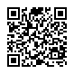

# UR Type Definition for Cryptocurrency Addresses

## BCR-2020-009

**© 2020 Blockchain Commons**

Authors: Wolf McNally, Christopher Allen<br/>
Date: June 6, 2020<br/>
Revised: November 25, 2023

---

### Introduction

Bitcoin, Ethereum, and other cryptocurrencies use [addresses](https://en.bitcoin.it/wiki/Address) as destinations for funds. Addresses are generated from public keys, which were in turn generated from private keys. Ultimately an address is just a string of bytes, but to facilitate recognition and handling by humans they are encoded as base58 (Bitcoin), bech32 (Bitcoin) or base16 (Ethereum). Encodings such as Bitcoin's include one or more tag characters at the front to help identify the string as an address, e.g., `1` for a Bitcoin P2PKH address or `m` for a Bitcoin testnet address, or `bc1` for a Bitcoin Bech32-encoded address.

## UR Types and CBOR Tags

This document defines the following UR types along with their corresponding CBOR tags:

| UR type    | CBOR Tag |
| :--------- | :------- |
| ur:address | #6.40307 |

These tags have been registered in the [IANA Registry of CBOR Tags](https://www.iana.org/assignments/cbor-tags/cbor-tags.xhtml).

This specification defines a UR type `address` (CBOR tag #6.40307) for encoding and transmitting cryptocurrency addresses.

The `info` field of the CBOR type defined herein references the `coininfo` type defined in [BCR-2020-007](bcr-2020-007-hdkey.md). This structure encodes both the type of coin and the network (main or test) the address is to be used with. If the optional `info` field is omitted, its defaults (mainnet Bitcoin address) are assumed.

The `data` field encodes the raw byte string comprising the address.

**Note:** This specification describes version 2 `address` (#6.40307), which differs from version 1 `crypto-address` (#6.307) only in the UR type and CBOR tag it uses. Version 1 `crypto-address` is deprecated, but may still be supported for backwards compatibility.

### CDDL

The following specification is written in Concise Data Definition Language [CDDL](https://tools.ietf.org/html/rfc8610).

When used embedded in another CBOR structure, this structure should be tagged #6.40307.

```
tagged-address = #6.40307(address)

address = {
	? info: tagged-coininfo,
	? type: address-type,
	data: bytes
}

info = 1
type = 2
data = 3

address-type = p2pkh / p2sh / p2wpkh
p2pkh = 0
p2sh = 1
p2wpkh = 2

; The `type` field MAY be included for Bitcoin (and similar cryptocurrency) addresses, and MUST be omitted for non-applicable types.

; `data` contains:
;   For addresses of type `p2pkh`, the hash160 of the public key (20 bytes).
;   For addresses of type `p2sh`, the hash160 of the script bytes (20 bytes).
;   For addresses of type `p2wphk`, the sha256 of the script bytes (32 bytes).
;   For ethereum addresses, the last 20 bytes of the keccak256 hash of the public key (20 bytes).
```

### Example/Test Vector 1

* A mainnet Bitcoin address.

```
1BvBMSEYstWetqTFn5Au4m4GFg7xJaNVN2
```

* Decoded

```
$ bx address-decode 1BvBMSEYstWetqTFn5Au4m4GFg7xJaNVN2
wrapper
{
    checksum 1802900980
    payload 77bff20c60e522dfaa3350c39b030a5d004e839a
    version 0
}
```

* In the CBOR diagnostic notation:

```
{
	3: h'77bff20c60e522dfaa3350c39b030a5d004e839a' ; data
}
```

* Encoded as binary using [CBOR-PLAYGROUND]:

```
a1                                      # map(1)
   03                                   # unsigned(3) ; data
   54                                   # bytes(20)
      77bff20c60e522dfaa3350c39b030a5d004e839a
```

* As a hex string:

```
a1035477bff20c60e522dfaa3350c39b030a5d004e839a
```

* As a UR:

```
ur:address/oyaxghktrswzbnhnvwcpurpkeogdsrndaxbkhlaegllsnyolrsemgu
```

* UR as QR Code:


### Example/Test Vector 2

* A testnet Ethereum address.

```
0x81b7E08F65Bdf5648606c89998A9CC8164397647
```

* In the CBOR diagnostic notation:

```
{
	1: 40305({ / info: coininfo [BCR-2020-007] /
		1: 60, / type: coin-type-eth (0x3c) [BCR-2020-007] /
		2: 1 / network: testnet-eth-ropsten [BCR-2020-007] /
	}),
	3: h'81b7e08f65bdf5648606c89998a9cc8164397647' / data /
}
```

* Encoded as binary using [CBOR-PLAYGROUND]:

```
a2                                      # map(2)
   01                                   # unsigned(1) info
   d9 9d71                              # tag(40305) coininfo
      a2                                # map(2)
         01                             # unsigned(1) type
         18 3c                          # unsigned(60) coin-type-eth
         02                             # unsigned(2) network
         01                             # unsigned(1) testnet-eth-ropsten
   03                                   # unsigned(3) data
   54                                   # bytes(20)
      81b7e08f65bdf5648606c89998a9cc8164397647
```

* As a hex string:

```
a201d99d71a201183c0201035481b7e08f65bdf5648606c89998a9cc8164397647
```

* As a UR:

```
ur:address/oeadtantjsoeadcsfnaoadaxghlyrlvtmyihryykielnamspnlmkptsflyieeskoflkovdfdlb
```

* UR as QR Code:


