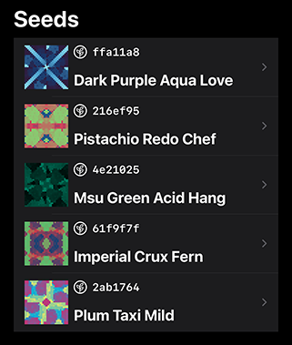
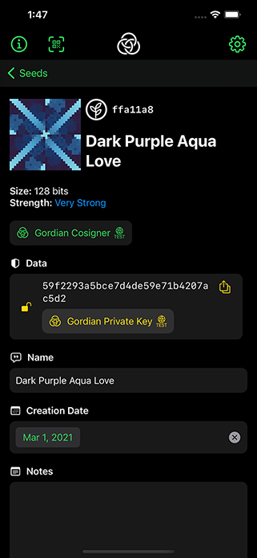
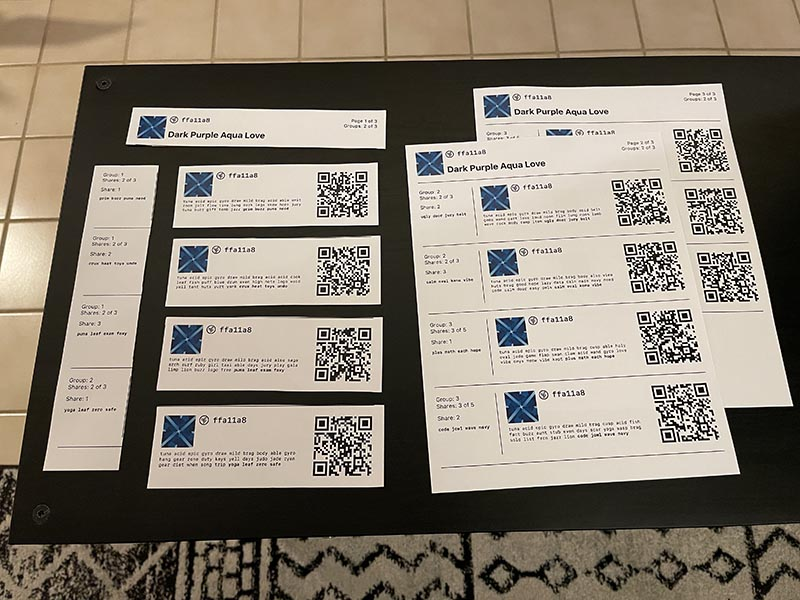
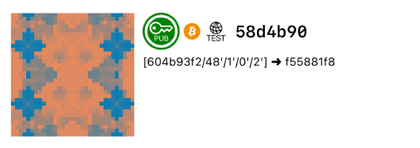
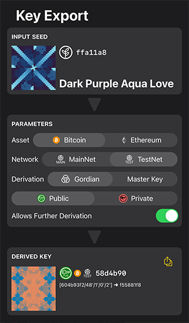
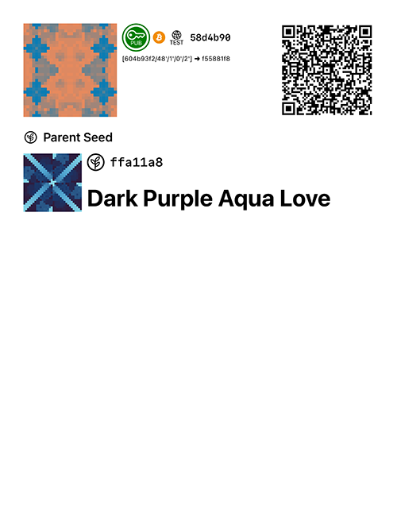

# Digests for Digital Objects

## BCR-2021-002

**© 2021 Blockchain Commons**

Authors: Wolf McNally, Christopher Allen<br/>
Date: Apr 20, 2021

---

## Introduction

There is often a need to uniquely identify a digital object without having the complete object at hand. Digital hashing algorithms take as input any binary data and output a distinct, deterministic, fixed-sized output. The output, called a *digest*, is constructed from every bit of the input (the *digest source*) such that, if even one bit of the source changes, *every* bit of the output is likely to change. A good hashing algorithm will produce a digest that is statistically random, with the digest bits having an equal probability of being zero or one. Yet, the result is deterministic such that a specific digest source will *always* yield the exact same output.

Hash algorithms are also *one-way* in that there is no possible way to reconstruct the original message from the digest, and yet any object can be hashed and the resulting digest compared to another digest: if the two digests are exactly equal, then it can be trusted to a high degree of certainty that they were produced from the same source.

When two different sources yield the same digest, this is called a *hash collision*. Effective hashing algorithms minimize the possibility of collisions by producing a true random distribution of bits. There is no way to absolutely guarantee that there is no possibility for a hash collision. To deal with this unlikely possibility, more bits are added to the digest such that the odds of a collision become astronomically small.

**A note on terminology:** The noun "hash" is often used synonymously with "digest", but this document consistently uses the noun "digest" to denote the output of a hashing algorithm and the verb "hash" as the process by which a digest is derived. Shorter digests are often referred to as "checksums" and sometimes as "fingerprints" but this document consistently refers to them as "digests" except when referring to them in specific contexts where the other terms are usually used.

## Hashing Algorithms used by Blockchain Commons

There are many different hashing algorithms with different attributes. Blockchain Commons currently uses two particular hashing algorithms in its proposals and specifications: CRC-32 and SHA-256.

### CRC-32

The [CRC-32](https://en.wikipedia.org/wiki/Cyclic_redundancy_check#CRC-32_algorithm) algorithm produces a digest of 32 bits (4 bytes.) With a digest of this length, the odds of a hash collision are approximately 1 in 4.3 billion. This is sufficient for error-detection purposes, but not considered to be safe for general cryptographic applications.

The [Blockchain Commons ByteWords](bcr-2020-012-bytewords.md) specification uses a CRC-32 digest at the end of each message for error-detection purposes. ByteWords is in turn used by the [Blockchain Commons Uniform Resource (UR)](bcr-2020-005-ur.md) specification, which is used to encode structured binary data as text URIs for transport in QR codes and by other means.

### SHA-256

The [SHA-256](https://en.wikipedia.org/wiki/SHA-2) algorithm produces a digest of 256 bits (32 bytes). A digest of this length provides for 2^256 (1.16x10^77) possibilities, which is close to the estimated number of atoms in the known universe. This low level of probability for collisions is considered to be safe for most cryptographic algorithms where digests are compared to guarantee that two input objects are identical.

## UR Types and CBOR Tags

This document defines the following UR types along with their corresponding CBOR tags:

| UR type      | CBOR Tag |
| :----------- | :------- |
| ur:digest    | #6.40001 |

These tags have been registered in the [IANA Registry of CBOR Tags](https://www.iana.org/assignments/cbor-tags/cbor-tags.xhtml).

## CDDL

```
tagged-digest = #6.40001(digest)
digest = bytes .size 32
```

### Example SHA-256 digests

The example below shows three SHA-256 digests produced from input typed into the terminal using the standard `shasum` utility. In the Unix shell, CTRL-D (`^d`) is pressed twice (`^d^d`) at the end of non-empty input strings to avoid adding an end-of-line character to the digest source of the hash algorithm.

```sh
# "0" (the numeral zero)
$ shasum -a 256
0^d^d
5feceb66ffc86f38d952786c6d696c79c2dbc239dd4e91b46729d73a27fb57e9

# "🐺" (UTF-8 wolf emoji, 0xf09f90ba)
$ shasum -a 256
🐺^d^d
25fdc5865ecb09d82029a25ef47f0c8686cb12bc9dae51075cad418667cc4a79

# "Blockchain Commons"
$ shasum -a 256
Blockchain Commons^d^d
314de8c8f27096b272aa8fb568beec8b122bf23e99269b7caa0ff013e4b3ac96
```

## Quick Visual Recognition of Digests

Computer programs can instantly compare two digests and report whether they match. But applications that include a human in the loop to manage and verify the accuracy of a transaction often need to display SHA-256 digests for comparison against known objects. In these cases, it is desirable to have ways of representing digests in such a way as to be readily recognizable by the human visual system while minimizing fatigue. Long strings of hexadecimal numbers as shown above, while presenting every bit of a digest, are difficult for humans to check quickly and accurately.

Blockchain Commons adopts two complementary approaches to visually comparing digests: *abbreviation* and *visualization*.

### Abbreviated Digests

An abbreviated digest is simply a fixed number of digits extracted from the front of the source digest. Blockchain Commons uses and recommends seven (7) hexadecimal digits for this application for these reasons:

* Sufficient for quick visual recognition while reducing likely error.
* Has precedent as it is used by the Git version control system as the default length for presenting [short commit IDs](https://stackoverflow.com/a/18134919), which are also digests.
* Less likely to be confused with other digests like CRC-32 and the Hash160 extended key fingerprint as specified by BIP-32, both of which are always presented as 8 hexadecimal digits.
* The likelihood of a comparison error is reduced even further by combining this technique with a visual hash (see below.)

Abbreviated digests are *only* displayed for human visual comparison. All comparisons of digests done by executable programs are done between full 256-bit digests.

This example shows the same digests from above being produced and then displayed in their abbreviated form:

```sh
# "0" (the numeral zero)
$ shasum -a 256 | sed 's/\(^.\{7\}\).*/\1/'
0^d^d
5feceb6

# "🐺" (UTF-8 wolf emoji, 0xf09f90ba)
$ shasum -a 256 | sed 's/\(^.\{7\}\).*/\1/'
🐺^d^d
25fdc58

# "Blockchain Commons"
$ shasum -a 256 | sed 's/\(^.\{7\}\).*/\1/'
Blockchain Commons^d^d
314de8c
```

### Visual Hashes

Visual Hashing (a.k.a. "identicons") is a family of methods for synthesizing images that can be quickly recognized by humans. A catalog of visual hashing methods can be found [here](https://github.com/drhus/awesome-identicons). Visual hashing algorithms usually start with a digest of an object, and use the bits of the digest to create a unique image.

Blockchain Commons has released [LifeHash](https://github.com/blockchaincommons/bc-lifehash), an open source visual hashing algorithm that we use for all our projects. Lifehash has a number of desirable qualities, including high complexity, good aesthetics, a printer-friendly (CMYK) color gamut and robustness when transformed to grayscale.

The examples below use the Blockchain Commons [lifehash-cli](https://github.com/blockchaincommons/lifehash-cli) command line tool to generate LifeHash images from the same strings as the examples above. When given strings, LifeHash uses the same SHA-256 algorithm to produce the digest that it then uses to synthesize the image.

```sh
# "0" (the numeral zero)
$ lifehash -m 4 '0'
```


```sh
# "🐺" (UTF-8 wolf emoji, 0xf09f90ba)
$ lifehash -m 4 '🐺'
```


```sh
# "Blockchain Commons"
$ lifehash -m 4 'Blockchain Commons'
```


### Object Identity Block

The above techniques can be used to develop a UI technique for making any digital object immediately recognizable to users. Blockchain Commons calls this an *Object Identity Block* (OIB). An OIB contains:

* A visual hash (LifeHash) of the object.
* An icon that identifies the type of object.
* An abbreviated digest of the object.
* The human-readable name of the object (optional).
* Additional icons after the type icon to represent object subtypes (optional).
* Additional lines of metadata between the first and last lines (optional).

The example below is the OIB for a specific cryptographic seed, showing the first four fields listed above, which in this arrangement form the basic visual language of an OIB. OIBs always show these key data items in this physical relation to each other. This helps users become comfortable identifying objects displayed in this arrangement, as they learn what information to expect in what position.


In the context of a complete user interface, OIBs can be used for rapid recognition of numerous objects, such as in a list:



They can also be used as the header of an object detail view:



Another use is when relating separate objects back to a particular object. In this example, a single cryptographic seed has been split into multiple *shares* using the Blockchain Commons [Sharded Secret Key Reconstruction (SSKR)](https://github.com/BlockchainCommons/bc-sskr) algorithm. The coupons each display an OIB to visually identify the seed of which they contain a part, but none of them contain the complete seed. The coupons also omit the seed name, which is shown only on the page header kept by the seed owner.



Depending on the needs of the object type, additional metadata may be displayed in the OIB. In the example below, the OIB represents a Bitcoin Testnet public key. The abbreviated digest is `58d4b90`. Additional metadata badge icons have been added between the object type icon and the abbreviated digest, and an additional line of metadata has been added showing the master key fingerprint (`604b93f2`), the BIP-32 derivation path, and the resulting key fingerprint (`f55881f8`), which is *not* the same as the object digest shown on the first line. Here again, that we only display the first seven digits of the digest helps to differentiate it from the key fingerprints, which always have eight digits. Note that there is still room for a user-defined object name at the bottom of the OID, should we wish to add one.



The reason that the abbreviated object digest and key fingerprint are different is that the digest includes *all* the metadata that uniquely identifies the key, including its purpose (public, bitcoin, testnet), whereas the fingerprint only identifies the key material. Two keys derived from a seed with the same derivation path but other different metadata, would produce different digests, even though they would end up with the same key material and fingerprints.

In this example, the user interface shows a workflow including an original `ur:crypto-seed` and the `ur:crypto-hdkey` derived from it. Both objects are signified by their OIB:



When the derived key is printed, the printout shows the OIB for the key along with a QR code containing the actual `ur:crypto-hdkey`, and also shows the OIB of the "parent seed" from which it was derived.



## The Digest Source Specification

Identifying a digital object requires producing a digest of the object. The input to the hashing algorithm (the *digest source*) is a sequence of bytes extracted from the object.

Some fields of a structured digital object may be integral to the object's identity and should be included in its digest, while others may not, and must be omitted from the digest. This ensures that all parties will produce the same digest of the same object. For instance, in a `ur:crypto-seed`, the seed `payload` itself is integral, but the `name`, `notes`, and `creation-date` fields can all be changed without changing the seed's essential identity, and are therefore not integral.

The method to produce the digest source for a particular object type SHOULD be specified by that type; this is its *Digest Source Specification* (DSS).

Examples of object types that include Digest Source Specifications:

* [ur:crypto-seed](bcr-2020-006-urtypes.md#seed-digest-source-specification)
* [ur:crypto-hdkey](bcr-2020-007-hdkey.md#hdkey-digest-source-specification)
