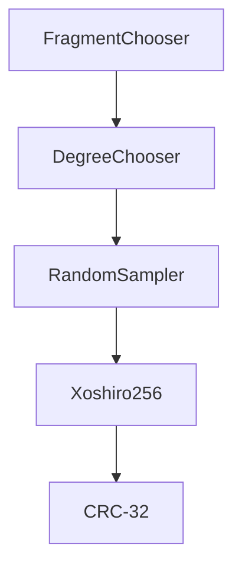

# Multipart UR (MUR) Implementation Guide

Implementer's guide for Multi-part UR (MUR), including rateless fountain codes.

## BCR-2024-001

**© 2024 Blockchain Commons**

Authors: Wolf McNally, Christopher Allen<br/>
Date: January 9, 2024

---

## Table of Contents

1. [Introduction](#1-introduction)
2. [Channel Types](#2-channel-types)
3. [QR Code Partitioning](#3-qr-code-partitioning)
4. [The Consensus Stack](#4-the-consensus-stack)
5. [The Encoder](#5-the-encoder)
6. [The Decoder](#6-the-decoder)

## 1. Introduction

The [UR specification](bcr-2020-005-ur.md) allows an entire message to be transmitted in a single message, and this is a common use case, but it is not always practical. For example, the payload data may be too large to fit in a single QR code. This document describes how UR implementations partition a message for transmission as a sequence of URs using an architecture called MUR (Multipart Uniform Resource).

A sequence generated using MUR may easily and efficiently be displayed as animated QR codes. Nonetheless, MUR is not specific to the textual UR encoding in general or QR codes in specific, and may be used with any binary communication channel.

MUR uses a hybrid of fixed-rate and rateless fountain codes to achieve robustness against transmission errors and convergence towards optimal transmission time. The fountain codes in MUR are based on the [Luby Transform Code](https://en.wikipedia.org/wiki/Luby_transform_code).

### Scope

This document does not deal with the encoding of URs generally, and specifically does not deal with their textual representation. It strictly deals only with the partitioning of a message into multiple parts, and the binary representation and serialization of those parts. While the multi-part architecture described here can be used to encode single-part messages as a degenerate case, when using URs the single-part syntax in the [UR specification](bcr-2020-005-ur.md) is REQUIRED for single-part messages.

### How to Read This Document

This document is intended to be read through from top to bottom, as later sections build on earlier ones. This will give both implementers and other interested parties an understanding of the architecture of the system. After that, it may be used as a reference for implementers, as it contains both annotated source code and test vectors. It is also recommended that implementers follow the top-to-bottom approach, as later code in this document frequently depends on earlier code.

The authors' goal is to make this document self-contained, providing everything necessary to implement MUR on a new platform. For anyone without deep knowledge of the language, the extracts of the [Swift reference implementation](https://github.com/BlockchainCommons/URKit) and test vectors should be understandable as pseudocode.

The authors welcome feedback on this document and the reference implementation.

### Terminology

**message**
: The original binary structure to be encoded and recovered through decoding. In the case of [URs](bcr-2020-005-ur.md), this MUST be a valid [dCBOR](https://datatracker.ietf.org/doc/draft-mcnally-deterministic-cbor/) structure, although this is not a requirement of MUR when used applications other than UR.

**fragment**
: a message is broken into a sequence of equal-sized fragments. The fragments are received by the decoder and reassembled to reconstruct the original message.

**part**
: Refers to one of a set of structures encoded for transmission, each of which contains a fragment of the message and metadata needed by the decoder. In the case of rateless codes, more than one fragment may be mixed together in a single part using XOR. Parts containing a single fragment are called *simple parts*, and parts containing multiple fragments XORed together are called *mixed parts*.

## 2. Channel Types

MUR is designed with a particular kind of communication channel in mind, so it is important to lay a foundation of understanding for the problems it solves.

Communication channels can be classified by several attributes:

### Dimensionality

* **Full-duplex:** both the sender and receiver can transmit and receive simultaneously.
* **Half-duplex:** the sender and receiver can transmit and receive, but not simultaneously.
* **Simplex:** the sender can only transmit and the receiver can only receive.

### Reliability

* **Reliable:** the receiver is guaranteed to receive all the data transmitted by the sender.
* **Unreliable/Erasure** the receiver may not receive all the data transmitted by the sender, but the sender is notified when data is not received.
* **Unreliable/Deletion** the receiver may not receive all the data transmitted by the sender, and the sender is not notified when data is not received.

### Ordering

* **Ordered:** the receiver receives the data in the same order that the sender transmits it.
* **Unordered:** the receiver may receive the data in a different order than the sender transmits it.

### Examples

Given the above terminology, here are some examples of communication channels and how they are classified:

* **TCP/IP:** Full-duplex, reliable, ordered.

The sender and receiver can both transmit and receive simultaneously, the receiver is guaranteed to receive all the data transmitted by the sender, and the receiver will receive the data in the same order that the sender transmitted it.

* **UDP/IP:** Full-duplex, unreliable/deletion, unordered.

The sender and receiver can both transmit and receive simultaneously, delivery is "best effort" so the receiver may not receive all the data transmitted by the sender with no inbuilt way of detecting failure, and the receiver may receive the data in a different order than the sender transmitted it.

* **Single QR Code:** Simplex, unreliable/erasure, ordered.

The sender can only transmit and the receiver can only receive, the receiver will either receive the entire message correctly or the user will know the scan failed, and there is only one message so the data within it is ordered.

* **Animated QR Codes:** Simplex, unreliable/deletion, unordered.

When a large message is broken into a series of QR codes and is displayed repeatedly: the sender can only transmit and the receiver can only receive, the receiver may not receive all the data transmitted by the sender, the receiver will not be notified when particular QR codes are missed, and due to missed QR codes the receiver may receive the data in a different order than the sender transmitted it.

It is this last form of channel for which we wish to provide a robust solution.

## 3. QR Code Partitioning

In the case of airgapped data transmission using QR codes, it is often desirable to transmit a *message* that is larger than can fit in a single QR code. In this case, the message may be broken into a sequence of smaller *fragments*, each of which is transmitted in a separate QR code, called a *part*. The fragments are then reassembled by the receiver to reconstruct the original message. This requires that each part, in addition to its payload fragment, must contain metadata with the length of the sequence and its index within the sequence, allowing the receiver to know when it has all the fragments and enabling it to assemble them in order, thus turning the unordered channel into an ordered one.

### Fixed-Rate vs. Rateless

The decision of how to break the message into fragments depends on the reliability of the channel. If the channel is reliable, then each fragment can be transmitted exactly once and the receiver will be able to reconstruct the original message. This might be the case if all the QR codes are printed on a single page and the receiver can scan them all at once.

If the channel is unreliable, then the sender may re-transmit the sequence of fragments repeatedly so the receiver can reconstruct the original message by eventually receiving all the fragments. This might be the case if the QR codes are displayed as an animation on a screen and the receiver can only scan one at a time.

The above options are called *fixed-rate*, because the number of fragments is fixed, and every part, each containing a unique fragment, must be received to reconstruct the original message.

Unfortunately, with animated QR codes created by repeating sequence of fixed-rate codes, *stalling* can occur when codes are missed as the camera fails to scan them correctly as they pass by. When a code is missed, the receiver must wait for the entire sequence to cycle through before getting another chance to read the missed code. If the same code is missed repeatedly (possibly due to environmental issues or reader limitations) the process can become inefficient, leading to significant delays in reconstructing the entire message.

* **This results divergence from optimal transmission time as more and more cycles through the entire sequence are needed to successfully capture all the codes.**

*Rateless codes*, on the other hand, are designed to be more robust against such issues and help in converging towards optimal transmission time. In a rateless system, each code is somewhat independent and contains some of the overall message encoded in such a way that any sufficiently large set of codes can be used to reconstruct the entire message. This means that even if some codes are missed, as long as enough other codes are successfully read, the message can still be reconstructed. There's no specific sequence that needs to be followed, and each code has a relatively high probability of bringing new information to the table. This property significantly reduces the likelihood of stalling, as the receiver doesn't have to wait for a specific code containing a specific fragment to come around again in a sequence. The more codes that are read, the closer the receiver gets to having enough information to reconstruct the original message.

* **This leads to a system that tends to converge towards the optimal transmission time regardless of individual code losses.**

In a well-designed rateless system, the number of codes that must be captured is not much higher than the number of fixed-rate codes that would be required.

*Fountain codes* are a type of rateless code so named by analogy to a water fountain: the flow of water from the fountain is continuous and effectively never-ending, but you only need to take a relatively tiny amount to get a drink.

### Hybrid Fixed-Rate/Rateless

Underlying MUR is a hybrid strategy of both fixed-rate and rateless fountain codes. The message is first broken into `seqLen` fragments. The first `seqLen` parts of the message are fixed-rate and can by themselves be used to reconstruct the original message. If the channel is reliable, as with a printed page, then these initial parts are all that need to be generated. Each part generated includes metadata that includes `seqLen`, which is the number of fragments in the message and `seqNum`, which is the 1-based index of the part. The receiver can use this metadata to know when it has received all the parts and to reconstruct the original message in order, even if the codes are scanned out of order. The fixed-rate parts have a `seqNum` less than or equal to `seqLen`.

The pair `<seqNum>-<seqLen>` is called the `seq` of the part. So for a 10-fragment message, the first part will have the `seq = 1-10` and the tenth will have the `seq = 10-10`.

If the channel is unreliable (as with animated QR codes) then our system, when requested to generate parts where `seqNum` > `seqLen`, will generate rateless parts. Hence values like `seq = 11-10` and up are normal, and indicate rateless codes. This indeterminate length stream of rateless parts are generated using an algorithm that in each generated part mixes together a subset of the entire set of fragments of the original message.

For this to work the sender and receiver need to agree on which fragments are mixed into each part. This is done by using a *consensus stack*, the heart of which is a [pseudorandom number generator](https://en.wikipedia.org/wiki/Pseudorandom_number_generator) (PRNG) seeded by the sequence number of the part and checksum of the original message. Therefore, which parts will be mixed into a specific part of a specific message is deterministic, so no additional metadata needs to be transmitted to convey the list of fragments that are mixed within each part: the only additional piece of metadata needed to implement this scheme is the CRC-32 `checksum` of the original message, which is used to both seed the PRNG and to verify the integrity of the reconstructed message.

## 4. The Consensus Stack

This section describes each supporting sub-component of the partitioning scheme and how they relate to each other.

Several of the components in this section, known as the *consensus stack*, are shared by the encoder and decoder and used by them to agree on which fragments are mixed into which parts. In the following subsections, we'll introduce and discuss each of these components from the bottom up:



### CRC-32 Checksum

The [CRC-32 checksum](https://en.wikipedia.org/wiki/Cyclic_redundancy_check) of the original message is used to seed the PRNG and to verify the integrity of the reconstructed message. Implementers should select a well-known CRC-32 implementation.

Test vectors:

```swift
func testCRC32() {
    let string = "Wolf"
    let checksum = crc32(string.utf8Data)
    XCTAssertEqual(checksum, 0x598c84dc)
    XCTAssertEqual(checksum.serialized.hex, "598c84dc")
}

func testCRC32_2() {
    let data = toData(hex: "916ec65cf77cadf55cd7f9cda1a1030026ddd42e905b77adc36e4f2d3ccba44f7f04f2de44f42d84c374a0e149136f25b01852545961d55f7f7a8cde6d0e2ec43f3b2dcb644a2209e8c9e34af5c4747984a5e873c9cf5f965e25ee29039fdf8ca74f1c769fc07eb7ebaec46e0695aea6cbd60b3ec4bbff1b9ffe8a9e7240129377b9d3711ed38d412fbb4442256f1e6f595e0fc57fed451fb0a0101fb76b1fb1e1b88cfdfdaa946294a47de8fff173f021c0e6f65b05c0a494e50791270a0050a73ae69b6725505a2ec8a5791457c9876dd34aadd192a53aa0dc66b556c0c215c7ceb8248b717c22951e65305b56a3706e3e86eb01c803bbf915d80edcd64d4d41977fa6f78dc07eecd072aae5bc8a852397e06034dba6a0b570797c3a89b16673c94838d884923b8186ee2db5c98407cab15e13678d072b43e406ad49477c2e45e85e52ca82a94f6df7bbbe7afbed3a3a830029f29090f25217e48d1f42993a640a67916aa7480177354cc7440215ae41e4d02eae9a191233a6d4922a792c1b7244aa879fefdb4628dc8b0923568869a983b8c661ffab9b2ed2c149e38d41fba090b94155adbed32f8b18142ff0d7de4eeef2b04adf26f2456b46775c6c20b37602df7da179e2332feba8329bbb8d727a138b4ba7a503215eda2ef1e953d89383a382c11d3f2cad37a4ee59a91236a3e56dcf89f6ac81dd4159989c317bd649d9cbc617f73fe10033bd288c60977481a09b343d3f676070e67da757b86de27bfca74392bac2996f7822a7d8f71a489ec6180390089ea80a8fcd6526413ec6c9a339115f111d78ef21d456660aa85f790910ffa2dc58d6a5b93705caef1091474938bd312427021ad1eeafbd19e0d916ddb111fabd8dcab5ad6a6ec3a9c6973809580cb2c164e26686b5b98cfb017a337968c7daaa14ae5152a067277b1b3902677d979f8e39cc2aafb3bc06fcf69160a853e6869dcc09a11b5009f91e6b89e5b927ab1527a735660faa6012b420dd926d940d742be6a64fb01cdc0cff9faa323f02ba41436871a0eab851e7f5782d10fbefde2a7e9ae9dc1e5c2c48f74f6c824ce9ef3c89f68800d44587bedc4ab417cfb3e7447d90e1e417e6e05d30e87239d3a5d1d45993d4461e60a0192831640aa32dedde185a371ded2ae15f8a93dba8809482ce49225daadfbb0fec629e23880789bdf9ed73be57fa84d555134630e8d0f7df48349f29869a477c13ccca9cd555ac42ad7f568416c3d61959d0ed568b2b81c7771e9088ad7fd55fd4386bafbf5a528c30f107139249357368ffa980de2c76ddd9ce4191376be0e6b5170010067e2e75ebe2d2904aeb1f89d5dc98cd4a6f2faaa8be6d03354c990fd895a97feb54668473e9d942bb99e196d897e8f1b01625cf48a7b78d249bb4985c065aa8cd1402ed2ba1b6f908f63dcd84b66425df")!
    let checksum = crc32(data)
    XCTAssertEqual(checksum, 0x2f19f3bb)
    XCTAssertEqual(checksum.serialized.hex, "2f19f3bb")
}
```

### SHA-256 Digest

[SHA-256](https://en.wikipedia.org/wiki/SHA-2) is used to stretch the CRC-32 of the message into a 256-bit seed for the PRNG.

Test vector:

```swift
func testSHA256() {
    let input = "abcdbcdecdefdefgefghfghighijhijkijkljklmklmnlmnomnopnopq";
    let digest256 = sha256(input.utf8Data)
    XCTAssertEqual(digest256.hex, "248d6a61d20638b8e5c026930c3e6039a33ce45964ff2167f6ecedd419db06c1")
}
```

### The Xoshiro256** Pseudorandom Number Generator

MUR uses [`Xoshiro256**`](https://en.wikipedia.org/wiki/Xorshift#xoshiro256**) (pronounced “Zoh-she-rho-256-star-star") for pseudorandom number generation. This algorithm was chosen for its speed, simplicity of implementation, [public domain status](http://xoshiro.di.unimi.it/xoshiro256starstar.c), use of 256-bit seed, and quality of output. It is not a cryptographically strong PRNG, but this is not a requirement for MUR.

```swift
final class Xoshiro256 : RandomNumberGenerator {
    var state: [UInt64]

    init(state: [UInt64]) {
        assert(state.count == 4)
        self.state = state
    }

    convenience init(digest: SHA256Digest) {
        var s = [UInt64](repeating: 0, count: 4)
        digest.withUnsafeBytes { p in
            for i in 0 ..< 4 {
                let o = i * 8
                var v: UInt64 = 0
                for n in 0 ..< 8 {
                    v <<= 8
                    v |= UInt64(p[o + n])
                }
                s[i] = v
            }
        }
        self.init(state: s)
    }

    convenience init(seed: Data) {
        self.init(digest: SHA256.hash(data: seed))
    }

    convenience init(string: String) {
        self.init(seed: string.utf8Data)
    }

    convenience init(crc32: UInt32) {
        self.init(seed: crc32.serialized)
    }

    func next() -> UInt64 {
        func rotl(_ x: UInt64, _ k: Int) -> UInt64 {
            (x << k) | (x >> (64 - k))
        }

        let result = rotl(state[1] &* 5, 7) &* 9
        let t = state[1] << 17

        state[2] ^= state[0]
        state[3] ^= state[1]
        state[1] ^= state[2]
        state[0] ^= state[3]

        state[2] ^= t

        state[3] = rotl(state[3], 45)

        return result
    }

    func nextDouble() -> Double {
        Double(next()) / (Double(UInt64.max) + 1)
    }

    func nextInt(in range: Range<Int>) -> Int {
        Int(nextDouble() * Double(range.count)) + range.lowerBound
    }

    func nextInt(in range: ClosedRange<Int>) -> Int {
        Int(nextDouble() * Double(range.count)) + range.lowerBound
    }

    func nextByte() -> UInt8 {
        UInt8(nextInt(in: 0 ... 255))
    }

    func nextData(count: Int) -> Data {
        let bytes = (0 ..< count).map { _ in nextByte() }
        return Data(bytes)
    }
}
```

Test vectors:

```swift
func testRNG1() {
    let rng = Xoshiro256(string: "Wolf")
    let numbers = (0 ..< 100).map { _ in Int(rng.next() % 100) }
    let expectedNumbers = [42, 81, 85, 8, 82, 84, 76, 73, 70, 88, 2, 74, 40, 48, 77, 54, 88, 7, 5, 88, 37, 25, 82, 13, 69, 59, 30, 39, 11, 82, 19, 99, 45, 87, 30, 15, 32, 22, 89, 44, 92, 77, 29, 78, 4, 92, 44, 68, 92, 69, 1, 42, 89, 50, 37, 84, 63, 34, 32, 3, 17, 62, 40, 98, 82, 89, 24, 43, 85, 39, 15, 3, 99, 29, 20, 42, 27, 10, 85, 66, 50, 35, 69, 70, 70, 74, 30, 13, 72, 54, 11, 5, 70, 55, 91, 52, 10, 43, 43, 52]
    XCTAssertEqual(numbers, expectedNumbers)
}

func testRNG2() {
    let checksum = crc32("Wolf".utf8Data)
    let rng = Xoshiro256(crc32: checksum)
    let numbers = (0 ..< 100).map { _ in Int(rng.next() % 100) }
    let expectedNumbers = [88, 44, 94, 74, 0, 99, 7, 77, 68, 35, 47, 78, 19, 21, 50, 15, 42, 36, 91, 11, 85, 39, 64, 22, 57, 11, 25, 12, 1, 91, 17, 75, 29, 47, 88, 11, 68, 58, 27, 65, 21, 54, 47, 54, 73, 83, 23, 58, 75, 27, 26, 15, 60, 36, 30, 21, 55, 57, 77, 76, 75, 47, 53, 76, 9, 91, 14, 69, 3, 95, 11, 73, 20, 99, 68, 61, 3, 98, 36, 98, 56, 65, 14, 80, 74, 57, 63, 68, 51, 56, 24, 39, 53, 80, 57, 51, 81, 3, 1, 30]
    XCTAssertEqual(numbers, expectedNumbers)
}

func testRNG3() {
    let rng = Xoshiro256(string: "Wolf")
    let numbers = (0 ..< 100).map { _ in Int(rng.nextInt(in: 1...10)) }
    let expectedNumbers = [6, 5, 8, 4, 10, 5, 7, 10, 4, 9, 10, 9, 7, 7, 1, 1, 2, 9, 9, 2, 6, 4, 5, 7, 8, 5, 4, 2, 3, 8, 7, 4, 5, 1, 10, 9, 3, 10, 2, 6, 8, 5, 7, 9, 3, 1, 5, 2, 7, 1, 4, 4, 4, 4, 9, 4, 5, 5, 6, 9, 5, 1, 2, 8, 3, 3, 2, 8, 4, 3, 2, 1, 10, 8, 9, 3, 10, 8, 5, 5, 6, 7, 10, 5, 8, 9, 4, 6, 4, 2, 10, 2, 1, 7, 9, 6, 7, 4, 2, 5]
    XCTAssertEqual(numbers, expectedNumbers)
}
```

### Random Sampler

The Random Sampler is used to choose among a number of alternatives with specific probabilities. It is used in the process of deciding how many fragments to mix together in each part, which may include many fragments, but is biased to include fewer. We use the [Walker-Vose alias method](https://www.keithschwarz.com/darts-dice-coins/) for this purpose and our reference implementation is based on the [C implementation by Keith Schwarz](https://jugit.fz-juelich.de/mlz/ransampl).

To support the requirement for determinism, MUR uses the Xoshiro256** PRNG to generate the random numbers needed by the algorithm.

Although this algorithm uses floating point numbers, as long as the implementation is running on an IEEE-754 compliant platform and the PRNG returns deterministic results, the results of this algorithm will also be deterministic. Therefore it is REQUIRED that the implementation of the random sampler use IEEE-754 floating point numbers.

```swift
final class RandomSampler {
    private let probs: [Double]
    private let aliases: [Int]

    init(_ probs: [Double]) {
        probs.forEach { precondition($0 >= 0) }

        // Normalize given probabilities
        let sum = probs.reduce(0, +)
        precondition(sum > 0)

        let n = probs.count
        var P = probs.map { $0 * Double(n) / sum }

        var S: [Int] = []
        var L: [Int] = []

        // Set separate index lists for small and large probabilities:
        for i in (0 ... n-1).reversed() {
            // at variance from Schwarz, we reverse the index order
            if P[i] < 1 {
                S.append(i)
            } else {
                L.append(i)
            }
        }

        // Work through index lists
        var probs = [Double](repeating: 0, count: n)
        var aliases = [Int](repeating: 0, count: n)
        while !S.isEmpty && !L.isEmpty {
            let a = S.removeLast() // Schwarz's l
            let g = L.removeLast() // Schwarz's g
            probs[a] = P[a]
            aliases[a] = g
            P[g] += P[a] - 1
            if P[g] < 1 {
                S.append(g)
            } else {
                L.append(g)
            }
        }

        while !L.isEmpty {
            probs[L.removeLast()] = 1
        }

        while !S.isEmpty {
            // can only happen through numeric instability
            probs[S.removeLast()] = 1
        }

        self.probs = probs
        self.aliases = aliases
    }

    func next(_ rng: () -> Double) -> Int {
        let r1 = rng()
        let r2 = rng()
        let n = probs.count
        let i = Int(Double(n) * r1)
        return r2 < probs[i] ? i : aliases[i]
    }

    func next<G: RandomNumberGenerator>(using generator: inout G) -> Int {
        next { Double.random(in: 0...1, using: &generator ) }
    }

    func next() -> Int {
        var g = SystemRandomNumberGenerator()
        return next(using: &g)
    }
}
```

Test vector:

```swift
func testRandomSampler() {
    // Each successive value should appear roughly twice as often as the previous value.
    let sampler = RandomSampler([1, 2, 4, 8])
    let rng = Xoshiro256(string: "Wolf")
    let samplesCount = 500
    let samples = (0 ..< samplesCount).map { _ in sampler.next( { rng.nextDouble() } ) }
    let expectedSamples = [3, 3, 3, 3, 3, 3, 3, 0, 2, 3, 3, 3, 3, 1, 2, 2, 1, 3, 3, 2, 3, 3, 1, 1, 2, 1, 1, 3, 1, 3, 1, 2, 0, 2, 1, 0, 3, 3, 3, 1, 3, 3, 3, 3, 1, 3, 2, 3, 2, 2, 3, 3, 3, 3, 2, 3, 3, 0, 3, 3, 3, 3, 1, 2, 3, 3, 2, 2, 2, 1, 2, 2, 1, 2, 3, 1, 3, 0, 3, 2, 3, 3, 3, 3, 3, 3, 3, 3, 2, 3, 1, 3, 3, 2, 0, 2, 2, 3, 1, 1, 2, 3, 2, 3, 3, 3, 3, 2, 3, 3, 3, 3, 3, 2, 3, 1, 2, 1, 1, 3, 1, 3, 2, 2, 3, 3, 3, 1, 3, 3, 3, 3, 3, 3, 3, 3, 2, 3, 2, 3, 3, 1, 2, 3, 3, 1, 3, 2, 3, 3, 3, 2, 3, 1, 3, 0, 3, 2, 1, 1, 3, 1, 3, 2, 3, 3, 3, 3, 2, 0, 3, 3, 1, 3, 0, 2, 1, 3, 3, 1, 1, 3, 1, 2, 3, 3, 3, 0, 2, 3, 2, 0, 1, 3, 3, 3, 2, 2, 2, 3, 3, 3, 3, 3, 2, 3, 3, 3, 3, 2, 3, 3, 2, 0, 2, 3, 3, 3, 3, 2, 1, 1, 1, 2, 1, 3, 3, 3, 2, 2, 3, 3, 1, 2, 3, 0, 3, 2, 3, 3, 3, 3, 0, 2, 2, 3, 2, 2, 3, 3, 3, 3, 1, 3, 2, 3, 3, 3, 3, 3, 2, 2, 3, 1, 3, 0, 2, 1, 3, 3, 3, 3, 3, 3, 3, 3, 1, 3, 3, 3, 3, 2, 2, 2, 3, 1, 1, 3, 2, 2, 0, 3, 2, 1, 2, 1, 0, 3, 3, 3, 2, 2, 3, 2, 1, 2, 0, 0, 3, 3, 2, 3, 3, 2, 3, 3, 3, 3, 3, 2, 2, 2, 3, 3, 3, 3, 3, 1, 1, 3, 2, 2, 3, 1, 1, 0, 1, 3, 2, 3, 3, 2, 3, 3, 2, 3, 3, 2, 2, 2, 2, 3, 2, 2, 2, 2, 2, 1, 2, 3, 3, 2, 2, 2, 2, 3, 3, 2, 0, 2, 1, 3, 3, 3, 3, 0, 3, 3, 3, 3, 2, 2, 3, 1, 3, 3, 3, 2, 3, 3, 3, 2, 3, 3, 3, 3, 2, 3, 2, 1, 3, 3, 3, 3, 2, 2, 0, 1, 2, 3, 2, 0, 3, 3, 3, 3, 3, 3, 1, 3, 3, 2, 3, 2, 2, 3, 3, 3, 3, 3, 2, 2, 3, 3, 2, 2, 2, 1, 3, 3, 3, 3, 1, 2, 3, 2, 3, 3, 2, 3, 2, 3, 3, 3, 2, 3, 1, 2, 3, 2, 1, 1, 3, 3, 2, 3, 3, 2, 3, 3, 0, 0, 1, 3, 3, 2, 3, 3, 3, 3, 1, 3, 3, 0, 3, 2, 3, 3, 1, 3, 3, 3, 3, 3, 3, 3, 0, 3, 3, 2];
    XCTAssertEqual(samples, expectedSamples)

    var totals: [Int: Int] = [:]
    for sample in samples {
        totals[sample, default: 0] += 1
    }
    let sortedValues = Array(totals)
        .sorted { $0.key < $1.key }
        .map { $0.value }
    // Nominal values for 500 samples: 33, 67, 133, 267
    XCTAssertEqual(sortedValues, [28, 68, 130, 274])
    XCTAssertEqual(sortedValues.reduce(0, +), samplesCount)
}
```

### Determining Fragment Length

The encoder first partitions the message into fragments of equal length. There is no single right way to do this, and the method chosen does not affect whether the sender and receiver agree on which fragments are mixed into rateless parts, so the specific algorithm to choose the fragment size MAY be chosen by the implementer.

How large the fragments should be depends on a variety of environmental factors, particularly the optimal size of the QR code given the size of the display, the resolution of the camera, the duration each QR code will be displayed (animation frame rate), and the distance between the camera and the display. The larger the fragment size, the fewer fragments there will be, and the fewer parts will need to be generated to transmit the entire message. However, larger fragment sizes yield denser QR codes, which make it more likely the camera will fail to scan a code correctly in the allotted time. Smaller fragment sizes will result in less dense QR codes, but more fragments will be required to transmit the entire message. So there is no one-size-fits-all solution, and the implementer must choose a fragment size that is appropriate for the specific use case.

The reference implementation does a linear search to find the fragment length that, for a given message length, produces the least number of fragments that lie within a given minimum and maximum fragment length.

```swift
final class FountainEncoder {
    // ...

    static func findNominalFragmentLength(messageLen: Int, minFragmentLen: Int, maxFragmentLen: Int) -> Int {
        precondition(messageLen > 0)
        precondition(minFragmentLen > 0)
        precondition(maxFragmentLen >= minFragmentLen)
        let maxFragmentCount = messageLen / minFragmentLen
        var fragmentLen: Int!
        for fragmentCount in 1 ... maxFragmentCount {
            fragmentLen = Int(ceil(Double(messageLen) / Double(fragmentCount)))
            if fragmentLen <= maxFragmentLen {
                break
            }
        }
        return fragmentLen
    }

    //...
}
```

Test vectors:

```swift
func testFindFragmentLength() {
    XCTAssertEqual(FountainEncoder.findNominalFragmentLength(messageLen: 12_345, minFragmentLen: 1_005, maxFragmentLen: 1_955), 1_764)
    XCTAssertEqual(FountainEncoder.findNominalFragmentLength(messageLen: 12_345, minFragmentLen: 1_005, maxFragmentLen: 30_000), 12_345)
}
```

The fragments are then generated. If the last fragment would be smaller, it is padded with zeroes at the end to make it of equal length to the others:

```swift
final class FountainEncoder {
    // ...

    static func partitionMessage(_ message: Data, fragmentLen: Int) -> [Data] {
        var remaining = message
        var fragments: [Data] = []
        while !remaining.isEmpty {
            var fragment = remaining.prefix(fragmentLen)
            remaining.removeFirst(fragment.count)
            let padding = fragmentLen - fragment.count
            if padding > 0 {
                fragment.append(Data(repeating: 0, count: padding))
            }
            fragments.append(fragment)
        }
        return fragments
    }

    // ...
}
```

Test vectors:

```swift
func makeMessage(len: Int, seed: String = "Wolf") -> Data {
    let rng = Xoshiro256(string: seed)
    return rng.nextData(count: len)
}

func testPartitionAndJoin() {
    let message = makeMessage(len: 1024)
    let fragmentLen = FountainEncoder.findNominalFragmentLength(messageLen: message.count, minFragmentLen: 10, maxFragmentLen: 100)
    let fragments = FountainEncoder.partitionMessage(message, fragmentLen: fragmentLen)
    let fragmentsHex = fragments.map { $0.hex }
    let expectedFragments = [
        "916ec65cf77cadf55cd7f9cda1a1030026ddd42e905b77adc36e4f2d3ccba44f7f04f2de44f42d84c374a0e149136f25b01852545961d55f7f7a8cde6d0e2ec43f3b2dcb644a2209e8c9e34af5c4747984a5e873c9cf5f965e25ee29039f",
        "df8ca74f1c769fc07eb7ebaec46e0695aea6cbd60b3ec4bbff1b9ffe8a9e7240129377b9d3711ed38d412fbb4442256f1e6f595e0fc57fed451fb0a0101fb76b1fb1e1b88cfdfdaa946294a47de8fff173f021c0e6f65b05c0a494e50791",
        "270a0050a73ae69b6725505a2ec8a5791457c9876dd34aadd192a53aa0dc66b556c0c215c7ceb8248b717c22951e65305b56a3706e3e86eb01c803bbf915d80edcd64d4d41977fa6f78dc07eecd072aae5bc8a852397e06034dba6a0b570",
        "797c3a89b16673c94838d884923b8186ee2db5c98407cab15e13678d072b43e406ad49477c2e45e85e52ca82a94f6df7bbbe7afbed3a3a830029f29090f25217e48d1f42993a640a67916aa7480177354cc7440215ae41e4d02eae9a1912",
        "33a6d4922a792c1b7244aa879fefdb4628dc8b0923568869a983b8c661ffab9b2ed2c149e38d41fba090b94155adbed32f8b18142ff0d7de4eeef2b04adf26f2456b46775c6c20b37602df7da179e2332feba8329bbb8d727a138b4ba7a5",
        "03215eda2ef1e953d89383a382c11d3f2cad37a4ee59a91236a3e56dcf89f6ac81dd4159989c317bd649d9cbc617f73fe10033bd288c60977481a09b343d3f676070e67da757b86de27bfca74392bac2996f7822a7d8f71a489ec6180390",
        "089ea80a8fcd6526413ec6c9a339115f111d78ef21d456660aa85f790910ffa2dc58d6a5b93705caef1091474938bd312427021ad1eeafbd19e0d916ddb111fabd8dcab5ad6a6ec3a9c6973809580cb2c164e26686b5b98cfb017a337968",
        "c7daaa14ae5152a067277b1b3902677d979f8e39cc2aafb3bc06fcf69160a853e6869dcc09a11b5009f91e6b89e5b927ab1527a735660faa6012b420dd926d940d742be6a64fb01cdc0cff9faa323f02ba41436871a0eab851e7f5782d10",
        "fbefde2a7e9ae9dc1e5c2c48f74f6c824ce9ef3c89f68800d44587bedc4ab417cfb3e7447d90e1e417e6e05d30e87239d3a5d1d45993d4461e60a0192831640aa32dedde185a371ded2ae15f8a93dba8809482ce49225daadfbb0fec629e",
        "23880789bdf9ed73be57fa84d555134630e8d0f7df48349f29869a477c13ccca9cd555ac42ad7f568416c3d61959d0ed568b2b81c7771e9088ad7fd55fd4386bafbf5a528c30f107139249357368ffa980de2c76ddd9ce4191376be0e6b5",
        "170010067e2e75ebe2d2904aeb1f89d5dc98cd4a6f2faaa8be6d03354c990fd895a97feb54668473e9d942bb99e196d897e8f1b01625cf48a7b78d249bb4985c065aa8cd1402ed2ba1b6f908f63dcd84b66425df00000000000000000000"
    ]
    XCTAssertEqual(fragmentsHex, expectedFragments)
    let rejoinedMessage = FountainDecoder.joinFragments(fragments, messageLen: message.count)
    XCTAssertEqual(message, rejoinedMessage)
}
```

### Degree Chooser

Once `seqLen` (the total number of fragments) is known, the degree chooser is used to determine a part's *degree*: the number of fragments mixed together within the part.

The degree is chosen pseudo-randomly, and with a bias towards lower degrees. The successive relative probabilities of higher degrees being chosen are a [harmonic series](https://en.wikipedia.org/wiki/Harmonic_series_(mathematics)): (1/1, 1/2, 1/3, 1/4, 1/5 ... 1/seqLen). The choice to use a harmonic series is strategic: it biases the selection towards lower degrees, which is crucial because degree-1 parts (*simple parts*) are essential in decoding higher-degree *mixed parts*. The system ensures that there are enough low-degree parts, especially simple parts, to initiate and facilitate the decoding process. This approach balances the need for redundancy in mixed parts with the necessity of having simple parts for efficient and successful decoding of the entire message.

The degree chooser is implemented as follows:

```swift
final class DegreeChooser {
    let seqLen: Int
    let degreeProbabilities: [Double]
    let sampler: RandomSampler

    init(seqLen: Int) {
        self.seqLen = seqLen
        self.degreeProbabilities = (1 ... seqLen).map { 1 / Double($0) }
        self.sampler = RandomSampler(degreeProbabilities)
    }

    func chooseDegree(using rng: Xoshiro256) -> Int {
        return sampler.next(rng.nextDouble) + 1
    }
}
```

Test vector:

```swift
func testDegreeChooser() {
    let message = makeMessage(len: 1024)
    let fragmentLen = FountainEncoder.findNominalFragmentLength(messageLen: message.count, minFragmentLen: 10, maxFragmentLen: 100)
    let fragments = FountainEncoder.partitionMessage(message, fragmentLen: fragmentLen)
    let seqLen = fragments.count
    let degreeChooser = DegreeChooser(seqLen: seqLen)
    let rng = Xoshiro256(string: "Wolf")
    let degrees = (1...1000).map let degrees = (1...1000).map { _ in degreeChooser.chooseDegree(using: rng) }
    let expectedDegrees = [7, 9, 2, 1, 4, 2, 1, 1, 3, 10, 7, 1, 1, 4, 3, 8, 6, 2, 3, 2, 1, 1, 4, 5, 8, 4, 4, 1, 6, 1, 5, 2, 3, 3, 5, 2, 1, 10, 2, 5, 1, 1, 1, 5, 5, 11, 1, 1, 8, 2, 1, 1, 2, 1, 1, 1, 1, 1, 1, 11, 1, 1, 5, 1, 1, 1, 3, 7, 3, 3, 2, 2, 4, 2, 1, 3, 1, 1, 8, 2, 1, 1, 2, 7, 1, 1, 2, 1, 2, 1, 4, 1, 1, 1, 2, 1, 8, 1, 5, 4, 2, 1, 1, 1, 1, 4, 1, 8, 1, 5, 4, 9, 1, 8, 6, 6, 7, 5, 4, 8, 5, 1, 2, 2, 11, 10, 1, 4, 3, 1, 2, 1, 2, 5, 1, 6, 2, 1, 3, 1, 8, 6, 3, 8, 1, 4, 1, 7, 6, 11, 1, 6, 1, 5, 5, 1, 3, 2, 4, 6, 3, 5, 1, 8, 1, 1, 1, 11, 3, 1, 2, 1, 4, 1, 2, 7, 5, 5, 5, 4, 6, 4, 3, 2, 3, 9, 1, 2, 3, 1, 2, 2, 5, 1, 1, 10, 3, 7, 2, 6, 1, 1, 1, 1, 3, 9, 1, 3, 1, 8, 4, 1, 3, 2, 3, 1, 1, 2, 4, 3, 4, 4, 4, 2, 6, 1, 7, 10, 3, 8, 1, 7, 6, 7, 1, 1, 1, 3, 11, 1, 1, 1, 2, 2, 3, 2, 8, 3, 1, 1, 2, 1, 3, 1, 3, 10, 1, 9, 11, 10, 3, 2, 5, 6, 1, 3, 3, 5, 1, 8, 8, 1, 2, 3, 1, 7, 6, 1, 11, 4, 9, 1, 1, 8, 1, 5, 3, 1, 8, 1, 1, 1, 3, 4, 2, 5, 1, 2, 10, 1, 8, 2, 11, 7, 4, 9, 2, 1, 1, 1, 3, 10, 1, 2, 1, 1, 8, 1, 1, 7, 1, 2, 9, 1, 1, 1, 11, 6, 6, 1, 8, 8, 4, 5, 6, 3, 5, 1, 7, 9, 1, 9, 2, 7, 8, 1, 1, 1, 2, 2, 2, 1, 8, 8, 2, 3, 2, 5, 8, 1, 5, 1, 3, 8, 8, 10, 2, 8, 3, 9, 3, 5, 2, 4, 2, 2, 2, 10, 6, 2, 2, 2, 11, 5, 4, 11, 1, 6, 10, 1, 10, 8, 1, 10, 6, 1, 2, 1, 3, 5, 1, 1, 4, 10, 2, 7, 2, 5, 8, 2, 2, 3, 11, 1, 6, 1, 6, 1, 4, 5, 1, 2, 5, 2, 1, 1, 2, 9, 2, 10, 1, 3, 1, 10, 3, 2, 7, 6, 1, 1, 4, 3, 6, 6, 1, 2, 1, 4, 2, 1, 2, 1, 1, 1, 3, 1, 4, 7, 11, 1, 4, 5, 2, 1, 2, 1, 9, 7, 1, 1, 2, 1, 6, 1, 1, 7, 11, 1, 1, 9, 5, 1, 1, 1, 4, 2, 1, 1, 4, 6, 2, 3, 1, 1, 1, 2, 1, 9, 1, 7, 1, 7, 1, 1, 1, 11, 1, 11, 11, 1, 8, 3, 5, 6, 4, 3, 9, 4, 1, 3, 1, 3, 2, 1, 1, 1, 1, 2, 1, 8, 1, 1, 6, 6, 3, 1, 8, 7, 2, 1, 2, 7, 6, 4, 3, 6, 1, 6, 3, 3, 2, 9, 9, 5, 2, 1, 2, 1, 9, 8, 8, 3, 7, 1, 5, 1, 2, 3, 1, 5, 2, 7, 8, 5, 1, 1, 2, 1, 1, 4, 3, 3, 2, 6, 2, 2, 1, 3, 4, 1, 2, 8, 2, 1, 4, 1, 2, 1, 2, 4, 1, 3, 1, 1, 1, 10, 1, 1, 2, 5, 11, 4, 1, 1, 1, 4, 3, 7, 1, 6, 8, 1, 3, 5, 1, 4, 1, 7, 8, 1, 4, 1, 2, 2, 7, 3, 1, 9, 11, 7, 1, 9, 4, 5, 2, 1, 5, 2, 4, 5, 1, 4, 2, 5, 2, 1, 10, 2, 1, 7, 4, 1, 7, 11, 5, 2, 11, 7, 6, 2, 1, 11, 3, 1, 5, 1, 1, 4, 10, 4, 1, 2, 1, 4, 11, 3, 1, 1, 1, 7, 1, 3, 1, 1, 7, 10, 6, 3, 6, 3, 9, 1, 3, 4, 7, 4, 1, 1, 1, 5, 7, 4, 5, 1, 6, 1, 4, 4, 8, 9, 1, 1, 2, 1, 10, 3, 1, 2, 1, 2, 3, 6, 2, 9, 1, 1, 6, 2, 3, 5, 2, 10, 5, 4, 10, 5, 2, 1, 5, 2, 1, 4, 4, 1, 2, 1, 1, 1, 9, 3, 3, 4, 2, 6, 7, 1, 1, 8, 3, 11, 1, 1, 2, 3, 8, 7, 11, 1, 1, 9, 3, 2, 2, 9, 3, 1, 8, 3, 7, 2, 4, 4, 1, 1, 5, 1, 1, 1, 2, 3, 10, 1, 11, 5, 3, 1, 1, 7, 9, 1, 1, 3, 5, 7, 5, 1, 5, 1, 2, 1, 11, 2, 1, 3, 3, 1, 1, 1, 2, 7, 9, 9, 5, 1, 4, 3, 5, 5, 8, 2, 1, 1, 2, 1, 2, 5, 4, 3, 3, 2, 4, 2, 4, 1, 8, 1, 2, 8, 3, 1, 8, 1, 1, 3, 2, 1, 1, 7, 1, 8, 1, 1, 1, 1, 2, 3, 6, 7, 1, 4, 4, 9, 6, 3, 4, 7, 6, 10, 1, 5, 6, 2, 3, 2, 3, 2, 11, 5, 3, 3, 6, 2, 1, 8, 5, 1, 8, 7, 2, 10, 1, 3, 1, 9, 2, 1, 10, 3, 3, 1, 1, 1, 1, 1, 8, 7, 3, 3, 1, 3, 4, 2, 8, 5, 6, 1, 10, 7, 4, 8, 1, 1, 1, 2, 3, 10, 2, 3, 3, 5, 3, 2, 3, 3, 5, 2, 2, 7, 1, 2, 6, 1, 1, 6, 1, 8, 7, 5, 10, 3, 9, 6, 3, 3, 11, 10, 4, 10, 5, 2, 1, 4, 1, 2, 6, 6, 3, 4, 1, 1, 2, 2, 1, 2, 1, 1, 3, 1, 1, 3]
    XCTAssertEqual(degrees, expectedDegrees)
    var totals: [Int: Int] = [:]
    for degree in degrees {
        totals[degree, default: 0] += 1
    }
    let sortedDegrees = Array(totals)
        .sorted { $0.key < $1.key }
        .map { $0.value }
    XCTAssertEqual(sortedDegrees, [328, 151, 116, 77, 71, 54, 52, 55, 33, 33, 30])
    // Nominal values for 1000 samples: [331, 166, 110, 83, 66, 55, 47, 41, 37, 33, 30]
}
```

### The Fisher-Yates Shuffle

MUR uses the Fisher-Yates shuffle algorithm to pseudo-randomly choose which fragments are included in each part. Its implementation affords efficiently generating only the number of fragments needed for a given part, rather than shuffling all fragment indexes and then taking a subset.

```swift
// Fisher-Yates shuffle
func shuffled<T>(_ items: [T], rng: Xoshiro256, count: Int) -> [T] {
    var remaining = items
    var result: [T] = []
    result.reserveCapacity(remaining.count)
    while result.count != count {
        let index = rng.nextInt(in: 0 ..< remaining.count)
        let item = remaining.remove(at: index)
        result.append(item)
    }
    return result
}
```

Test vector:

```swift
func testShuffle() {
    let indexes = 1...10
    let values = Array(indexes)
    let result: [[Int]] = indexes.map { count in
        let rng = Xoshiro256(string: "Wolf")
        return shuffled(values, rng: rng, count: count)
    }

    let expectedResult = [
        [6],
        [6, 4],
        [6, 4, 9],
        [6, 4, 9, 3],
        [6, 4, 9, 3, 10],
        [6, 4, 9, 3, 10, 5],
        [6, 4, 9, 3, 10, 5, 7],
        [6, 4, 9, 3, 10, 5, 7, 8],
        [6, 4, 9, 3, 10, 5, 7, 8, 1],
        [6, 4, 9, 3, 10, 5, 7, 8, 1, 2]
    ]
    XCTAssertEqual(result, expectedResult)
}
```

### Fragment Chooser

The fragment chooser is initialized with the `seqLen` and `checksum` of the message. It is then used to pseudo-randomly choose which fragments to include in each part by providing it with the `seqNum` of the part being generated. This is the means by which the sender and receiver agree on which fragments are included in each part. The return value is a set of fragment indexes.

When `seqNum` is in `1...seqLen`, the `seqNum` is used to choose the corresponding fixed-rate fragment. This is because the first `seqLen` parts contain only the minimal, simple, in-order fragments of the original message, allowing the entire message to be conveyed in a minimal number of fixed-rate codes.

When `seqNum` is greater than `seqLen`, the big-endian serialized `seqNum` and `checksum` are concatenated and then passed through SHA-256 to generate a 256-bit seed for the PRNG.

```
(seqNum || checksum) -> SHA256 -> Xoshiro256
```

The PRNG is then used to choose the `degree` of the part, and to perform a Fisher-Yates shuffle on the fragment indexes. The entire list of segment indexes will rarely need to be randomized, so the Fisher-Yates shuffle terminates when `degree` fragments have been pseudo-randomly chosen.

```swift
public typealias FragmentIndexes = Set<Int>

final class FragmentChooser {
    let degreeChooser: DegreeChooser
    let indexes: [Int]
    let checksum: UInt32

    var seqLen: Int { indexes.count }

    init(seqLen: Int, checksum: UInt32) {
        self.degreeChooser = DegreeChooser(seqLen: seqLen)
        self.indexes = Array(0 ..< seqLen)
        self.checksum = checksum
    }

    func chooseFragments(at seqNum: UInt32) -> FragmentIndexes {
        // The first `seqLen` parts are the "simple" fragments, not mixed with any
        // others. This means that if you only generate the first `seqLen` parts,
        // then you have all the fragments you need to decode the message.
        if seqNum <= seqLen {
            return Set([Int(seqNum) - 1])
        } else {
            let seed = Data([seqNum.serialized, checksum.serialized].joined())
            let rng = Xoshiro256(seed: seed)
            let degree = degreeChooser.chooseDegree(using: rng)
            return Set(shuffled(indexes, rng: rng, count: degree))
        }
    }
}
```

Test vector:

```swift
func testFragmentChooser() {
    let message = makeMessage(len: 1024)
    let checksum = crc32(message)
    let fragmentLen = FountainEncoder.findNominalFragmentLength(messageLen: message.count, minFragmentLen: 10, maxFragmentLen: 100)
    let fragments = FountainEncoder.partitionMessage(message, fragmentLen: fragmentLen)
    let fragmentChooser = FragmentChooser(seqLen: fragments.count, checksum: checksum)
    let fragmentIndexes = (1...50).map { nonce -> [Int] in
        Array(fragmentChooser.chooseFragments(at: UInt32(nonce))).sorted()
    }

    // The first `seqLen` parts are the "simple" fixed-rate fragments, not mixed with any
    // others. This means that if you only generate the first `seqLen` parts,
    // you have all the fragments you need to decode the message.
    let expectedFragmentIndexes = [
        // Fixed-rate parts:
        [0],
        [1],
        [2],
        [3],
        [4],
        [5],
        [6],
        [7],
        [8],
        [9],
        [10],

        // Rateless parts:
        [9],
        [2, 5, 6, 8, 9, 10],
        [8],
        [1, 5],
        [1],
        [0, 2, 4, 5, 8, 10],
        [5],
        [2],
        [2],
        [0, 1, 3, 4, 5, 7, 9, 10],
        [0, 1, 2, 3, 5, 6, 8, 9, 10],
        [0, 2, 4, 5, 7, 8, 9, 10],
        [3, 5],
        [4],
        [0, 1, 2, 3, 4, 5, 6, 7, 8, 9, 10],
        [0, 1, 3, 4, 5, 6, 7, 9, 10],
        [6],
        [5, 6],
        [7],
        [4, 9, 10],
        [5],
        [10],
        [1, 3, 4, 5],
        [6, 8],
        [9],
        [4, 5, 6, 8],
        [4],
        [0, 10],
        [2, 5, 7, 10],
        [4],
        [0, 2, 4, 6, 7, 10],
        [9],
        [1],
        [3, 6],
        [3, 8],
        [1, 2, 6, 9],
        [0, 2, 4, 5, 6, 7, 9],
        [0, 4],
        [9]
    ]
    XCTAssertEqual(fragmentIndexes, expectedFragmentIndexes)
}
```

### Part Serialization

Parts generated by the encoder are serialized as a [CBOR](https://www.rfc-editor.org/rfc/rfc8949.html) array that carries metadata needed by the decoder. The following description is written in [CDDL](https://tools.ietf.org/html/rfc8610):

```
part = [
	uint32 seqNum,
	uint seqLen,
	uint messageLen,
	uint32 checksum,
	bytes data
]
```

The only field that we haven't discussed yet is `messageLen`, which is the total length of the message in bytes, not including any padding added to the last fragment. This is needed by the decoder to know how many bytes to expect in the reconstructed message, allowing it strip off any padding in the last fragment, and calculating the CRC-32 checksum of the reconstructed message to verify its integrity.

The above structure decodes from CBOR to the following [structure](https://github.com/BlockchainCommons/URKit/blob/master/Sources/URKit/Fountain/FountainEncoder.swift) in the reference implementation:

```swift
final class FountainEncoder {
	// ...

	struct Part {
	    let seqNum: UInt32
	    let seqLen: Int
	    let messageLen: Int
	    let checksum: UInt32
	    let data: Data

	    // ...
	}

	// ...
}
```

* `seqNum`: The monotonically-increasing sequence number of this fragment. The count starts at 1 and wraps back to zero after 2^32 - 1.
* `seqLen`: The number of fragments in the message.
* `messageLen`: The total length of the message in bytes, not including any padding added to the last fragment.
* `checksum`: The CRC-32 checksum of the message.
* `data`: The fragment data as generated by the fountain encoder.

`seqNum` and `data` are the only two fields that change from part to part. Once the first part of a sequence is decoded, any subsequent parts with different `seqLen`, `messageLen`, or `checksum`, or where `data` is a different length from the first received part MUST be rejected.

Test vector:

```swift
func testCBOR() throws {
    let part = FountainEncoder.Part(seqNum: 12, seqLen: 8, messageLen: 100, checksum: 0x12345678, data: Data([1,5,3,3,5]))
    let cbor = part.cbor
    XCTAssertEqual(cbor.hex, "850c0818641a12345678450105030305")
    XCTAssertEqual(try! CBOR(cbor).diagnostic(), """
    [
        12,
        8,
        100,
        305419896,
        h'0105030305'
    ]
    """)
    let part2 = try FountainEncoder.Part(cbor: cbor)
    let cbor2 = part2.cbor
    XCTAssertEqual(cbor, cbor2)
}
```

### Buffer XOR

The XOR (exclusive OR) operation is used to mix and unmix fragments. The XOR operation is commutative, associative, and involute (reversible), meaning that it can be used to mix fragments together in any order, and that the same operations in any order can be used to unmix them.

```swift
extension Data {
    func xor(into data: inout Data) {
        assert(count == data.count)
        withUnsafeBytes { selfBytes -> Void in
            let selfBytes = selfBytes.bindMemory(to: UInt8.self)
            return data.withUnsafeMutableBytes { dBytes in
                let dBytes = dBytes.bindMemory(to: UInt8.self)
                for i in (0..<count) {
                    dBytes[i] ^= selfBytes[i]
                }
            }
        }
    }

    func xor(with data: Data) -> Data {
        var b = self
        data.xor(into: &b)
        return b
    }
}
```

Test vector:

```swift
func testXOR() {
    let rng = Xoshiro256(string: "Wolf")
    let data1 = rng.nextData(count: 10)
    XCTAssertEqual(data1.hex, "916ec65cf77cadf55cd7")
    let data2 = rng.nextData(count: 10)
    XCTAssertEqual(data2.hex, "f9cda1a1030026ddd42e")
    var data3 = data1
    data2.xor(into: &data3)
    XCTAssertEqual(data3.hex, "68a367fdf47c8b2888f9")
    data1.xor(into: &data3)
    XCTAssertEqual(data3, data2)
}
```

## 5. The Encoder

The `FountainEncoder` is the API for generating parts. It is initialized with the message to be encoded, and if this is the only provided argument, then the encoder will generate a single part only.

If the `maxFragmentLen` is provided and the message is longer than this value, then the encoder will generate multiple parts. The `maxFragmentLen` is the maximum size of the fragment data, not including the metadata and CBOR encoding overhead in generated parts.

Optionally, the `firstSeqNum` can be provided to set the sequence number of the first part. This is useful if one wishes to skip past the initial fixed-rate parts of the sequence.

Optionally, the `minFragmentLen` can be provided to set the minimum size of the fragment data. This is not usually necessary, but can be useful if the message is very short but you still want to generate multiple parts for testing purposes.

The `public` attributes can be used to inspect the state of the encoder. The `isComplete` attribute can be used to determine when the minimum number of fixed-rate parts to transmit the complete message have been generated. `isSinglePart` is `true` if only a single part will be generated.

The `nextPart()` method is used to generate the next part. Each successive part produced will have a monotonically increasing `seqNum` that will wrap to zero in the unlikely even it ever exceeds 2^32-1.

It is an error to call `nextPart()` a second time on a single-part encode.

The encoder is considerably simpler than the decoder described later in this document. After initialization, for each part to be generated:

1. The `seqNum` is incremented.
2. The `fragmentChooser` is used to choose the fragments to be mixed together.
3. The fragments are mixed together using XOR.
4. The resulting part is returned.

Here are the key parts of the reference implementation:

```swift
public final class FountainEncoder {
    public let messageLen: Int
    public let fragmentLen: Int
    public let maxFragmentLen: Int
    public var seqNum: UInt32
    public var seqLen: Int { fragments.count }
    public private(set) var lastFragmentIndexes: FragmentIndexes!

    let checksum: UInt32
    let fragments: [Data]
    let fragmentChooser: FragmentChooser

    /// This becomes `true` when the minimum number of parts
    /// to relay the complete message have been generated
    public var isComplete: Bool { seqNum >= seqLen }

    /// True if only a single part will be generated.
    public var isSinglePart: Bool { seqLen == 1 }

    // ...

    public init(message: Data, maxFragmentLen: Int? = nil, firstSeqNum: UInt32 = 0, minFragmentLen: Int = 10) {
        assert(message.count <= UInt32.max)
        self.messageLen = message.count
        self.checksum = crc32(message)
        self.maxFragmentLen = maxFragmentLen ?? message.count
        self.fragmentLen = Self.findNominalFragmentLength(messageLen: message.count, minFragmentLen: minFragmentLen, maxFragmentLen: self.maxFragmentLen)
        self.fragments = Self.partitionMessage(message, fragmentLen: fragmentLen)
        self.seqNum = firstSeqNum
        fragmentChooser = FragmentChooser(seqLen: fragments.count, checksum: checksum)
    }

    public func nextPart() -> Part {
        // wrap at period 2^32
        seqNum &+= 1
        // Don't call more than once on single-part generations.
        assert(seqLen > 1 || seqNum == 1)
        // Choose the fragments, and let the caller interrogate which fragments were chosen for debugging or feedback
        lastFragmentIndexes = fragmentChooser.chooseFragments(at: seqNum)
        // Mix the fragments
        let mixed = mix(fragmentIndexes: lastFragmentIndexes)
        // Return the resulting part
        return Part(seqNum: seqNum, seqLen: seqLen, messageLen: messageLen, checksum: checksum, data: mixed)
    }

    private func mix(fragmentIndexes: FragmentIndexes) -> Data {
        if fragmentIndexes.count == 1 {
            // Trivially return a single fragment
            return fragments[fragmentIndexes.first!]
        } else {
            // XOR all the requested fragments together
            return fragmentIndexes.reduce(into: Data(repeating: 0, count: fragmentLen)) { result, index in
                fragments[index].xor(into: &result)
            }
        }
    }

    // ...
}
```

Test vectors:

```swift
func testEncoder() {
    let message = makeMessage(len: 256)
    let encoder = FountainEncoder(message: message, maxFragmentLen: 30)
    let parts = (0 ..< 20).map { _ in encoder.nextPart().description }
    let expectedParts = [
        "seqNum:1, seqLen:9, messageLen:256, checksum:23570951, data:916ec65cf77cadf55cd7f9cda1a1030026ddd42e905b77adc36e4f2d3c",
        "seqNum:2, seqLen:9, messageLen:256, checksum:23570951, data:cba44f7f04f2de44f42d84c374a0e149136f25b01852545961d55f7f7a",
        "seqNum:3, seqLen:9, messageLen:256, checksum:23570951, data:8cde6d0e2ec43f3b2dcb644a2209e8c9e34af5c4747984a5e873c9cf5f",
        "seqNum:4, seqLen:9, messageLen:256, checksum:23570951, data:965e25ee29039fdf8ca74f1c769fc07eb7ebaec46e0695aea6cbd60b3e",
        "seqNum:5, seqLen:9, messageLen:256, checksum:23570951, data:c4bbff1b9ffe8a9e7240129377b9d3711ed38d412fbb4442256f1e6f59",
        "seqNum:6, seqLen:9, messageLen:256, checksum:23570951, data:5e0fc57fed451fb0a0101fb76b1fb1e1b88cfdfdaa946294a47de8fff1",
        "seqNum:7, seqLen:9, messageLen:256, checksum:23570951, data:73f021c0e6f65b05c0a494e50791270a0050a73ae69b6725505a2ec8a5",
        "seqNum:8, seqLen:9, messageLen:256, checksum:23570951, data:791457c9876dd34aadd192a53aa0dc66b556c0c215c7ceb8248b717c22",
        "seqNum:9, seqLen:9, messageLen:256, checksum:23570951, data:951e65305b56a3706e3e86eb01c803bbf915d80edcd64d4d0000000000",
        "seqNum:10, seqLen:9, messageLen:256, checksum:23570951, data:330f0f33a05eead4f331df229871bee733b50de71afd2e5a79f196de09",
        "seqNum:11, seqLen:9, messageLen:256, checksum:23570951, data:3b205ce5e52d8c24a52cffa34c564fa1af3fdffcd349dc4258ee4ee828",
        "seqNum:12, seqLen:9, messageLen:256, checksum:23570951, data:dd7bf725ea6c16d531b5f03254783803048ca08b87148daacd1cd7a006",
        "seqNum:13, seqLen:9, messageLen:256, checksum:23570951, data:760be7ad1c6187902bbc04f539b9ee5eb8ea6833222edea36031306c01",
        "seqNum:14, seqLen:9, messageLen:256, checksum:23570951, data:5bf4031217d2c3254b088fa7553778b5003632f46e21db129416f65b55",
        "seqNum:15, seqLen:9, messageLen:256, checksum:23570951, data:73f021c0e6f65b05c0a494e50791270a0050a73ae69b6725505a2ec8a5",
        "seqNum:16, seqLen:9, messageLen:256, checksum:23570951, data:b8546ebfe2048541348910267331c643133f828afec9337c318f71b7df",
        "seqNum:17, seqLen:9, messageLen:256, checksum:23570951, data:23dedeea74e3a0fb052befabefa13e2f80e4315c9dceed4c8630612e64",
        "seqNum:18, seqLen:9, messageLen:256, checksum:23570951, data:d01a8daee769ce34b6b35d3ca0005302724abddae405bdb419c0a6b208",
        "seqNum:19, seqLen:9, messageLen:256, checksum:23570951, data:3171c5dc365766eff25ae47c6f10e7de48cfb8474e050e5fe997a6dc24",
        "seqNum:20, seqLen:9, messageLen:256, checksum:23570951, data:e055c2433562184fa71b4be94f262e200f01c6f74c284b0dc6fae6673f"]
    XCTAssertEqual(parts, expectedParts)
}

func testEncoderCBOR() {
    let message = makeMessage(len: 256)
    let encoder = FountainEncoder(message: message, maxFragmentLen: 30)
    let parts = (0 ..< 20).map { _ in encoder.nextPart().cbor.hex }
    let expectedParts = [
        "8501091901001a0167aa07581d916ec65cf77cadf55cd7f9cda1a1030026ddd42e905b77adc36e4f2d3c",
        "8502091901001a0167aa07581dcba44f7f04f2de44f42d84c374a0e149136f25b01852545961d55f7f7a",
        "8503091901001a0167aa07581d8cde6d0e2ec43f3b2dcb644a2209e8c9e34af5c4747984a5e873c9cf5f",
        "8504091901001a0167aa07581d965e25ee29039fdf8ca74f1c769fc07eb7ebaec46e0695aea6cbd60b3e",
        "8505091901001a0167aa07581dc4bbff1b9ffe8a9e7240129377b9d3711ed38d412fbb4442256f1e6f59",
        "8506091901001a0167aa07581d5e0fc57fed451fb0a0101fb76b1fb1e1b88cfdfdaa946294a47de8fff1",
        "8507091901001a0167aa07581d73f021c0e6f65b05c0a494e50791270a0050a73ae69b6725505a2ec8a5",
        "8508091901001a0167aa07581d791457c9876dd34aadd192a53aa0dc66b556c0c215c7ceb8248b717c22",
        "8509091901001a0167aa07581d951e65305b56a3706e3e86eb01c803bbf915d80edcd64d4d0000000000",
        "850a091901001a0167aa07581d330f0f33a05eead4f331df229871bee733b50de71afd2e5a79f196de09",
        "850b091901001a0167aa07581d3b205ce5e52d8c24a52cffa34c564fa1af3fdffcd349dc4258ee4ee828",
        "850c091901001a0167aa07581ddd7bf725ea6c16d531b5f03254783803048ca08b87148daacd1cd7a006",
        "850d091901001a0167aa07581d760be7ad1c6187902bbc04f539b9ee5eb8ea6833222edea36031306c01",
        "850e091901001a0167aa07581d5bf4031217d2c3254b088fa7553778b5003632f46e21db129416f65b55",
        "850f091901001a0167aa07581d73f021c0e6f65b05c0a494e50791270a0050a73ae69b6725505a2ec8a5",
        "8510091901001a0167aa07581db8546ebfe2048541348910267331c643133f828afec9337c318f71b7df",
        "8511091901001a0167aa07581d23dedeea74e3a0fb052befabefa13e2f80e4315c9dceed4c8630612e64",
        "8512091901001a0167aa07581dd01a8daee769ce34b6b35d3ca0005302724abddae405bdb419c0a6b208",
        "8513091901001a0167aa07581d3171c5dc365766eff25ae47c6f10e7de48cfb8474e050e5fe997a6dc24",
        "8514091901001a0167aa07581de055c2433562184fa71b4be94f262e200f01c6f74c284b0dc6fae6673f"
    ]
    XCTAssertEqual(parts, expectedParts)
}

func testEncoderIsComplete() {
    let message = makeMessage(len: 256)
    let encoder = FountainEncoder(message: message, maxFragmentLen: 30)
    var generatedPartsCount = 0
    while !encoder.isComplete {
        _ = encoder.nextPart()
        generatedPartsCount += 1
    }
    XCTAssertEqual(encoder.seqLen, generatedPartsCount)
}
```

## 6. The Decoder

### Essential Decoding Concepts

As mentioned above, the MUR decoder is more complex than the encoder. Nonetheless, it is fairly straightforward to understand once the essential concepts are grasped. This section walks though a simple example of decoding a message transmitted via rateless fountain codes. The example is simplified to illustrate the essential concepts, and does not include all the details of the reference implementation. In particular, we're going to skip over the initial fixed-rate parts in the implementation and focus on the rateless parts here.

Fountain codes may be *simple* or *mixed*. Simple codes contain exactly one fragment of the message. Mixed codes contain two or more fragments combined using XOR, represented here by the ⊕ operator.

Let's say we wish to transmit a message `ABCD` which we partition into fragments [`A`, `B`, `C`, `D`], where the lexicographic order of the letters represents each fragment's `seqNum`. Each part is also transmitted with the `seqLen` of the message, which is the total number of fragments.

The decoder keeps a list of mixed parts, a list of simple parts, and a queue of parts that still need to be processed. These structures are initially empty:

* Mixed:
* Simple:
* Queue:

As the decoder receives a stream of parts in our scenario, it first receives part `1: A ⊕ B ⊕ C`. All it knows about this part is how many fragments there are in the final message (`seqLen = 4`) and which three this part mixes, but it cannot actually extract any of them yet, so it places this part in a list of mixed parts. For the moment we're glossing over the fact that each new part gets put into the queue and then immediately taken out of it.

* Mixed: `1: A ⊕ B ⊕ C`
* Simple:
* Queue:

The next part it receives is `2: C ⊕ D`. It still cannot extract any fragments, so it must wait for more parts. It places this part in the list of still-mixed parts:

* Mixed: `1: A ⊕ B ⊕ C`, `2: C ⊕ D`
* Simple:
* Queue:

The next part it receives is `3: A ⊕ B ⊕ C ⊕ D`. Each time a part is received, the decoder checks to see whether the set of fragments it contains is a proper subset or superset of the set of fragments in any part is has received. If so, it can *reduce* the superset part by the subset part. In this case, it discovers it can reduce the incoming part `3: A ⊕ B ⊕ C ⊕ D` by XORing it with part `1: A ⊕ B ⊕ C`, yielding the simple part `3: D`.

This reduced part `3: D` now goes into a list of simple parts that have been received. When this list is complete, the entire message can be reassembled and decoding will be complete. The reduced part also goes back into a queue of parts that may take part in reduction. As long as this queue is not empty, it takes the next item from the queue and continues looking for parts that can be reduced. The state of the decoder is now:

* Mixed: `1: A ⊕ B ⊕ C`, `2: C ⊕ D`
* Simple: `3: D`
* Queue: `3: D`

Taking part `3: D` from the queue, it now discovers that it can reduce part `2: C ⊕ D` by part `3: D`, yielding the simple part `2: C`. So this reduced part is moved into the list of simple parts, and back into the queue:

* Mixed: `1: A ⊕ B ⊕ C`
* Simple: `2: C`, `3: D`
* Queue: `2: C`

Taking `2: C` from the queue, it discovers that it can reduce part `1: A ⊕ B ⊕ C` by part `2: C`, yielding `1: A ⊕ B`. This reduced part is still mixed, so it stays in the same list, and it is put into the queue:

* Mixed: `1: A ⊕ B`
* Simple: `2: C`, `3: D`
* Queue: `1: A ⊕ B`

Taking `1: A ⊕ B` from the queue, it discovers no possible reductions, so the queue is now empty.

* Mixed: `1: A ⊕ B`
* Simple: `2: C`, `3: D`
* Queue:

The decoder now receives the next part from the stream: `4: A ⊕ C`. It can reduce this part by part `2: C`, yielding the simple part `4: A`. This part is put into the list of simple parts, and into the queue:

* Mixed: `1: A ⊕ B`
* Simple: `2: C`, `3: D`, `4: A`
* Queue: `4: A`

Taking `4: A` from the queue, it discovers that it can reduce part `1: A ⊕ B` by part `4: A`, yielding the simple part `1: B`. This part is put into the list of simple parts, and all fragments have been received:

* Mixed:
* Simple: `1: B`, `2: C`, `3: D`, `4: A`
* Queue:

The original message is now assembled by sorting the parts by `seqNum` (represented here by the letter's lexicographic order) and concatenating their fragment data to yield the original message:

* `A` || `B` || `C` || `D` = `ABCD`

### Parts in the Decoder

The `FountainEncoder.Part` structure (already covered above) is both output of the `FountainEncoder`, and input to the `FountainDecoder`, and also supports serialization to and from CBOR so it can be transmitted. Internally `FountainDecoder` has its own `FountainDecoder.Part` structure it uses to track the simple and mixed parts it is processing. All `FountainDecoder.Part` keeps track of is the part's data and the indexes of the fragments it contains, and needs no support for serialization.

```swift
public typealias FragmentIndexes = Set<Int>

public final class FountainDecoder {
    // ...

    struct Part {
        let fragmentIndexes: FragmentIndexes
        let data: Data

        // Only used for simple parts
        var index: Int { fragmentIndexes.first! }

        init(_ p: FountainEncoder.Part, fragmentIndexes: FragmentIndexes) {
            self.data = p.data
            self.fragmentIndexes = fragmentIndexes
        }

        init(fragmentIndexes: FragmentIndexes, data: Data) {
            self.fragmentIndexes = fragmentIndexes
            self.data = data
        }

        var isSimple: Bool {
            fragmentIndexes.count == 1
        }
    }

    // ...
}
```

### Decoder State

The decoder keeps track of the `simpleParts` and `mixedParts` it has received. These are dictionaries keyed by the set of fragments they contain. It also keeps track of the `queuedParts` still needing processing.

The `FountainDecoder` is initialized with no arguments, so all the state is initialized to empty. The `enqueue` method is used to add a part to the queue.

The `result` attribute is used to return the result of decoding. It is set to `nil` until the message is complete, at which point it is set to the reconstructed message. Parts submitted to the decoder after `result` is set are not processed. The `result` is a `Result<Data, Error>` type, where the `Data` is the reconstructed message, and the `Error` is a `FountainDecoderError` type that indicates the reason for failure. Invalid parts are discarded, and so do not end the decode process. However, at the end of the decode process, if the checksum calculated from the reconstructed message does not match the checksum in the first part, then the decode process fails with an invalid checksum error.

Several other `public` attributes are are tracked and can be used for debugging or UI feedback. The `expectedFragmentCount` is the number of fragments in the message. The `receivedFragmentIndexes` is the set of fragments that have been received so far. The `lastFragmentIndexes` is the set of fragments in the last part received. The `processedPartsCount` is the number of parts that have been processed so far.

```swift
public final class FountainDecoder {
    typealias PartDict = [FragmentIndexes: Part]

    // ...

    public var expectedFragmentCount: Int! { return expectedFragmentIndexes?.count }
    public private(set) var receivedFragmentIndexes: FragmentIndexes = []
    public private(set) var lastFragmentIndexes: FragmentIndexes!
    public private(set) var processedPartsCount = 0

    public private(set) var result: Result<Data, Error>?

    // ...

    var simpleParts: PartDict = [:]
    var mixedParts: PartDict = [:]
    var queuedParts: [Part] = []

    // ...

    public init() {
    }

    // ...

    private func enqueue(_ part: Part) {
        queuedParts.append(part)
    }

    // ...
}

public enum FountainDecoderError: LocalizedError {
    case invalidChecksum

    public var errorDescription: String? {
        switch self {
        case .invalidChecksum:
            return "FountainDecoder: Invalid checksum."
        }
    }
}
```

### Validating Incoming Parts

As each part is received, it is validated. The first part received is assumed valid and sets the values that all subsequent parts must match to be valid. If any part does not match these values, it is discarded. The values that must match are `seqLen`, `messageLen`, `checksum`, and `data.count`. The `validatePart` method returns `true` if the part is valid, and `false` if it is not.

```swift
public final class FountainDecoder {
    // ...

    var expectedFragmentIndexes: FragmentIndexes!
    var expectedFragmentLen: Int!
    var expectedMessageLen: Int!
    var expectedChecksum: UInt32!

    // ...

    private func validatePart(_ part: FountainEncoder.Part) -> Bool {
        // If this is the first part we've seen
        if expectedFragmentIndexes == nil {
            // Record the things that all the other parts we see will have to match to be valid.
            expectedFragmentIndexes = Set(0 ..< part.seqLen)
            expectedMessageLen = part.messageLen
            expectedChecksum = part.checksum
            expectedFragmentLen = part.data.count
        } else {
            // If this part's values don't match the first part's values
            guard expectedFragmentCount == part.seqLen,
                  expectedMessageLen == part.messageLen,
                  expectedChecksum == part.checksum,
                  expectedFragmentLen == part.data.count
            else {
                // Throw away the part
                return false
            }
        }
        // This part should be processed
        return true
    }

    // ...
}
```

### Part Reduction

Incoming parts are used to reduce the mixed parts in the decoder. The `reducePart` method takes two parts and returns a new part that is the result of reducing part `a` by part `b`. If `a` is not reducible by `b`, then `a` is returned unchanged.

```swift
public final class FountainDecoder {
    // ...

    // Reduce part `a` by part `b`
    private func reducePart(_ a: Part, by b: Part) -> Part {
        // If the fragments mixed into `b` are a strict (proper) subset of those in `a`...
        if b.fragmentIndexes.isStrictSubset(of: a.fragmentIndexes) {
            // The new fragments in the revised part are `a` - `b`.
            let newIndexes = a.fragmentIndexes.subtracting(b.fragmentIndexes)
            // The new data in the revised part are `a` XOR `b`
            let newData = a.data.xor(with: b.data)
            return Part(fragmentIndexes: newIndexes, data: newData)
        } else {
            // `a` is not reducible by `b`, so return a
            return a
        }
    }

    // ...
}
```

### Reducing the Mixed Parts

Any time there is a new part to process, we're going to try to reduce all the existing mixed parts we're tracking by the new part using the `reduceMixed` method. Any resulting simple parts are added to the queue. Any remaining mixed parts are kept in the mixed parts list.

```swift
public final class FountainDecoder {
    // ...

    private func reduceMixed(by part: Part) {
        // Reduce all the current mixed parts by the given part
        let reducedParts = mixedParts.values.map {
            reducePart($0, by: part)
        }

        // Collect all the remaining mixed parts
        var newMixed: PartDict = [:]
        reducedParts.forEach { reducedPart in
            // If this reduced part is now simple
            if reducedPart.isSimple {
                // Add it to the queue
                enqueue(reducedPart)
            } else {
                // Otherwise, add it to the list of current mixed parts
                newMixed[reducedPart.fragmentIndexes] = reducedPart
            }
        }
        mixedParts = newMixed
    }

    // ...
}
```

### Processing Simple Parts

Simple parts are processed by the `processSimplePart` method. If the part is a duplicate, it is discarded. If it is not a duplicate, it is added to the list of simple parts, and the set of received fragments is updated. If the set of received fragments is now equal to the set of expected fragments, then the message is reassembled and the checksum is verified. If the checksum is valid, then the result is set to the reconstructed message. If the checksum is invalid, then the result is set to an invalid checksum error.

If the set of received fragments is not yet equal to the set of expected fragments, then the decoder attempts to reduce all the mixed parts by the new part. This may result in new simple parts being added to the queue.

```swift
public final class FountainDecoder {
    // ...

    private func processSimplePart(_ part: Part) {
        // Don't process duplicate parts
        let fragmentIndex = part.index
        guard !receivedFragmentIndexes.contains(fragmentIndex) else { return }

        // Record this part
        simpleParts[part.fragmentIndexes] = part
        receivedFragmentIndexes.insert(fragmentIndex)

        // If we've received all the parts
        if receivedFragmentIndexes == expectedFragmentIndexes {
            // Reassemble the message from its fragments
            let sortedParts = Array(simpleParts.values).sorted { $0.index < $1.index }
            let fragments = sortedParts.map { $0.data }
            let message = Self.joinFragments(fragments, messageLen: expectedMessageLen)

            // Verify the message checksum and note success or failure
            let checksum = crc32(message)
            if checksum == expectedChecksum {
                result = .success(message)
            } else {
                result = .failure(FountainDecoderError.invalidChecksum)
            }
        } else {
            // Reduce all the mixed parts by this part
            reduceMixed(by: part)
        }
    }

    // ...
}
```

### Processing Mixed Parts

Mixed parts are processed by the `processMixedPart` method. If the part is a duplicate, it is discarded. If it is not a duplicate, then an attempt is made to reduce the new part by all the parts we're currently tracking, simple and mixed. If after reduction the part is now simple, then it is added to the queue.

If it is still mixed, then an attempt is made to reduce all the mixed parts by the new part. This may result in new simple parts being added to the queue. Finally, the new mixed part is added to the list of mixed parts.

```swift
public final class FountainDecoder {
    // ...

    private func processMixedPart(_ part: Part) {
        // Don't process duplicate parts
        guard !mixedParts.keys.contains(part.fragmentIndexes) else { return }

        // Reduce this part by all the others
        let p = [simpleParts.values, mixedParts.values].joined().reduce(part) {
            reducePart($0, by: $1)
        }

        // If the part is now simple
        if p.isSimple {
            // Add it to the queue
            enqueue(p)
        } else {
            // Reduce all the mixed parts by this one
            reduceMixed(by: p)
            // Record this new mixed part
            mixedParts[p.fragmentIndexes] = p
        }
    }

    // ...
}
```

### Processing the Queue

When it's time to process the queue, parts are processed in the queue until the queue is empty or the message is complete. Each time a part is removed, it is either processed as a simple or mixed part as described above.

```swift
public final class FountainDecoder {
    // ...

    private func processQueue() {
        // Process the queue until we're done or the queue is empty
        while result == nil && !queuedParts.isEmpty {
            let part = queuedParts.removeFirst()
            if part.isSimple {
                processSimplePart(part)
            } else {
                processMixedPart(part)
            }
        }
    }

    // ...
}
```

### Receiving Incoming Parts

The `receivePart` method is called to submit an incoming part to the decoder. It returns `true` if the part was processed, and `false` if it was discarded. The part is discarded if the decoder is already done, or if the part is invalid.

When receiving the first part, a `FragmentChooser` is initialized with the `seqLen` and `checksum` from the part. The `FragmentChooser` is used to choose the fragments mixed into each part in agreement with the `FountainEncoder`.

Once the incoming part's fragments are known, the part is added to the queue, and the queue is processed until the message is complete or the queue is empty. Finally, the `processedPartsCount` is incremented.

```swift
public final class FountainDecoder {
    // ...

    public func receivePart(_ encoderPart: FountainEncoder.Part) -> Bool {
        // Don't process the part if we're already done
        guard result == nil else { return false }

        // Don't continue if this part doesn't validate
        guard validatePart(encoderPart) else { return false }

        if fragmentChooser == nil {
            self.fragmentChooser = FragmentChooser(seqLen: encoderPart.seqLen, checksum: encoderPart.checksum)
        }

        // Add this part to the queue
        let fragmentIndexes = fragmentChooser.chooseFragments(at: encoderPart.seqNum)
        let part = Part(encoderPart, fragmentIndexes: fragmentIndexes)
        lastFragmentIndexes = part.fragmentIndexes
        enqueue(part)

        // Process the queue until we're done or the queue is empty
        processQueue()

        // Keep track of how many parts we've processed
        processedPartsCount += 1
        return true
    }

    // ...
}
```

Test vector:

```swift
func testDecoder() {
    let messageSize = 32767
    let maxFragmentLen = 1000

    let message = makeMessage(len: messageSize)
    let encoder = FountainEncoder(message: message, maxFragmentLen: maxFragmentLen, firstSeqNum: 100)
    let decoder = FountainDecoder()
    repeat {
        let part = encoder.nextPart()
        _ = decoder.receivePart(part)
        //print(decoder.estimatedPercentComplete)
    } while decoder.result == nil
    switch decoder.result! {
    case .success(let decodedMessage):
        XCTAssertEqual(decodedMessage, message)
    case .failure(let error):
        XCTFail(error.localizedDescription)
    }
}
```
