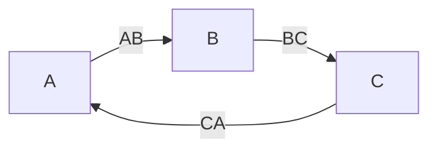
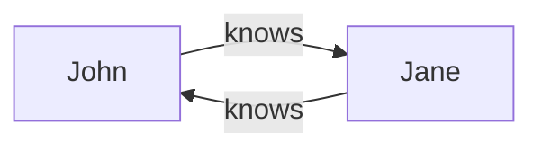

# Representing Graphs using Gordian Envelope

This document explores the representation of graphs using Gordian Envelope.

## BCR-2024-006

**© 2024 Blockchain Commons**

Authors: Wolf McNally, Christopher Allen, Shannon Appelcline<br/>
Date: April 16, 2024

---

## Introduction

[Graphs](https://en.wikipedia.org/wiki/Graph_(discrete_mathematics)) are mathematical structures that consist of a set of vertices (also known as nodes) and a set of edges connecting these vertices. Formally, a graph $G$ is represented as an ordered pair $(V, E)$, where $V$ is the set of vertices and $E$ is the set of edges. Each edge is a pair $`\left\{ u, v \right\}`$ (for undirected graphs) or an ordered pair $(u, v)$ (for directed graphs) representing a connection between vertices $u$ and $v$.

The following example graph contains three vertices $`V = \left\{ A, B, C \right\}`$ and three directed edges $`E = \left\{ (A, B), (B, C), (C, A) \right\}`$ arranged in a "cycle":



Graphs are versatile tools for modeling and analyzing relationships and interactions between objects in various domains. In computer science, graphs are particularly useful for knowledge representation, as they can effectively capture the relationships and dependencies among entities. By representing knowledge as a graph, with nodes denoting concepts or entities and edges signifying statements about them or relationships between them, complex domains can be modeled and reasoned about efficiently. Graph-based knowledge representation finds applications in areas such as bio-informatics, semantic networks, ontologies, recommendation systems, and social network analysis.

A number of graph representation languages exist, and Gordian Envelope is not intended to replace them. Gordian Envelope is a binary format that supports a number of features oriented towards creating documents that are secure and privacy-preserving. Understanding how to represent graphs using Envelope is important for applications that require secure and private storage and exchange of graph-based knowledge. Gordian Envelope itself is tree-structured, but can be used to represent graphs of arbitrary complexity, and some techniques for doing so are explored in this document.

## Status of This Document

📙 This document is research, and not a formal specification. It explores how graphs might be represented using Gordian Envelope, and is presented as a starting point for discussion and further development.

## Known Value Assignments

The known value codepoints 260-289 are reserved for graph types, elements, and relationships. See [BCR-2023-002](bcr-2023-002-known-value.md#graphs) for specific assignments.

## A Simple Example

In our examples below, we will use a simple directed graph with two nodes, John and Jane, connected by edges representing a cyclic "knows" relationship between them, representing "John knows Jane, and Jane knows John".



To highlight the privacy-preserving aspects of Gordian Envelope, we will also add potentially sensitive personal information to the nodes and edges, such as names, dates, and locations.

## Resource Description Framework (RDF)

One widely used graph description language for knowledge graphs is the [Resource Description Framework (RDF)](https://en.wikipedia.org/wiki/Resource_Description_Framework), which this document will use as a primary point of comparison. RDF is a standard model for data interchange on the Web and is a core component of the [Semantic Web](https://en.wikipedia.org/wiki/Semantic_Web).

Key concepts of RDF:

1. **Resources:** RDF represents information as a collection of *resources*. A resource can be anything identifiable by a URI (Uniform Resource Identifier), such as a web page, a person, or an abstract concept.

2. **Triples:** RDF describes resources using *triples*, which consist of a *subject*, a *predicate*, and an *object*. The subject is the resource being described, the predicate represents a relationship or property of the subject, and the object is the value of the property or a link to another resource.

3. **Statements:** Each triple represents a *statement* or fact about a resource. For example, "John (subject) knows (predicate) Jane (object)" is a statement describing a relationship between two resources.

4. **Vocabularies:** RDF uses *vocabularies* to define the meaning of the predicates and resources used in the triples. Vocabularies provide a shared understanding of the terms and allow for interoperability between different knowledge graphs.

RDF can be serialized using different formats, such as [RDF/XML](https://en.wikipedia.org/wiki/RDF/XML), [TriG](https://en.wikipedia.org/wiki/TriG_(syntax)), [N-Triples](https://en.wikipedia.org/wiki/N-Triples), or [JSON-LD](https://en.wikipedia.org/wiki/JSON-LD). Here's a simple example of an RDF graph in TriG format, which is an extension of Turtle that also allows the naming of graphs, and which we use throughout this document for RDF examples:

```turtle
@prefix ex: <http://example.com/> .
@prefix foaf: <http://xmlns.com/foaf/0.1/> .
@prefix rdf: <http://www.w3.org/1999/02/22-rdf-syntax-ns#> .
@prefix xsd: <http://www.w3.org/2001/XMLSchema> .

ex:node_john
    rdf:type foaf:Person ;
    foaf:name "John Doe" ;
    ex:birthdate "1990-01-01"^^xsd:date ;
    foaf:based_near "New York" ;
    foaf:knows ex:node_jane .

ex:node_jane
    rdf:type foaf:Person ;
    foaf:name "Jane Smith" ;
    ex:birthdate "1995-01-01"^^xsd:date ;
    foaf:based_near "Los Angeles" ;
    foaf:knows ex:node_john .
```

In this example:

- `@prefix` is used to define namespace prefixes for the URIs used in the graph.
- The prefixes `ex` and `foaf`, `rdf`, and `xsd` are defined to represent the example, FOAF, RDF, and XSD namespaces, respectively.
- `ex:node_john` and `ex:node_jane` are the identifiers resources representing two people in our example "`ex`" namespace.
- `ex:birthdate` is a custom predicate representing the birthdate of a person.
- `rdf:type` is a predicate declaring the type of a resource.
- `foaf:name`, `foaf:based_near`, and `foaf:knows` are predicates from the [FOAF (Friend of a Friend)](https://en.wikipedia.org/wiki/FOAF) vocabulary, describing the name and other attributes of the resources, and the relationships between them.

Since declaring the type of a resource is a common operation in RDF, the `rdf:type` predicate is often abbreviated using the `a` predicate, which is a shorthand for `rdf:type`. The following example is semantically equivalent to the previous one:

```turtle
@prefix ex: <http://example.com/> .
@prefix foaf: <http://xmlns.com/foaf/0.1/> .
@prefix xsd: <http://www.w3.org/2001/XMLSchema> .

ex:node_john a foaf:Person ;
    foaf:name "John Doe" ;
    ex:birthdate "1990-01-01"^^xsd:date ;
    foaf:based_near "New York" ;
    foaf:knows ex:node_jane .

ex:node_jane a foaf:Person ;
    foaf:name "Jane Smith" ;
    ex:birthdate "1995-01-01"^^xsd:date ;
    foaf:based_near "Los Angeles" ;
    foaf:knows ex:node_john .
```

While compact, the above format does not allow for the representation of data about the edges (the relationships between John and Jane). RDF provides a capability called *reification* that allows for the explicit representation of statements as resources, which can be used to add data to the edges:

```turtle
@prefix ex: <http://example.com/> .
@prefix foaf: <http://xmlns.com/foaf/0.1/> .
@prefix rdf: <http://www.w3.org/1999/02/22-rdf-syntax-ns#> .
@prefix xsd: <http://www.w3.org/2001/XMLSchema> .

ex:node_john a foaf:Person ;
    foaf:name "John Doe" ;
    ex:birthdate "1990-01-01"^^xsd:date ;
    foaf:based_near "New York" .

ex:node_jane a foaf:Person ;
    foaf:name "Jane Smith" ;
    ex:birthdate "1995-01-01"^^xsd:date ;
    foaf:based_near "Los Angeles" .

ex:edge_john_knows_jane a rdf:Statement ;
    rdf:subject ex:node_john ;
    rdf:predicate foaf:knows ;
    rdf:object ex:node_jane ;
    ex:since "2020-04-16"^^xsd:date .

ex:edge_jane_knows_john a rdf:Statement ;
    rdf:subject ex:node_jane ;
    rdf:predicate foaf:knows ;
    rdf:object ex:node_john ;
    ex:since "2020-04-16"^^xsd:date .
```

In the above example, we have added two reified statements `ex:edge_john_knows_jane` and `ex:edge_jane_knows_john` to represent the "knows" relationships between John and Jane. These statements have additional data, such as the date when the relationship started (`ex:since`). In addition, each statement now has its own identifier, e.g., `ex:edge_john_knows_jane`, which can be used to refer to the statement.

One further generalization we can make is to group all these statements together into a single named graph, which is expressible in TriG format:

```turtle
@prefix ex: <http://example.com/> .
@prefix foaf: <http://xmlns.com/foaf/0.1/> .
@prefix rdf: <http://www.w3.org/1999/02/22-rdf-syntax-ns#> .
@prefix xsd: <http://www.w3.org/2001/XMLSchema#> .

ex:graph_people {
    ex:node_john a foaf:Person ;
        foaf:name "John Doe" ;
        ex:birthdate "1995-01-01"^^xsd:date ;
        foaf:based_near "New York" .

    ex:node_jane a foaf:Person ;
        foaf:name "Jane Smith" ;
        ex:birthdate "1995-01-01"^^xsd:date ;
        foaf:based_near "Los Angeles" .

    ex:edge_john_knows_jane a rdf:Statement ;
        rdf:subject ex:node_john ;
        rdf:predicate foaf:knows ;
        rdf:object ex:node_jane ;
        ex:since "2020-04-16"^^xsd:date .

    ex:edge_jane_knows_john a rdf:Statement ;
        rdf:subject ex:node_jane ;
        rdf:predicate foaf:knows ;
        rdf:object ex:node_john ;
        ex:since "2020-04-16"^^xsd:date .
}
```

We now have a fully-featured general graph representation in RDF, with nodes, edges, and data about the edges, all grouped together in a named graph.

## Representing Graphs in Gordian Envelope

In the parlance of Gordian Envelope, each person in the example above is a "subject" and each property is an "assertion" about the subject. Each person in the RDF graph has four assertions on it, including its type (a person), name, birthdate, location. Each edge in the RDF graph has five assertions on it, including its type (a statement), subject (the source of the edge), predicate (the type of the edge), object (the target of the edge), and a "since" date as additional data.

Gordian Envelope is a binary format, and not designed to be easy for machines to process but not human readable. Our Gordian Envelope examples in this document are written in "Envelope Notation," which is human readable and concise, but not (at this time) round-trippable to the binary Envelope format. As envelopes always have a subject and a set of assertions about that subject, we use the graph identifier as the top-level subject, and express the graph's nodes and edges as assertions on that subject. As such, unlike RDF Envelope does not require a separate "subject" statement to declare a subject, and each predicate and object are positional pairs:

```envelope
"ex:graph_people" [
    'isA': 'Digraph'
    'node': "node_john" [
        'isA': 'foaf:person'
        'foaf:name': "John Doe"
        'ex:birthdate': 1990-01-01
        'foaf:based_near': "New York"
    ]
    'node': "node_jane" [
        'isA': 'foaf:person'
        'foaf:name': "Jane Smith"
        'ex:birthdate': 1995-01-01
        'foaf:based_near': "Los Angeles"
    ]
    'edge': "edge_john_knows_jane": [
        'isA': 'foaf:knows'
        'source': "node_john"
        'target': "node_jane"
        'ex:since': 2020-04-16
    ]
    'edge': "edge_jane_knows_john": [
        'isA': 'foaf:knows'
        'source': "node_jane"
        'target': "node_john"
        'ex:since': 2020-04-16
    ]
]
```

This may be considered the proposed "canonical" format for representing graphs in Gordian Envelope, where each node and edge is a single assertion about the graph identifier.

Things to note about this representation:

- Strings in double quotes, e.g. `"Jane Smith"`, are simply UTF-8 text strings, but can be any envelope, including arbitrary [dCBOR](bcr-2024-002-dcbor.md)-encoded data.
- Strings in single quotes, e.g., `'foaf:name'`, are [known values](bcr-2023-002-known-value.md), which are values in a namespace of 64-bit integers. These examples presume that each term in the FOAF vocabulary has been assigned a code point in the known values namespace. Known values are encoded as variable-length 64-bit integers, which are more compact and efficient than strings. In principle regular strings could also be used, but known values are preferred.
- Unquoted dates, e.g., `2020-04-16` are tagged CBOR date values converted to ISO-8601 format for display.
- Gordian Envelope is a tree-based, recursively defined structure. Therefore the graph, each of its nodes, and each of its edges, are themselves envelopes, all having subjects with strings as their identifiers. These node and edge identifiers must at least be unique within the graph, but could be universally unique if desired. And although we are using strings in our example, they could be binary identifiers such as [ARIDs](bcr-2022-002-arid.md).
- The graph, its nodes, and its edges, all have an `'isA'` assertion (equivalent to `rdf:type`) that specifies the type of the subject.
- There are several defined graph types, which restrict or enhance the allowable structure of the graph. In this example, we have used the `'Digraph'` type, which implies that the graph is directed and has distinct source and target nodes for each edge.
- Becuse the document is typed as a graph, the only other assertions allowed are those with `'node'` or `'edge'` predicates, which are used to define the nodes and edges of the graph.
- The nodes in the example graph are typed `'foaf:person'`.
- The edges in the example graph are typed `'foaf:knows'`.
- The subject of the object of each `'node'` and `'edge'` assertion is the identifier of the node or edge being defined, itself holding a set of assertions about the node or edge.
- The object of each `'edge'` assertion includes `'source'` and `'target'` assertions that specify the nodes at either end of the edge.
- The object of each `'node'` and `'edge'` assertion is a complete Envelope that can be extracted and processed independently of the graph, for example:

```envelope
"node_john" [
    'isA': 'foaf:person'
    'foaf:name': "John Doe"
    'ex:birthdate': 1990-01-01
    'foaf:based_near': "New York"
]
```

## Security and Privacy Advantages

One key advantage of representing graphs using Gordian Envelope is the opportunity for privacy preservation using holder-based elision. Such elision is powerful because it can be performed without invalidating signatures on the entire envelope. Below, the example envelope has been wrapped and signed, and then later all personal information other than the individuals' names has been elided. Envelope supports this transformation, *without* invalidating the signature:

```envelope
{
    "ex:graph_people" [
        'isA': 'Digraph'
        'node': "node_john" [
            'isA': 'foaf:person'
            'foaf:name': "John Doe"
            ELIDED (2)
        ]
        'node': "node_jane" [
            'isA': 'foaf:person'
            'foaf:name': "Jane Smith"
            ELIDED (2)
        ]
        'edge': "edge_john_knows_jane": [
            'isA': 'foaf:knows'
            'source': "node_john"
            'target': "node_jane"
            ELIDED
        ]
        'edge': "edge_jane_knows_john": [
            'isA': 'foaf:knows'
            'source': "node_jane"
            'target': "node_john"
            ELIDED
        ]
    ]
} [
    'signed': Signature
]
```

You an also elide entire graph edges, for example the relationships:

```envelope
{
    "ex:graph_people" [
        'isA': 'Digraph'
        'node': "node_john" [
            'isA': 'foaf:person'
            'foaf:name': "John Doe"
            ELIDED (2)
        ]
        'node': "node_jane" [
            'isA': 'foaf:person'
            'foaf:name': "Jane Smith"
            ELIDED (2)
        ]
        ELIDED (2)
    ]
} [
    'signed': Signature
]
```

Of course, if you just wanted to represent the structure of the graph without any additional information about the nodes or edges, you could do so as follows. In this case the other information has actually been *deleted*, rather than *elided*:

```envelope
"ex:graph_people" [
    'isA': 'Digraph'
    'node': "node_john"
    'node': "node_jane"
    'edge': "edge_john_knows_jane": [
        'source': "node_john"
        'target': "node_jane"
    ]
    'edge': "edge_jane_knows_john": [
        'source': "node_jane"
        'target': "node_john"
    ]
]
```

## Alternative Graph Representations

How can we use Envelope to model our example graph more like the original, concise RDF example? We can do so by "collapsing" the edge assertions into the node assertions as follows. We'll continue with the version of the envelope above with the extraneous information removed:

```envelope
"ex:graph_people" [
    'isA': 'Digraph'
    'node': "node_john" [
        'isA': 'foaf:person'
        'foaf:knows': "node_jane"
    ]
    'node': "node_jane" [
        'isA': 'foaf:person'
        'foaf:knows': "node_john"
    ]
]
```

Now that we are using "implicit" edges, we have a more compact representation that is ismorphic with the initial RDF example. But we've also given up something: isomorphism with our "canonical" envelope graph format. We cannot without loss transform this representation back into the "canonical" representation, because our edges no longer have unique identifiers. In the initial RDF example, it's also not possible to add information to the edges, such as timestamps or other data.

Isomorphism is easily restored by using Envelope's capability for rich metadata (data attached to data), by adding an assertion to the implicit edge that specifies its unique identifier:

```envelope
"ex:graph_people" [
    'isA': 'Digraph'
    'node': "node_john" [
        'isA': 'foaf:person'
        'foaf:knows' [
            'id': "edge_john_knows_jane"
        ]: "node_jane"
    ]
    'node': "node_jane" [
        'isA': 'foaf:person'
        'foaf:knows' [
            'id': "edge_jane_knows_john"
        ]: "node_john"
    ]
]
```

Assuming we're not going to be adding any additional information to the nodes, we could also just provide the list of edges, which would be an even more concise representation:

```envelope
"ex:graph_people" [
    'isA': 'Digraph'
    'edge': "edge_john_knows_jane" [
        'source': "node_john"
        'target': "node_jane"
    ]
    'edge': "edge_jane_knows_john" [
        'source': "node_jane"
        'target': "node_john"
    ]
]
```

Now the node identifiers are implicit in the edge declarations.

## Comparing and Diffing Graphs

To compare two Envelope-based graphs, we first transform them to canonical format. We can then compare their root hashes to determine if they are equivalent, modulo any parts that have been obscured (elided, encrypted, or compressed). The Envelope reference implementations also include an `isIdentical` function that can be used to compare two Envelopes for exact identicality. Envelopes can also be "diffed" to produce a "diff envelope" structure that when applied transforms one envelope into another. This can of course be used to diff two envelopes containing graphs, but it is not graph-specific.

## Future Work

- Implement first-class support for envelope-based graphs to our reference implementations:
    - Implement the ability to manipulate graphs that use envelopes as their graph, node, and edge data structure.
    - Implement validation of envelope graphs using their declared graph types.
    - Implement a "graph diff" algorithm that produces a diff specific to graph structures, including a list of changes to the graph topology and associated data:
        - Nodes added and removed
        - Edges added, removed, and moved
        - Graph, node, and edge data changed (using existing envelope diffing mechanisms)
    - Implement the ability to apply a graph diff to the source graph, reproducing the target graph.
- Research techniques for creating distributed graphs using envelopes, including:
    - Techniques for merging graphs from multiple sources.
    - Techniques for resolving conflicts in merged graphs.
    - Techniques for representing CRDTs (Conflict-free Replicated Data Types) as graphs.
