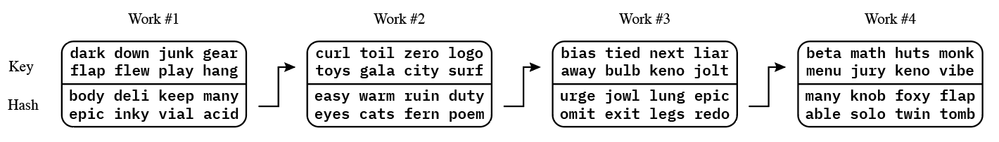
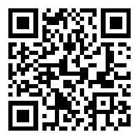
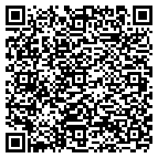

# Provenance Marks: An Innovative Approach for Authenticity Verification

## BCR-2025-001

Author: Wolf McNally<br/>
Date: Jun 26, 2023<br/>
Revised: Jan 9, 2025

**© 2025 Blockchain Commons**

<div style="display: flex; align-items: center; gap: 20px;">
    <a rel="license" href="http://creativecommons.org/licenses/by-sa/4.0/">
        
    </a>
    <span>This work is licensed under a <a rel="license" href="http://creativecommons.org/licenses/by-sa/4.0/">Creative Commons Attribution-ShareAlike 4.0 International License</a>.</span>
</div>

---

[PROVENANCE MARK:\
Click here to verify this document's authenticity](https://gist.github.com/wolfmcnally/86bce635a34fd991dce38e54869368e8#urprovenancelfaohdftrttdfdmntbsftttlecbwaetseepsamtkwlhsgdwmvywndkrochsggusolnynsfmwrewpatimqdwmolzojlsrtpcxlbwzftvagwbbhfrklbbtfxpljsztolaaptgs)


[🅟 KNOB BETA AQUA NOON](https://gist.github.com/wolfmcnally/86bce635a34fd991dce38e54869368e8#%F0%9F%85%9F-knob-beta-aqua-noon)\
🅟 🪐 🤨 🙄 🔔

---

## Abstract

In this nascent era of rampant AI-powered digital manipulation and plagiarism, best practices for establishing the provenance of works of art both tangible and intangible like videos, as well as other creative or intellectual outputs has never been more critical. This paper introduces a novel approach for marking and verifying the provenance of works that blends cryptography, pseudorandom number generation, and linguistic representation. We describe a system of "Provenance Marks" that generate a small but unique digital "mark" for each work. Each mark includes a portion that verifies the authenticity of the previous mark and a portion that, through a hash function, commits to the content of the next mark. The result is a cryptographically-secured chain of marks associated with works that facilitates easy and public verification of provenance. In one basic form, these provenance marks may be represented as a simple sequence of natural language words. This system affords users the dual advantages of a robust security mechanism and a linguistically intuitive and easily transcribed sequence, providing a simple yet effective solution to establish and verify the provenance of works in the digital era. We anticipate this approach will prove particularly useful for artists, content creators, and institutions looking to secure their works against fraudulent attributions and deep fakes, thereby preserving their reputation and the integrity of their works. It may also have applications in larger commercial fields involving product authenticity, supply chain, and chain-of-custody verification.

## Contents

- [Provenance Marks: An Innovative Approach for Authenticity Verification](#provenance-marks-an-innovative-approach-for-authenticity-verification)
  - [BCR-2025-001](#bcr-2025-001)
  - [Abstract](#abstract)
  - [Contents](#contents)
  - [Implementations](#implementations)
  - [Introduction](#introduction)
  - [Historical Methods of Verifying Provenance](#historical-methods-of-verifying-provenance)
    - [Artist Signatures and Monograms](#artist-signatures-and-monograms)
    - [Seals and Stamps](#seals-and-stamps)
    - [Documentation and Pedigree](#documentation-and-pedigree)
    - [Expert Authentication](#expert-authentication)
    - [Scientific and Technical Analysis](#scientific-and-technical-analysis)
  - [Method](#method)
    - [The Seed](#the-seed)
    - [Pseudorandom Number Generator (PRNG)](#pseudorandom-number-generator-prng)
    - [Cryptographic Hash Function](#cryptographic-hash-function)
    - [Bytewords](#bytewords)
    - [The Hash Chain](#the-hash-chain)
    - [Chain ID, Sequence Number, and Date Stamp](#chain-id-sequence-number-and-date-stamp)
    - [Verification](#verification)
    - [Human Identification](#human-identification)
    - [Provenance Mark Resolution](#provenance-mark-resolution)
    - [Provenance Mark Structure](#provenance-mark-structure)
      - [Payload Obfuscation](#payload-obfuscation)
      - [Initialization](#initialization)
      - [The `key` Field](#the-key-field)
      - [The `hash` field](#the-hash-field)
      - [The `id` field](#the-id-field)
      - [The `seq` field](#the-seq-field)
      - [The `date` field](#the-date-field)
        - [`low` resolution date encoding](#low-resolution-date-encoding)
        - [`medium` resolution date encoding](#medium-resolution-date-encoding)
        - [`quartile` and `high` resolution date encoding](#quartile-and-high-resolution-date-encoding)
      - [The `info` field](#the-info-field)
    - [Security Analysis of the Four Resolutions](#security-analysis-of-the-four-resolutions)
    - [Other Output Formats](#other-output-formats)
      - [CBOR](#cbor)
      - [URs](#urs)
      - [QR Codes](#qr-codes)
      - [URLs](#urls)
  - [Extension: Periodic "Heartbeat" Marks](#extension-periodic-heartbeat-marks)
    - [Temporal Synchronization](#temporal-synchronization)
    - [Preventing Future Date Forgery](#preventing-future-date-forgery)
  - [Extension: Chain Rotation](#extension-chain-rotation)
    - [Motivations for Chain Rotation](#motivations-for-chain-rotation)
    - [Implementing Chain Rotation](#implementing-chain-rotation)
  - [Strengths, Weaknesses, and Implications](#strengths-weaknesses-and-implications)
    - [Strengths](#strengths)
    - [Weaknesses](#weaknesses)
    - [Implications](#implications)
  - [Comparison with Existing Digital Systems](#comparison-with-existing-digital-systems)
    - [Digital Signatures and Watermarking](#digital-signatures-and-watermarking)
    - [Public Key Infrastructure (PKI) Systems](#public-key-infrastructure-pki-systems)
    - [Blockchain-Based Provenance Systems](#blockchain-based-provenance-systems)
  - [Improving the Robustness of the Provenance Marking Method](#improving-the-robustness-of-the-provenance-marking-method)
    - [Public Registries](#public-registries)
    - [Independent Verification Services](#independent-verification-services)
    - [Backup and Recovery](#backup-and-recovery)
  - [Potential Fields of Application](#potential-fields-of-application)
    - [Chains of Custody](#chains-of-custody)
    - [Supply Chain Management](#supply-chain-management)
    - [Document Verification](#document-verification)
    - [Blockchain and Digital Assets](#blockchain-and-digital-assets)
    - [Environment and Sustainability](#environment-and-sustainability)

## Implementations

Implementations of the Provenance Marking System are available in the following repositories:

| Type | Language | Repository |
|:--|:--|:--|
| Reference | Swift | [Provenance](https://github.com/BlockchainCommons/Provenance) |
| Reference | Rust | [provenance-mark-rust](https://github.com/BlockchainCommons/provenance-mark-rust) |

## Introduction

In the digital era, the issue of authenticity and provenance has risen to prominence as never before. The ready ability to manipulate, duplicate, and distribute digital content, particularly using artificial intelligence (AI) tools, raises pressing questions about originality, ownership, and authenticity. This is particularly crucial for works of art, digital content, and other creative outputs, where the provenance of a piece can significantly impact its value, both culturally and economically.

Existing solutions, while valuable, exhibit a variety of shortcomings. Traditional methods, such as physical certificates of authenticity or artist's signatures, may be lost or forged. Modern approaches, including non-fungible tokens (NFTs) and other blockchain-based solutions, can be complex and require a sophisticated understanding of digital technologies. In addition, the use of blockchain technologies has been critiqued for its environmental impact and its reliance on the integrity of the linking mechanism between the physical work and its digital token.

It is against this backdrop that we propose a novel system for marking and verifying the provenance of works that combines the robustness of cryptographic techniques with the simplicity and universality of linguistic representation. By utilizing a sequence of words generated via a pseudorandom number generator (PRNG) and secured through a hash function, we create a unique identifier for each work. This identifier serves a dual purpose: it confirms the authenticity of the previous work and commits to the identifier of the subsequent work, creating a verifiable chain of provenance.

The system is designed with simplicity in mind: the word sequences, encoded as [Bytewords](https://github.com/BlockchainCommons/Research/blob/master/papers/bcr-2020-012-Bytewords.md), are easy to transcribe and communicate, making the method accessible to a wide audience. At the same time, the underpinning cryptographic mechanism provides a robust level of security against forgery and false attribution.

In this paper, we detail the design and operation of this novel provenance marking system, demonstrate its practical application, and explore its potential implications and benefits for artists, content creators, and institutions seeking to safeguard their works in the digital age. The proposed approach presents a fresh perspective on the provenance conundrum, bridging the gap between the robust security mechanisms required in the modern age and the human-friendly interfaces necessary for widespread adoption and use.

## Historical Methods of Verifying Provenance

Provenance, the chronology of the ownership, custody, or location of a historical, artistic, or culturally significant item, has long been a concern for artists, collectors, and historians. Various methods have been used throughout history to ensure the authenticity of an object and the legitimacy of its origin.

### Artist Signatures and Monograms

One of the earliest and simplest forms of provenance comes in the form of artist signatures or monograms, often found on the corner of a canvas or the base of a sculpture. These provide a clear, albeit not foolproof, indicator of the origin of a work of art.

### Seals and Stamps

For documents, books, and certain types of art, seals or stamps often served as markers of provenance. These symbols, unique to an individual or institution, would be applied to the item to indicate its ownership or authenticity.

### Documentation and Pedigree

An important historical method of verifying provenance is through thorough documentation, also known as the item's pedigree. This includes receipts, wills, and contracts, as well as exhibition and auction catalogs. A well-documented chain of ownership can provide strong evidence of an item's provenance, but it can also be labor-intensive to compile and verify.

### Expert Authentication

Expert authentication has been, and continues to be, a crucial aspect of verifying provenance. This might involve an expert in a particular artist or era examining the work to authenticate its origin based on style, technique, materials used, and other factors.

### Scientific and Technical Analysis

Over the past century, scientific methods have increasingly been employed to assist in the verification of provenance. These include materials analysis, radiometric dating, and forensic techniques, among others. While powerful, these techniques often require specialized equipment and expertise and may not be accessible or appropriate for all types of works.

These historical methods of verifying provenance have proven effective over time but also come with their own challenges, such as susceptibility to forgery, the need for expert knowledge, and reliance on physical artifacts and documentation. The proposed provenance marking system, while designed for a modern context, draws on the principles of these traditional methods. It offers a simple, accessible way of marking a work's origin and sequence in a body of work, while leveraging the robustness of cryptographic techniques to guard against forgery and mis-attribution.

## Method

The provenance marking system hinges on the use of a [pseudorandom number generator (PRNG)](https://en.wikipedia.org/wiki/Pseudorandom_number_generator), a [cryptographic hash function](https://en.wikipedia.org/wiki/Cryptographic_hash_function), and a method of representing bytes as words, such as [Bytewords](https://github.com/BlockchainCommons/Research/blob/master/papers/bcr-2020-012-Bytewords.md). In this section, we will elaborate on the design and operation of the system, demonstrating how these components are integrated to create a unique and secure identifier for each work.

### The Seed

Creating a chain of provenance marks begins with generating a secret "cryptographic seed", which is 32 truly random bytes unique to the chain.

Numerous methods of generating seeds exist, including relying on cryptographically-strong random number generators built into most computer systems. But other methods such as flipping coins, rolling dice, and drawing from a thoroughly shuffled deck of playing cards can also be used.

Cryptographic seeds are often used to secure valuable information like cryptocurrencies. In the present case, the seed is that which prevents an attacker from forging valid provenance marks in a creator's chain. It is therefore paramount that the chain owner keep their seed secure.

Apps like [Gordian Seed Tool](https://apps.apple.com/us/app/gordian-seed-tool/id1545088229) are designed to support the secure generation, storage, and backup of cryptographic seeds.

### Pseudorandom Number Generator (PRNG)

Unlike the cryptographically strong random number generator used to create the seed, pseudorandom number generators (PRNGs) are used when one wishes to generate an apparently random but actually deterministic sequence of random numbers. The seed is used to initialize the PRNG, defining a unique infinite sequence of pseudorandom numbers. Because the seed is kept secret, only the chain's owner can generate the next correct numbers in the sequence.

We employ the [Xoshiro256**](https://prng.di.unimi.it/) PRNG due to its robust statistical properties.

### Cryptographic Hash Function

A hash function is a mathematical algorithm that can take data of any length and output a fixed-size "digest", such that the same input always produces the same digest, but nothing about the input can be learned from examining the digest.

We employ the [SHA-256 hash function](https://en.wikipedia.org/wiki/SHA-2), a cryptographic hash function that produces a 256-bit (32-byte) hash. This function provides robust security, with strong resistance against [hash collision](https://en.wikipedia.org/wiki/Hash_collision) and [preimage attacks](https://en.wikipedia.org/wiki/Preimage_attack). The hash function is applied to a sequence of bytes from the PRNG to create part of the Bytewords sequence for each work.

### Bytewords

The use of [Bytewords](https://github.com/BlockchainCommons/Research/blob/master/papers/bcr-2020-012-Bytewords.md) introduces a human-friendly layer to our system. By mapping bytes to common four-letter words from a predefined dictionary, we can represent each provenance mark's unique byte sequence in as little as twenty words. This approach facilitates easy transcription and communication of the unique identifiers. Bytewords are also chosen to have a number of other desirable properties that aid in communication and error correction.

```
0x00: able acid also apex aqua arch atom aunt
0x08: away axis back bald barn belt beta bias
0x10: blue body brag brew bulb buzz calm cash
0x18: cats chef city claw code cola cook cost
0x20: crux curl cusp cyan dark data days deli
0x28: dice diet door down draw drop drum dull
0x30: duty each easy echo edge epic even exam
0x38: exit eyes fact fair fern figs film fish
0x40: fizz flap flew flux foxy free frog fuel
0x48: fund gala game gear gems gift girl glow
0x50: good gray grim guru gush gyro half hang
0x58: hard hawk heat help high hill holy hope
0x60: horn huts iced idea idle inch inky into
0x68: iris iron item jade jazz join jolt jowl
0x70: judo jugs jump junk jury keep keno kept
0x78: keys kick kiln king kite kiwi knob lamb
0x80: lava lazy leaf legs liar limp lion list
0x88: logo loud love luau luck lung main many
0x90: math maze memo menu meow mild mint miss
0x98: monk nail navy need news next noon note
0xa0: numb obey oboe omit onyx open oval owls
0xa8: paid part peck play plus poem pool pose
0xb0: puff puma purr quad quiz race ramp real
0xb8: redo rich road rock roof ruby ruin runs
0xc0: rust safe saga scar sets silk skew slot
0xc8: soap solo song stub surf swan taco task
0xd0: taxi tent tied time tiny toil tomb toys
0xd8: trip tuna twin ugly undo unit urge user
0xe0: vast very veto vial vibe view visa void
0xe8: vows wall wand warm wasp wave waxy webs
0xf0: what when whiz wolf work yank yawn yell
0xf8: yoga yurt zaps zero zest zinc zone zoom
```

### The Hash Chain

For each work, the creator generates the next mark in their chain. Each mark is linked into the chain by two critical fields: the `key` and the `hash`. Each `key` is the next part of the infinite sequence of random numbers generated by the PRNG, and cryptographically proves this mark's link to the previous mark's `hash`, while the `hash` of the current mark commits to the `key` that will be revealed by the next mark. Due to the nature of PRNG and the cryptographic hash, it is hard for an attacker to guess the key in the next mark that goes with the hash in the current mark.

This forms a verifiable chain, where each mark can be authenticated and linked to the previous and subsequent mark.



The first mark in the chain (called the "genesis mark") can either be assigned to a work or left "blank" and published solely as the basis of trust for the rest of the chain. Its `key`, while never used in a `hash` (except in [Chain Rotation](#extension-chain-rotation)), nonetheless could only have been generated by the creator's PRNG, and hence could be verified, if necessary, by the creator revealing the seed.

### Chain ID, Sequence Number, and Date Stamp

Each provenance mark also includes three additional fields that improve the chain's robustness and auditability: a chain ID (`id`), a sequence number (`seq`) and date stamp (`date`).

* The `id` is shared by every mark in the chain and helps ensure that only marks from the same chain are compared. In the genesis mark, the `key` and `id` are the same.
* The `seq` starts at zero in the genesis mark and increases by 1 in every subsequent mark. This supports ordering and sorting of marks within a chain, and makes it easy to see where a record of the mark chain may have omissions.
* The `date` contains the encoded date and time of the mark's generation and must either stay the same or increase for each mark in the chain.

### Verification

Third parties can verify the provenance of a work by comparing the `key` of the mark with the hash of the previous work's mark. This can be done by collecting marks in a chain from public sources, or auditing marks against a trusted repository of all the chain's marks. Each mark can be verified to precede the next mark in the chain by using this algorithm:

```swift
public extension ProvenanceMark {
    func precedes(next: ProvenanceMark) -> Bool {
        // `next` can't be a genesis
        next.seq != 0 &&
        next.key != next.chainID &&
        // `next` must have the next highest sequence number
        seq == next.seq - 1 &&
        // `next` must have an equal or later date
        date <= next.date &&
        // `next` must reveal the key that was used to generate this mark's hash
        hash == Self.hash(resolution: res, key: key, nextKey: next.key, chainID: chainID, seqBytes: seqBytes, dateBytes: dateBytes, infoBytes: infoBytes)
    }

    static func isSequenceValid(marks: [ProvenanceMark]) -> Bool {
        guard marks.count >= 2 else {
            return false
        }
        if marks.first!.seq == 0 {
            guard marks.first!.isGenesis else {
                return false
            }
        }
        return zip(marks, marks.dropFirst()).allSatisfy { $0.precedes(next: $1) }
    }

    var isGenesis: Bool {
        seq == 0 &&
        key == chainID
    }
}
```

This process confirms that the works are part of the same chain and have been created by the same individual or entity. Moreover, once the creator publishes a new work, it retroactively verifies the authenticity of the committed-to `hash` in the previous work.

### Human Identification

For quick identification, the first four bytes of a provenance mark's `hash` can be translated into Bytewords and displayed with a provenance mark symbol, which can either be the logo of the provenance marking system seen at the top of this document, and which is approved for public use in this capacity, or the unicode symbol `🅟` (U+1F15F, "NEGATIVE CIRCLED LATIN CAPITAL LETTER P"):

> `🅟 OVAL GAME HARD YURT`

These four Bytewords are sufficiently distinct to be used as a database lookup key for the full provenance mark.

A presentation that includes the full mark along with other metadata might appear as:

> ur:provenance/lfaohdftdpkeiontynhpfljzfnntcxfzgoiakoryeheyimdirfesvttptikiolwshnpakobgeofgdnmnuraydmgrwfpfiewpvodawelrrydefgaelukelrrtgstovszcbzdm
>
> `🅟 OVAL GAME HARD YURT` 2023-06-26T08:19:11Z
>
> Provenance Marks: An Innovative Approach for Authenticity Verification

Finally, the entire [CBOR](#cbor) encoding of the mark can be used as the input to the [LifeHash](https://lifehash.info) visual hashing algorithm. This produces a unique visual representation of the mark that can be used for quick visual identification, especially in conjunction with the Bytewords:


`🅟 OVAL GAME HARD YURT`

### Provenance Mark Resolution

To support a range of space vs. security tradeoffs, provenance marks support four *resolutions.* The length of a provenance mark in bytes is given by the formula:

> total == 3 * linkLen + seqLen + dateLen

| Resolution | linkLen | seqLen | dateLen | total |
|:--|--:|--:|--:|--:|
| `low` | 4 | 2 | 2 | 16 |
| `medium` | 8 | 4 | 4 | 32 |
| `quartile` | 16 | 4 | 6 | 58 |
| `high` | 32 | 4 | 6 | 106 |

When a `low` resolution mark is packaged as Bytewords, the Bytewords standard adds an additional 4 words as a CRC-32 checksum. So a `low` resolution provenance mark would consist of a total of 16 + 4 == 20 words. An example would be:

```
taco kite buzz nail arch
fact bias nail apex plus
deli wave cats webs ruin
legs quiz draw work onyx
```

It doesn't matter whether these twenty words are formatted as a single line of text, or as four rows of five words, or five rows of four words, etc., as long as the order of the words is clear.

This small size is easy to handle, for example by writing it on a physical work of art, or displaying it in a video work. Unlike the four Bytewords used for human identification, these are the full Bytewords of the mark.

### Provenance Mark Structure

Provenance marks are a packed binary data structure, consisting of five mandatory fields and an optional sixth `info` field at the end:

| Name | Length | Description |
|:--|:--|:--|
| `key` | `linkLen` | The current `linkLen` output of the PRNG. |
| `hash` | `linkLen` | The SHA-256 hash of the next mark's PRNG output and all the other fields of this mark, truncated to `linkLen`. |
| `id` | `linkLen` | The unique identifier of this chain. |
| `seq` | `seqLen` | The sequence number of this mark within the chain. |
| `date` | `dateLen` | The encoded date of mark generation. |
| `info` | any | Optional CBOR data of any kind embedded in the mark. |

So for each of the four resolutions, the byte-fields of provenance marks (not including the optional `info` field) are:

```
LOW (16 bytes)
0000  0000  0000  00  00
0123  4567  89ab  cd  ef
key   hash  id    seq date

MEDIUM (32 bytes)
00000000  00000000  11111111  1111  1111
01234567  89abcdef  01234567  89ab  cdef
key       hash      id        seq   date

QUARTILE (58 bytes)
0000000000000000  1111111111111111  2222222222222222  3333  333333
0123456789abcdef  0123456789abcdef  0123456789abcdef  0123  456789
key               hash              id                seq   date

HIGH (106 bytes)
00000000000000001111111111111111  22222222222222223333333333333333  44444444444444445555555555555555  6666  666666
0123456789abcdef0123456789abcdef  0123456789abcdef0123456789abcdef  0123456789abcdef0123456789abcdef  0123  456789
key                               hash                              id                                seq   date
```

#### Payload Obfuscation

The first field, `key`, is the header of the structure. The other fields are collectively called the `payload` and are obfuscated using the key and the [ChaCha20](https://en.wikipedia.org/wiki/Salsa20#ChaCha_variant) cipher. The key is *not* considered secret, which is why we refer to its use with the ChaCha20 cipher as *obfuscation* and not *encryption*. The purpose of obfuscation is two-fold:

1. It provides a layer of error detection, and
2. It produces a sequence of bytes having a uniformly random appearance.

Because the `key` field is statistically random, and due to the obfuscation of the rest of the fields, the entire embodied provenance mark appears to be uniformly random, without any runs or sequences of symbols regardless of the internal structure of its content.

The ChaCha20 cipher requires a 32-byte key and a 12-byte initialization vector (nonce). To meet these requirements we use the Hashed Key Derivation Function (HKDF-SHA256) to stretch the key from `linkLen` to the required length of 32. For the initialization vector we reverse the stretched key and take its first 12 bytes. These two functions, `extendKey` and `obfuscate` are implemented in pseudocode like this:

```swift
func extendKey(data: Data) -> Data {
    return hkdf(password: data, salt: [], info: [], keyLength: 32, variant: .sha256)
}

func obfuscate(key: Data, message: Data) -> Data {
    guard !message.isEmpty else {
        return message
    }
    let extendedKey = extendKey(key)
    let iv = extendedKey.reversed().prefix(12)
    return chaCha20(key: extendedKey, iv: iv, message: message)
}
```

#### Initialization

In the reference implementations, to prevent the `id` or any saved PRNG state from exposing part or all of the seed, given a seed $s$, the `id` for the chain is generated by:

$$digest = H(s)$$
$$id = trunc(digest, linkLen)$$

Then the Xoshiro256** PRNG is initialized with:

$$state = H(digest)$$

#### The `key` Field

Each provenance mark includes as the `key` field the next `linkLen` bytes generated from the PRNG. So depending on the chain's resolution, the `key` field may be 4, 8, 16, or 32 bytes.

The first `key` in a chain is the same as the chain's `id`, so the "genesis" mark of a chain is identified as having `key == id` and `seq == 0`.

Part of the image of the `hash` field is the *next* key in the sequence (`nextKey`). Thus, the `key` field of this mark reveals the key used in the hash of the previous mark in the chain, and the `hash` field is a cryptographic commitment to `nextKey`.

Because the key is generated from the PRNG initialized by the chain owner's seed, it is hard for attackers who wish to produce forged marks to guess the upcoming sequence of keys as they would have to find a combination of valid fields for the forgery that produces the `hash` from the previous mark.

The owner of the chain can choose to reveal the seed used to generate it as a way of claiming legitimate ownership of the chain (at the cost of burning the seed, but see below for discussion of using the `info` field to rotate seeds in such a case.)

#### The `hash` field

The `hash` field is the SHA-256 ($H$) of the image produced by concatenating the `key`, the `nextKey`, and the other fields of this mark:

$$hash=trunc(H(key||nextKey||id||seq||date||info),linkLen)$$

The hash function's digest is then truncated to `linkLen` bytes, so depending on the chain's resolution it may be encoded as 4, 8, 16, or 32 bytes.

#### The `id` field

The `id` field identifies the chain that produced a given provenance mark. In the genesis mark the `id` MUST be equal to `key`. The `id` field is also `linkLen` bytes long.

#### The `seq` field

The `seq` (sequence number) field identifies the order of a given mark within its chain. The `seq` in a genesis mark MUST be zero. Each subsequent mark in the chain MUST carry the next incrementally higher `seq`, i.e., (0, 1, 2, 3, 4...). The bytes of the value are serialized in big-endian order.

`low` resolution provenance marks use two bytes for `seq`, allowing up to 2^16 == 65,536 marks in a chain, while the `medium`, `quartile`, and `high` resolution use 4 bytes, allowing 2^32 == 4,294,967,296 marks in a chain.

Using a `low` resolution chain for a weekly podcast would provide for 65,536 weeks of production, or over 1,200 years.

#### The `date` field

The `date` field represents the generation date of the mark, and each successive mark must carry a `date` value that is greater than or equal to its predecessor mark. Combined with the `seq` field, and the nature of the hash chain, this makes provenance marks robust against the forging of marks that would fall between existing marks.

In general, it is acceptable for sequential marks to have the same `date`, as the `seq` still increases between them.

##### `low` resolution date encoding

The `low` resolution provenance mark uses 2 bytes (16 bits) to encode the date, with single-day resolution: marks produced on the same calendar day will have the same `date`.

The packed bit format of `low` resolution encoded dates is produced from the Gregorian (year - 2023), month, and day of the encoded date/time in the GMT time zone:

```
fedcba98 76543210
yyyyyyym mmmddddd
```

* The year is encoded as seven bits, giving a range of years from 2023 to 2150 inclusive.
* The month is encoded as four bits containing the binary-encoded values 1-12. The values 0, 13, 14, or 15 are invalid and MUST be rejected by provenance mark decoders.
* The day is encoded as five bits containing the binary-encoded values 1-31. The value 0, and values above the range of applicable dates for the encoded year and month are invalid and MUST be rejected by provenance mark decoders.
* Encodings such as `0x5e` == `2023-02-30T00:00:00Z` MUST be rejected as invalid (February never has 30 days.)
* Using this scheme, the range of encodable dates with one-day resolution is:
    * `0x0021` == `2023-01-01T00:00:00Z` through
    * `0xff9f` == `2150-12-31T00:00:00Z`.

##### `medium` resolution date encoding

`medium` resolution provenance marks use 4 bytes (32 bits) to encode the date and time with one-second resolution: marks produced within the same second will have the same `date`.

* The date and time is encoded as the number of elapsed seconds since midnight GMT on January 1, 2001.
* This gives a range of possible dates with one-second resolution is:
    * `0x00000000` == `2001-01-01T00:00:00Z` through
    * `0xffffffff` == `2137-02-07T06:28:15Z`.

##### `quartile` and `high` resolution date encoding

`quartile` and `high` resolution provenance marks use 6 bytes (48 bits) to encode the date and time with one-millisecond resolution: marks produced within the same millisecond will have the same `date`.

* The date and time is encoded as the number of elapsed milliseconds since midnight GMT on January 1, 2001.
* This gives a range of possible dates with one-millisecond resolution is:
    * `0x000000000000` == `2001-01-01T00:00:00.000Z` through
    * `0xe5940a78a800` == `9999-12-31T23:59:59.999Z`.
* Values outside this range MUST be rejected by provenance mark decoders.

#### The `info` field

The `info` field is an optional trailing field of any length. If included, it MUST be CBOR conformant with the [Gordian Deterministic CBOR (dCBOR)](https://datatracker.ietf.org/doc/draft-mcnally-deterministic-cbor/) specification.

The primary advantage of adding metadata to the mark using the `info` field is that the self-describing nature of CBOR enables any sort of structured data to be cryptographically bound into the mark:

* In a simple use-case, it may just be a CBOR-encoded UTF-8 string describing the work associated with the provenance mark.
* In another use-case associated with digital works, it may contain a cryptographic digest of the work, thus binding its bit-for-bit embodiment into the chain.
* In another use-case, it may contain information relating to transfer of ownership of a work identified by a previous mark in the same chain or in another chain.
* In a more complex use-case, it may be a structure that authorizes one or more new mark chains, enabling scenarios such as seed rotation or tree-structured chain delegation. For one example, see [Extension: Chain Rotation with Burn Marks](#extension-chain-rotation-with-burn-marks).

The `info` field is included in the `hash` image, binding it into the entire mark chain in a way that cannot be edited or updated. This makes the `info` in a mark non-editable and non-repudiable without invalidating every mark after it in the chain. This may be considered an advantage or a disadvantage depending on the scenario.

The primary potential disadvantage of using the `info` field is that it increases the size of the mark. This may be problematic when size is a consideration, for example with `low` resolution marks.

An alternative to using the `info` field is to embed the mark in a URL that directs users to a site where the mark and its latest metadata can be verified. See the following section.

### Security Analysis of the Four Resolutions

A cryptographic problem is considered "hard" if the most efficient known algorithm to solve it would take an impractical amount of time or resources, making it effectively impossible to solve using current technology.

The cryptographic hardness (security level) of each provenance mark resolution increases as its `linkLen` increases. An attacker who wants to forge a next message in a chain would need to try an average of 2^(8 * `linkLen` - 1) hashes to find the next `key`. This is known as a [preimage attack](https://en.wikipedia.org/wiki/Preimage_attack). For lower resolution marks, this attack may practically succeed with current hardware.

But even discovering a series of collisions will not help the attacker discover the 32-byte seed used with the chain's PRNG; they will need to spend the same amount of effort for the production of every forged mark. So while the owner of the chain can produce marks with a single operation, an attacker will need to perform billions.

In addition, due to the chained nature of provenance marks, altering any specific mark in the chain will necessarily alter every mark after it, and require finding a series of `key`s that fit becomes much harder.

Compounding the difficulty, if the record of the chain is distributed in several places, it will require an attacker to alter it in enough places that the forged chain becomes accepted as authentic. This is especially hard when authentic works also carry their assigned provenance mark.

* The `low` resolution format is short and easy to handle, but since it only has a 4-byte (32 bit) `linkLen`, an attacker could forge a next message in the chain by trying an average of 2^31 keys. This could be done relatively quickly with a modern computer and would not be considered "hard". It is therefore recommended that the `low` resolution be used in situations where the risk and consequences of attack is low, space is a premium consideration, and other forms of establishing provenance may be available such as certificates of authenticity. Such a case might be physical works of art such as paintings, prints, or sculptures.
* The `medium` resolution has a `linkLen` of 8 bytes (64 bits) requiring trying an average of 2^63 keys. This is a significantly larger space and would require a lot of computational resources. However, large botnets or state-level attackers might still be able to perform this many operations, so this could be considered "moderately hard".
* The `quartile` resolution has a `linkLen` of 16 bytes (128 bits) requiring trying an average of 2^127 keys. This is a huge number and beyond the reach of current technology to brute force. This would be considered "cryptographically hard".
* The `high` resolution has a `linkLen` of 32 bytes (256 bits) requiring trying an average of 2^255 keys. This is an even larger number, far beyond the reach of current technology, and would also be considered "cryptographically hard" and in line with current cryptographic best practice.

### Other Output Formats

#### CBOR

In addition to pure Bytewords output:

```
knob race hawk rock
taxi iris frog taxi
tomb veto skew paid
foxy limp gush vows
back grim time glow
```

provenance marks can be output as a self-contained and self describing [CBOR](https://cbor.io) object. CBOR is a compact way to structure binary data similar to JSON but more concise. CBOR provides ways to tag and structure data such that readers can unambiguously decode any CBOR received. The CBOR encoded provenance mark above is:

```
da50524f568200507eb559bbd06846d0d6e2c6a8448554e8
```

When decoded to [CBOR diagnostic notation]([CBOR](https://cbor.me)) becomes:

```
1347571542([0, h'7EB559BBD06846D0D6E2C6A8448554E8'])
```

The first integer (`1347571542`, hex `0x50524f56`, ASCII `PROV`) is a CBOR tag identifying this as a provenance mark, and the first element of the array is `0`, signifying the `low` resolution. The hex string is the 16 bytes of the mark itself.

#### URs

The full, self-describing CBOR structure can further be represented in text as a [Uniform Resource ("UR")](https://github.com/BlockchainCommons/Research/blob/master/papers/bcr-2020-005-ur.md), which is a way of representing CBOR as [URIs](https://en.wikipedia.org/wiki/Uniform_Resource_Identifier) that are particularly well-suited to transmission in [QR codes](https://en.wikipedia.org/wiki/QR_code):

```
ur:provenance/lfaegdkbrehkrktiisfgtitbvoswpdfylpghvsmkgujkhl
```

Notice that the `ur:` schema identifies this string as a UR, and the `provenance` path element identifies the remainder of UR as containing a provenance mark. The string is encoded in "minimal bytewords", each pair of letters being the first and last letter of a byteword, and the final four bytewords being a CRC-32 checksum to help detect transmission or transcription errors. If the bytewords part of the UR is decoded to CBOR diagnostic notation we get:

```
[0, h'7EB559BBD06846D0D6E2C6A8448554E8']
```

Which is the same structure we saw above without the CBOR tag (this type information is provided by the `provenance` path element of the UR.)

#### QR Codes

As mentioned above, the UR format is specifically designed to produce QR codes of minimal density, as they use a special limited subset of alphanumeric characters that are efficiently encoded. Here is the above UR, translated to upper-case (which you need to do to ensure the UR uses the QR code alphanumeric mode) and displayed as a QR code:



#### URLs

Finally, a bytewords-encoded provenance mark can be placed into a URL that includes information about where to verify the mark in its entire chain of marks. URLs like this can be displayed as clickable links or placed into QR codes:

```
https://gist.github.com/wolfmcnally/86bce635a34fd991dce38e54869368e8#urprovenancelfaohdftdpkeiontynhpfljzfnntcxfzgoiakoryeheyimdirfesvttptikiolwshnpakobgeofgdnmnuraydmgrwfpfiewpvodawelrrydefgaelukelrrtgstovszcbzdm
```



## Extension: Periodic "Heartbeat" Marks

In the realm of networked systems, a "heartbeat" is a periodic signal used to indicate normal operation or to synchronize other parts of a system. We propose a similar concept for our provenance marking system - the periodic issuance of "blank" provenance marks that serve as temporal landmarks within the provenance mark sequence.

A "blank" mark is a provenance mark not tied to any specific work. A "heartbeat" is a blank provenance mark issued at a set interval (say, every day, week, or month) irrespective of whether a new work is published within that timeframe. These marks contain no new content but simply extend the chain of marks and confirm the date and time when they were created.

Heartbeat marks serve two key functions:

### Temporal Synchronization

By periodically emitting provenance marks, content creators establish a consistent temporal rhythm for their output. The heartbeat continues even if no new works are produced within a given timeframe, providing a continuous temporal context for the provenance mark sequence. This makes it easier to spot anomalies in the sequence and provides a stronger temporal structure to the provenance chain.

### Preventing Future Date Forgery

While our provenance marking system prevents forgeries through hash commitments, an attacker might still attempt to falsely attribute a work to a future date. By generating heartbeat marks, content creators can effectively "block off" past dates, making it infeasible for an attacker to claim that a work was produced on a date earlier than the latest heartbeat mark.

For example, let's say an artist publishes a heartbeat mark every week on Monday morning. Even if they published no works in the preceding week, an attacker trying to attribute a forgery to the artist in any prior week would not be able to create a mark that fits the existing sequence.

Heartbeat marks also make forgery detectable for marks that claim to be produced later than the next heartbeat mark to appear.  Any forged mark claiming to be published in the future would have to be positioned after the heartbeat mark for that period. Even if the attacker breaks a single key, the next heartbeat mark to appear would repudiate the forgery.

Adding a heartbeat of blank marks to the provenance mark sequence provides a stronger temporal structure and an additional layer of security against forgeries. This extension underscores the versatility and adaptability of our provenance marking system to address the complex demands of establishing and verifying provenance.

## Extension: Chain Rotation

*Chain rotation* enables creators to transition between cryptographic seeds, ensuring the ongoing integrity and security of their provenance chains.
To facilitate this, the mechanism of *Rotation Statements* is introduced. Rotation Statements allow for the simultaneous termination of an existing provenance chain and its seed, and the initiation of a new chain using a new seed, linking the two chains together.

The new chain must have the *same or higher* resolution as the old chain, allowing for upgrading (but never downgrading) the security of the chain if desired.

### Motivations for Chain Rotation

Several factors might necessitate or benefit from chain rotation:

- **Seed Compromise:** While provenance marks offer robust protection against forgery, the compromise (or suspected compromise) of the cryptographic seed used to generate the marks could undermine the integrity of marks produced after the compromise event. Chain rotation mitigates this risk by declaring the old seed unusable and establishing a new, secure chain.
- **Delegation of Authority:** Chain rotation enables the transfer of provenance marking authority to (or away from) other entities. For example, an artist might delegate marking to an agent or an organization might shift responsibility between departments.
- **Periodic Security Enhancements:** Chain rotation as a matter of policy, either at particular intervals or upon the occurrence of defined events, can serve as a proactive security measure, reducing the window of vulnerability associated with a single, long-lived seed.

### Implementing Chain Rotation

A *Burn Mark* is a special provenance mark that includes a *Rotation Statement* in its `info` field. The Rotation Statement explicitly terminates the current chain by invalidating the current seed, and includes information that links the old chain to the a chain, ensuring a smooth transition between the two. To publish a Burn Mark:

1. **Generate `nextKey`:** The creator generates the next `key` in the current chain using the and current seed PRNG. This is the `key` that verifies the `hash` of the Burn Mark.
2. **Generate new seed:** The creator generates and securely stores a fresh cryptographic seed to initiate the new chain.
3. **Generate new `id`:** The `id` of the new chain is the first `linkLen` bytes generated from the PRNG using the seed, and MUST be the same or greater length as the `linkLen` of the old chain. In other words, the resolution of the new chain MUST be at least as high as the old chain.
4. **Calculate `hash`:** The SHA-256 hash of the chain's new `id`: `H(id)` and take the first `linkLen` bytes of the digest. This is the pre-commitment to the new chain.
5. **Compose Rotation Statement:** The Rotation Statement is a CBOR array containing:
    - `nextKey`: The next `key` in the current chain.
    - `hash`: The hashed `id` of the new chain.
6. **Tag Rotation Statement:** The Rotation Statement is tagged `1112887886` (hex `0x4255524e`, ASCII `BURN`).
7. **Embed Rotation Statement:** The Rotation Statement is included in the `info` field of the last provenance mark in the old chain, which means it will be part of the image of the `hash` field of the burn mark. This is the Burn Mark.

When verifying a chain of provenance marks, burn marks are detected by the presence of a tagged Rotation Statement in the `info` field of a mark. The next mark in the chain must be the genesis mark of the new chain, which can be verified by hashing the `key` or `id` (which must be the same in a genesis mark) and comparing it to the `hash` in the Rotation Statement.

## Strengths, Weaknesses, and Implications

The provenance marking system offers a unique way for creators to authenticate their works, build an auditable chain of creation, and deter misattribution. However, as with any method, it comes with its own set of strengths and weaknesses, as well as implications for broader use.

### Strengths

**Simplicity and Accessibility:** This system does not require advanced cryptographic knowledge to verify. Bytewords are also human-friendly and easy to communicate.

**Robustness:** Given the cryptographic strength of the seed, the PRNG, the hash function, and the hash chain, the system is resistant to forgery and false attribution.

**Flexibility:** The system can be adapted to various types of works, from digital content like videos or audio tracks to physical creations like paintings.

### Weaknesses

**Dependence on the Secret Seed:** The security of this system heavily depends on the secrecy and secure storage of the initial seed. If the seed is compromised, the system's integrity is at risk.

**Limited Forgery Detection:** While the system can help confirm the authenticity of a creator's work, it does not prevent the unauthorized use or alteration of the work itself.

**Potential Misappropriation:** Attackers could misappropriate an existing mark, affix it to a forgery, and claim it as authentic. It is the therefore the responsibility of those using provenance marking to provide ways to authenticate the work to which each provenance mark is assigned.

**First-Party Forgery**: The issuer of a chain of marks could reassign a mark to a different work. It may therefore be important that third-party verification not rely entirely on the attestation of first-party creators, depending on the security and risk profiles.

### Implications

This system's main implication lies in its potential to revolutionize how we think about authenticity and provenance in the digital age. It offers a solution to an increasingly relevant problem, the attribution of digital and physical works, and tackles issues of forgery and deepfakes.

Future work could explore the potential applications of this system in various fields, assess its effectiveness in real-world scenarios, and investigate methods to enhance its security and ease of use. Further exploration could also delve into incorporating other cryptographic techniques or adapting the system for different types of content and formats.

## Comparison with Existing Digital Systems

In this section, we aim to position the proposed provenance marking system in relation to existing authentication and attribution systems, highlighting its unique features and potential advantages.

### Digital Signatures and Watermarking

Digital signatures and watermarks have been widely used for authenticating and verifying digital content. However, they typically require specialized software or technical expertise to validate and can often be embedded in ways that are not readily human-readable. They also primarily target digital content and might not be suitable for physical creations. Our proposed system, in contrast, produces human-friendly Bytewords that can be communicated easily and used with both digital and physical works.

### Public Key Infrastructure (PKI) Systems

Public Key Infrastructure systems use pairs of public and private cryptographic keys to authenticate digital content. These systems provide strong security but are often complex to use and understand. They also necessitate key management and can be overkill for scenarios where the content creator simply wants to establish a chain of provenance rather than secure content against unauthorized access or modification. Our system requires only a single, securely stored seed and is designed to be straightforward for creators and verifiers.

### Blockchain-Based Provenance Systems

Blockchain technology has been used to create immutable records for digital asset provenance. It's especially prevalent in the digital art space with the rise of Non-Fungible Tokens (NFTs). While blockchain-based systems offer robust provenance tracking and verification, they also come with their own complexities, such as reliance on specific blockchain networks and issues related to scalability, environmental impact, and cost. The proposed system, on the other hand, does not depend on any external networks or infrastructures and operates with minimal computational requirements.

## Improving the Robustness of the Provenance Marking Method

While the proposed provenance marking system is designed to be straightforward and reliable, its robustness can be enhanced through various mechanisms that add additional layers of security and redundancy.

### Public Registries

Public registries serve as an invaluable tool for bolstering the system's robustness. By registering each work and its associated provenance mark, content creators create a public record to which anyone can refer. This minimizes the chances of an unauthorized party falsely attributing a work. The registry could be a simple website, a database, or even a blockchain, depending on the specific needs and context. It should ideally be easily accessible, user-friendly, and tamper-resistant.

Where the number of marks in a chain is moderate (up to the low thousands), public version control systems like [GitHub](https://github.com/) could be used as free public repositories of entire chains of provenance marks, including a history of revisions to metadata. High volume chains may require custom databases and specific protocols for verifying provenance marks.

### Independent Verification Services

Third-party services could be employed to independently verify provenance marks. These services, which could operate in a manner similar to certificate authorities in PKI systems, would add an additional layer of trust and validation. They could periodically verify the integrity of the public registry, independently confirm the provenance of works, and provide services for dispute resolution.

### Backup and Recovery

Ensuring the secure backup and recovery of the secret seed is crucial. Content creators should follow best practices for secure data storage, which might involve encrypting the seed before storing it, using redundant and geographically distributed storage solutions, using secret-sharing techniques such as [Sharded Secret Key Reconstruction (SSKR)](https://github.com/BlockchainCommons/Research/blob/master/papers/bcr-2020-011-sskr.md), and periodically testing the recovery process.

It's worth noting that these methods are enhancements and should be considered in line with the creators' specific needs and risk profiles. They could add complexity and overhead, so a balanced approach should be taken to maintain the simplicity and usability of the provenance marking system.

## Potential Fields of Application

Provenance marks, as a system of public, verifiable, and sequence-linked identifiers, have potential uses far beyond establishing the authenticity of works of art or videos. They can provide a simple yet powerful tool for verifying the origin, history, and integrity of items in various fields where chains of custody or supply chains are crucial.

### Chains of Custody

In legal and investigative contexts, maintaining a clear and unbroken chain of custody is vital for ensuring the integrity of evidence. Provenance marks could provide a straightforward way to link each item of evidence to its point of origin and all subsequent handlers. Each handover could generate a new mark, linked to the previous one, thus creating a verifiable chain of custody that is resistant to tampering.

### Supply Chain Management

The provenance of goods, particularly in sectors like food, pharmaceuticals, and high-value commodities, is of great importance. Consumers, regulators, and companies themselves increasingly demand assurances that products are genuine, safely produced, and ethically sourced. Provenance marks could enhance existing traceability systems, providing a public, verifiable record of each stage in a product's journey from source to consumer.

### Document Verification

Provenance marks could also serve to validate the authenticity and origin of documents. This could be particularly useful in fields such as academia, journalism, or government, where the integrity and origin of documents are critical.

### Blockchain and Digital Assets

The nature of provenance marks aligns well with the principles of blockchain technology, potentially providing a simplified method of establishing and verifying the authenticity of transactions or digital assets within a blockchain. This could be particularly relevant for non-fungible tokens (NFTs) representing digital artwork or other unique digital assets.

### Environment and Sustainability

Provenance marks could also play a role in environmental and sustainability efforts. For example, they could be used to verify the source of recycled materials, to track the carbon footprint of products, or to provide transparent evidence of compliance with environmental standards.

In all these applications, the simplicity, verifiability, and sequence-linking properties of provenance marks could provide significant benefits. However, the implementation of such systems would need to consider practicalities such as the method of mark generation, the choice of key length, the method of mark embodiment, and the affordances for public verification. Furthermore, the system would need to be integrated with existing processes and standards in each field of application.
