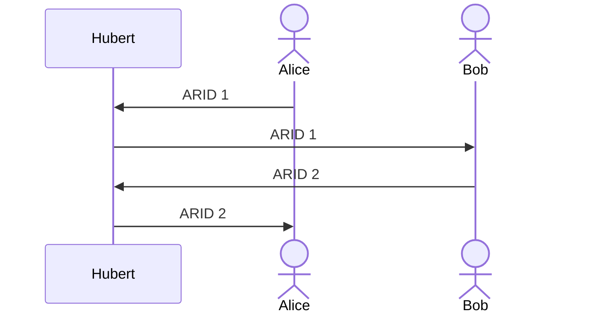
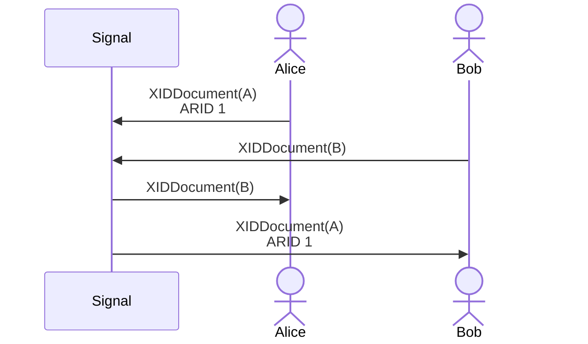
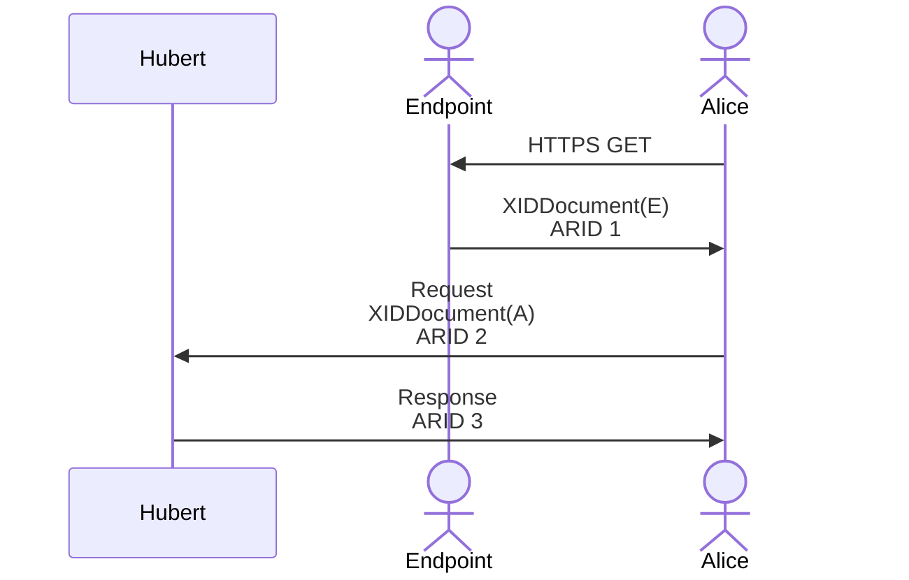
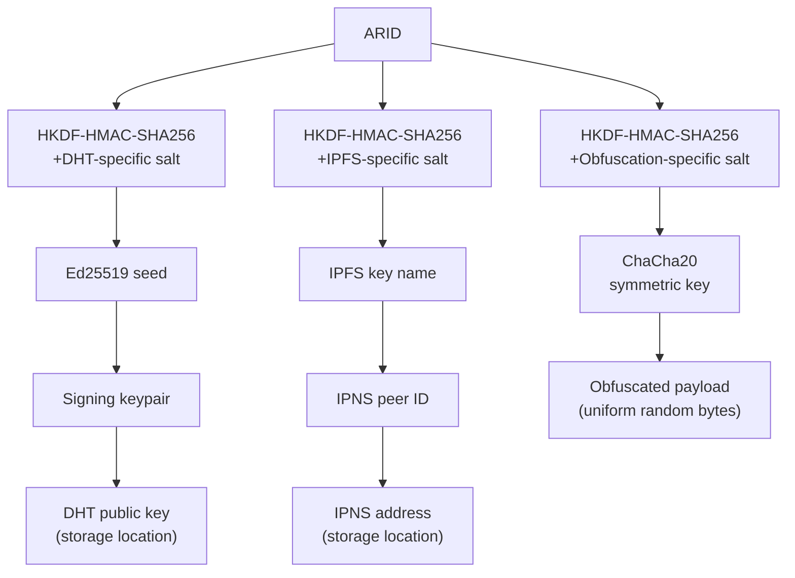

# Hubert: Distributed Key-Value Store for Secure Multiparty Coordination

## BCR-2025-006

**© 2025 Blockchain Commons**

Authors: Wolf McNally, Christopher Allen 
Date: December 9, 2025

---

## Abstract

Hubert is a distributed key-value storage protocol designed to facilitate secure multiparty transactions such as FROST threshold signature ceremonies and distributed key generation without requiring centralized servers, persistent connections, or synchronous participation. By leveraging write-once semantics on public distributed networks (BitTorrent Mainline DHT and IPFS), Hubert creates a trustless coordination layer where parties exchange encrypted messages using cryptographically derived addresses.

The protocol addresses the centralization vulnerability inherent in traditional secure messaging: even with end-to-end encryption, centralized servers observe the social graph of who communicates with whom. Hubert hardens this visibility by implementing a "cryptographic dead-drop" architecture where decentralized storage networks processes only encrypted binary blobs and derived keys, gaining no insight into the sender, receiver, or content. All stored data is obfuscated and appears uniform random bytes to network observers.

Key design properties include:

- **Serverless Operation**: No single entity controls message flow or retains user logs.
- **Asynchronous Communication**: Participants need not be online simultaneously.
- **Network Opacity**: Storage networks see only random data blobs, never metadata.
- **Write-Once Semantics**: Each storage location is written exactly once, ensuring message immutability and eliminating race conditions.
- **Automatic Size Routing**: Hubert supports the BitTorrent Mainline Distributed Hash Table (DHT) and the Interplanetary File System (IPFS). These storage layers can be used independently or together via a hybrid storage that routes small messages (≤1 KB) through DHT for speed, and large messages through IPFS.

## Table of Contents

1. [Introduction](#1-introduction)
2. [Design Principles](#2-design-principles)
3. [Security Considerations](#3-security-considerations)
4. [Reference Implementation](#4-reference-implementation)

---

## 1. Introduction

Modern cryptographic protocols increasingly require coordination among multiple parties. Threshold signature schemes like FROST demand several rounds of message exchange between participants. Distributed key generation ceremonies require commitments and shares to flow between nodes. Secure voting, multiparty computation, and collaborative custody all share this requirement: parties must exchange messages to complete a cryptographic ceremony.

The conventional approach routes these messages through centralized servers. This introduces a single point of failure: the server operator can censor, delay, or selectively deliver messages. It creates a trust requirement: participants must believe the server will not collude against them. And it concentrates risk: a compromised server exposes the entire coordination graph, who participates with whom, when ceremonies occur, and how groups are structured.

> **FROST— Flexible Round-Optimized Schnorr Threshold signatures:** a protocol for generating threshold Schnorr signatures with minimal rounds of communication. Threshold signatures allow a subset of participants to jointly produce a valid signature without reconstructing the private key. To observers, a threshold signature is indistinguishable from a standard Schnorr signature made by a single party.

Hubert eliminates this centralization by transforming existing public distributed networks into a trustless coordination substrate. Rather than sending messages through a server, participants publish encrypted and obfuscated messages to locations in the BitTorrent Mainline DHT or IPFS. These locations are derived from secrets known as *ARIDs* shared only among the participants. The storage network sees only random binary blobs at apparently random addresses, and therefore cannot enumerate participants, correlate messages, or interfere with delivery (without hampering the entire network).

> **ARID— Apparently Random IDentifier:** a 256-bit statistically random string that may point to an object but reveals no information about the object or its participants. If the entire observable universe were divided up into $2^{256}$ equal cubes, each cube would be about 15m on a side: about the size of a four-story building.

> **DHT— Distributed Hash Table:** a decentralized key-value storage system where nodes cooperate to store and retrieve values based on their hash-derived keys. The BitTorrent Mainline DHT is widely used for peer discovery in the BitTorrent protocol, but can be used as a general-purpose storage layer for small values (typically ≤1 KB).

> **IPFS— InterPlanetary File System:** a peer-to-peer distributed file system that uses content-addressed storage. IPFS allows storage and retrieval of larger objects (up to several megabytes or more) and provides mechanisms for pinning data to ensure persistence.

Hubert implements a digital *dead-drop*: the DHT nodes and IPFS peers act as an astronomically large space of locations, storing and serving encrypted data without knowledge of the operation they facilitate. Only those who possess a necessary ARID can locate and deobfuscate the message, and even then the message is encrypted end-to-end to its particular recipients using separate keys.

> **Dead Drop:** In HUMINT tradecraft, a pre-arranged location where one party leaves material for another to retrieve. The two parties never meet (if they did, that would be a *live drop*); the location itself serves as the intermediary.

Hubert itself does not provide end-to-end encryption or authentication; these functions are handled by the [Gordian Sealed Transport Protocol (GSTP)](https://github.com/BlockchainCommons/research/tree/main/papers/bcr-2023-014-gstp). However, Hubert does provide a steganographic layer that conceals the structure and content of stored messages from the storage network itself. All data written via Hubert is obfuscated to appear as uniform random bytes, defeating pattern analysis, content scanning, and magic-byte detection. The key for obfuscation and deobfuscation is derived from the ARID, ensuring that only parties who know the ARID can retrieve meaningful data.

> **Gray Man:** The tradecraft principle of blending in with the environment to avoid detection. In digital communications, this translates to making messages indistinguishable from random noise, thereby avoiding scrutiny.

> **Living Off the Land:** A tradecraft principle where operatives use existing infrastructure and resources to avoid creating new, detectable artifacts. By leveraging ubiquitous public networks like DHT and IPFS, Hubert allows participants to "live off the land," using common protocols that blend into normal network traffic.

> **Numbers Station:** A type of shortwave radio station used to broadcast coded messages to intelligence operatives. The messages are typically sequences of numbers read aloud, which can be decrypted by the intended recipient using a one-time pad or other cryptographic method. Hubert's use of public distributed networks as dead-drops echoes the clandestine nature of numbers stations, where messages are hidden in plain sight.

> **Spread Spectrum:** A communication technique that spreads a signal over a wide frequency band, making it less detectable and more resistant to interference. Hubert's use of ARIDs to derive storage locations can be seen as a form of digital spread spectrum, where messages are dispersed across a vast network in a manner that conceals their presence and purpose.

The result is serverless, asynchronous, and opaque coordination. Participants need not be online simultaneously. No single entity controls message flow. And the storage infrastructure, despite being public, learns nothing about the content, participants, or purpose of the messages it carries. The nature of the public networks is that messages are available globally, but also ephemeral: both DHT and IPFS nodes discard data over time unless actively pinned or republished. This ephemeral quality enhances privacy, as messages do not persist indefinitely on any node unless specifically maintained.

Hubert supports bidirectional and multicast communication patterns. When Alice wishes to send a message to Bob and expects a response, she generates a fresh ARID and includes it in her message. When Bob retrieves the message, he extracts the ARID and uses it to publish his response. If Bob in turn expects a reply from Alice, he includes a new ARID in his response. This pattern can repeat indefinitely.

Bootstrapping trust between the parties occurs out-of-band. Parties who wish to communicate must securely share their encryption and signing public keys. To start a new coordination session, at least one party must generate and share a fresh ARID with the others. Keys are shared using *XID Documents*.

> **Pre-Coordination:** Before using dead-drops in the field, agents must meet in person or use secure channels to exchange protocol parameters, including location and nature of dead-drops and signals indicating when dead-drops are active and ready to be "serviced." With Hubert, parties must pre-coordinate by securely sharing cryptographic keys and an initial ARID. This can be done in person, via secure messaging like Signal chat, or through other trusted means.

> **XID Document— eXtensible IDentifier Document:** A Gordian Envelope structure that binds a stable 32-byte identifier (XID) to public keys, permissions, endpoints, and delegation rules. XIDs are generated from the SHA-256 hash of an *inception key*, providing cryptographic proof of origin while allowing keys to be rotated without changing the identifier. Parties exchange XID Documents to establish mutual authentication: each document declares the public keys authorized to sign and encrypt on behalf of the subject, the operations those keys may perform, and the endpoints through which they act. See [BCR-2024-010](bcr-2024-010-xid.md) for the full specification.

Pre-coordination can also be accomplished using Trust on First Use (TOFU) techniques. For example, a party may publish an endpoint that vends their XID Document and freshly generated ARID over HTTPS. When a new participant connects, they retrieve the document and ARID, which the endpoint agent will monitor for the first message. In this way coordination can be bootstrapped between anonymous parties.

## 2. Design Principles

Hubert's design emerges from six core principles that inform every aspect of the protocol. These principles align with the broader [Gordian Principles](https://github.com/BlockchainCommons/Gordian#gordian-principles) of independence, privacy, resilience, and openness.

### 2.1 Write-Once Semantics

Each ARID maps to exactly one storage location that can be written exactly once. Subsequent attempts to write to the same ARID fail with an error. This design avoids an entire class of problems:

- **No race conditions**: Two parties cannot simultaneously write conflicting values.
- **No versioning complexity**: There are no sequence numbers to track, no conflict resolution to implement, no "last write wins" ambiguity.
- **Immutability guarantees**: Once published, a message cannot be modified or replaced by anyone, including the original author.
- **Simplified security model**: The capability to write is exercised once and consumed.

At their core, both the BitTorrent Mainline DHT and IPFS are *content-addressed* systems. In BitTorrent, files are identified by their *infohash*: a SHA-1 hash of the torrent's metadata. In IPFS, content is identified by its *CID* (Content IDentifier): a hash of the content itself. These identifiers are immutable by construction, so if the content changes the hash must also change, producing an entirely different address. This property makes content-addressed storage ideal for verifiable, tamper-evident data, but it binds the *key* to the *value* the key points to. This creates a challenge for coordination: how do you tell someone where to find a message (the *key*) before you know what the message (the *value*) will be?

Both systems solve this by offering a *mutable* layer built atop the immutable foundation:

- **BEP-44 mutable items** for DHT: content addressed by a cryptographic public key rather than content hash
- **IPNS** for IPFS: content addressed by a peer ID derived from a key pair, which can point to different CIDs over time

These are designed to allow content at a fixed address to be updated over time. Hubert repurposes these mutable features to create *immutable* write-once storage by constraining how they are used:

**For BEP-44 mutable items**, Hubert enforces immutability through sequence number constraints. BEP-44 items include a monotonically increasing sequence number; DHT nodes reject updates with a sequence number less than or equal to the stored value. Hubert always publishes with `seq=1` and never issues updates. If two parties race to write the same location, the DHT's sequence number check ensures at most one succeeds. Hubert's application-layer check detects any attempt to overwrite.

**For IPNS**, Hubert enforces immutability by treating publication as a one-time operation. Before publishing, Hubert resolves the IPNS name; if it already points to a CID, the write fails. Once published, the IPNS name permanently resolves to that CID. The underlying IPNS protocol allows updates, but Hubert's policy layer prevents them.

In both cases, the initial ARID holder can compute the storage location and write once. Thereafter, the location is read-only to everyone including the original writer.

Hubert derives storage keys deterministically from ARIDs using HKDF:

For DHT, Hubert derives an Ed25519 signing key; its public half becomes the storage location. For IPFS, Hubert derives a deterministic key name, creates (or retrieves) an IPNS key, adds the content to IPFS to obtain a CID, and publishes that CID to the IPNS name. In both cases, only the ARID holder can produce the required signature to write. The obfuscation key (derived with a third salt) encrypts the payload so it appears as uniform random bytes. This encryption is reversible by anyone with the ARID, hence we refer to it as obfuscation.

### 2.2 Envelope-Based Values

All stored values are Gordian Envelopes, not arbitrary byte sequences. This constraint provides structural guarantees:

- **Deterministic serialization**: Envelopes use dCBOR (deterministic CBOR), ensuring identical byte representations for identical semantics across implementations.
- **Intrinsic integrity**: Every envelope contains a Merkle-like digest tree, allowing recipients to verify structural integrity without external metadata.
- **Composable security**: Envelopes natively support encryption, compression, signatures, and holder-based elision.
- **Semantic structure**: Envelopes can represent assertions, hierarchies, and typed data rather than opaque blobs.

By requiring Envelope values, Hubert inherits these properties without reimplementing them.

### 2.3 Capability-Based Access Control

The ARID model inverts traditional access control. Rather than "who are you and what are you allowed to do?", Hubert asks "what capability token do you hold?" The ARID itself is the authorization, a bearer token that grants access to whoever possesses it:

- **No accounts or identity**: The storage network never learns who you are. Authorization is possession of the ARID, not authentication against an identity provider.
- **Delegable**: Sharing an ARID grants the recipient the same capabilities you have.
- **Ephemeral**: Each ARID is used once; there is no long-lived identity to track or compromise.

### 2.4 Transport Agnosticism

Hubert defines storage semantics, not network protocols. A common interface abstracts over multiple backends:

| Backend      | Max Size     | Write Latency | Propagation | Persistence          | Local Dependencies      |
| :----------- | :----------- | :------------ | :---------- | :------------------- | :---------------------- |
| Mainline DHT | ~1 KB        | 1-5s          | 5-30s       | ~2 hours             | None (embedded client)  |
| IPFS         | ~10 MB       | 5-30s         | 30-120s     | 48 hours (DHT entry) | Kubo daemon required    |
| Hybrid       | ~10 MB       | Varies        | Varies      | See above            | Kubo (large payloads)   |
| Local Server | Configurable | <10ms         | Immediate   | Indefinite           | Self-hosted HTTP server |

**Write latency** is how long the put operation takes to complete. **Propagation** is the time before the value becomes reliably retrievable from other nodes. **Persistence** is how long the value remains available without re-announcement or pinning.

The **Mainline DHT** backend requires no external software; Hubert embeds a DHT client that connects directly to the BitTorrent Mainline DHT network. BEP-44 items expire after approximately 2 hours and should be re-announced hourly to remain available.

The **IPFS** backend requires a locally running [Kubo](https://docs.ipfs.tech/install/command-line/) daemon. Hubert communicates with Kubo over its HTTP RPC interface to add content and publish IPNS records. Kubo automatically republishes IPNS records every 4 hours (for keys it holds), so IPNS names remain resolvable as long as the daemon is running. By default, Hubert does not pin content; unpinned content may be garbage collected by the local node. For messages that must persist beyond a single session, use the `--pin` flag. Pinned content remains available as long as the Kubo daemon is running and has not explicitly unpinned it.

The **hybrid** mode automatically routes messages based on size. Small messages (≤1 KB) are stored directly in the DHT. For larger messages, Hubert uses an indirection pattern:

1. The actual envelope is stored in IPFS under a freshly generated *reference ARID*.
2. A small *reference envelope* is stored in the DHT at the original ARID. This reference envelope contains:
   - A `dereferenceVia: "ipfs"` assertion indicating the storage backend
   - An `id` assertion containing the reference ARID
   - A `size` assertion for diagnostics
3. When retrieving, Hubert first fetches from the DHT. If it finds a reference envelope, it extracts the reference ARID and fetches the actual envelope from IPFS.

This indirection is transparent to callers: `put` and `get` use the same API regardless of which backend stores the actual data. The pattern combines DHT's speed (small reference envelopes resolve quickly) with IPFS's capacity (actual content can be megabytes). Both the reference envelope in the DHT and the actual envelope in IPFS are independently obfuscated using their respective ARIDs. For large messages, total latency is the sum of both operations: writing requires a DHT put plus an IPFS put; reading requires a DHT get followed by an IPFS get.

The **local server** backend provides a simple HTTP key-value store for testing and controlled deployments. It offers no additional security beyond what the network provides and requires you to run the server yourself. Hubert's built-in server supports both an in-memory hash table (ephemeral, fast) and SQLite persistence (durable across restarts). This backend is useful for development, local testing, and scenarios where decentralization is not required.

This agnosticism allows Hubert to adapt as new distributed storage systems emerge without changing the application-level API or security model.

## 3. Security Considerations

Hubert provides defense in depth through layered protections, but operates within inherent constraints of public distributed networks.

### What Hubert Protects

**Content opacity.** All data stored via Hubert is obfuscated using ChaCha20 with an ARID-derived key. The stored bytes are indistinguishable from uniform random data. Without the ARID, observers cannot determine whether stored data is a Hubert message, random noise, or any other binary content. Pattern analysis, magic-byte detection, and content scanning all fail.

**Payload confidentiality.** Even if an attacker obtains the ARID and reverses the obfuscation, they encounter a GSTP-format Gordian Envelope. The envelope's subject is encrypted with an ephemeral ChaCha20-Poly1305 content key, which is then encapsulated to each recipient's public key. Reading the plaintext requires compromising at least one recipient's private encapsulation key. Knowing the ARID alone is never sufficient.

**Sender authentication.** GSTP messages, after decryption, are revealed to be signed by the sender's private signing key. Recipients can verify the message originated from the claimed sender and has not been modified.

**Unlinkable storage locations.** The DHT public key or IPNS name reveals nothing about the ARID that generated it. Observers cannot correlate storage locations with the secrets that address them, nor can they derive the ARID from the storage key.

**Write-once integrity.** Once published, a message cannot be modified or replaced. The BEP-44 sequence number mechanism and Hubert's IPNS policy layer enforce this at the protocol level.

### What Hubert Does Not Protect

**IP address exposure.** Participating in DHT or IPFS networks exposes your IP address to peers you interact with. During a Kademlia lookup, you contact roughly 60 distinct nodes (approximately $\alpha \cdot \log_2 N$ with typical parameters). Any of these nodes can log your IP, the storage key you queried or announced, and the timestamp. The Mainline DHT has tens of millions of concurrent nodes; even a well-resourced attacker can only operate a small fraction. The probability that at least one of the ~60 nodes you contact is logging depends on the attacker's coverage:

| Attacker nodes | Fraction of DHT | Probability observed |
| :------------- | :-------------- | :------------------- |
| 200,000        | 1%              | ~45%                 |
| 20,000         | 0.1%            | ~6%                  |
| 2,000          | 0.01%           | ~0.6%                |

For random (untargeted) surveillance, observation probability is low. A targeted Sybil attack—where the adversary concentrates nodes near a specific storage key—is only possible if the attacker already knows the ARID or derived key they want to monitor. Since ARIDs are random and stored data appears as uniform random bytes, there is no way to identify "interesting" keys by inspecting DHT traffic. An attacker who has obtained an ARID through other means (e.g., compromising the out-of-band channel) could position Sybil nodes to observe queries for that key, but at that point they could simply query the key themselves. Hubert does not route traffic through Tor or similar anonymity networks; users requiring IP-level anonymity must layer such protections themselves.

> **Future mitigation.** Users can route DHT traffic through a VPN to hide their IP from storage nodes, though this shifts trust to the VPN provider (who sees your real IP and all your traffic). A Tor-based transport backend could route DHT queries through onion circuits, distributing trust across multiple relays. Alternatively, a trusted relay architecture (where a small set of relays query the DHT on behalf of clients) could provide IP privacy at the cost of trusting those relays. [Private information retrieval](https://grokipedia.com/page/Private_information_retrieval) (PIR) techniques could theoretically allow queries without revealing the target key, though current PIR schemes impose significant computational overhead.

**Polling amplifies exposure.** When waiting for an expected message, Hubert polls the DHT repeatedly (once per second by default). Each poll performs a fresh Kademlia lookup, contacting approximately the same set of nodes closest to the target key. This repeated querying provides logging nodes with multiple observations of the same (IP, storage key) association, strengthening the correlation signal. The routing table caches which nodes are closest, so subsequent polls converge quickly, but they still traverse the network rather than returning cached results. For IPFS, Kubo's local cache can serve repeated IPNS resolutions without additional DHT queries (controlled by the record's TTL), reducing exposure compared to raw DHT polling.

> **Future mitigation.** Client-side caching with exponential backoff would reduce query frequency while still supporting polling semantics. Query batching across multiple ARIDs could amortize exposure across unrelated lookups, making it harder to correlate any single query with a specific communication. Push-based notifications are not compatible with Hubert's dead-drop model, as they require receivers to register interest in a topic, creating observable metadata about who expects messages at which locations.

**Traffic analysis.** While content is opaque, timing and access patterns may leak information. An observer who sees your IP query a particular storage key at a particular time learns that association, even without knowing what the key contains.

> **Future mitigation.** Cover traffic (dummy queries to random keys) could obscure which queries are meaningful, at the cost of increased bandwidth and load on the DHT. Randomized query timing with jitter would make timing correlation less precise. Mixing queries through multiple hops before reaching the DHT (onion-style routing) would separate the querier's identity from the query content.

**ARID distribution.** ARIDs must be shared out-of-band before communication can begin. If the channel used to share ARIDs is compromised, the attacker can monitor or intercept messages at those locations.

> **Future mitigation.** Key agreement protocols (e.g., X3DH as used in Signal) could derive shared ARIDs from exchanged public keys, reducing the sensitivity of the out-of-band channel. A rendezvous protocol using blinded tokens could allow parties to discover each other without revealing the ARID to intermediaries.

**Protocol fingerprinting.** Although stored content appears as uniform random bytes, the *uniformity itself* could be a distinguishing characteristic. An observer could analyze DHT values to identify blobs that are exactly random (high entropy, no magic bytes, no recognizable structure) and flag them as potential obfuscated messages. By correlating the storage keys of such blobs with the IP addresses that query them, an adversary could build a list of suspected Hubert users—even without knowing the ARIDs or decrypting any content. This is a limitation of steganography-by-obfuscation: looking like a "gray man" is still looking like *something*.

> **Future mitigation.** Storing obfuscated payloads inside plausible cover formats (e.g., as the payload of a fake image or torrent metadata) could make Hubert blobs indistinguishable from legitimate DHT traffic. However, this adds complexity and may conflict with size constraints.

**Network-level blocking.** Some regimes block or severely degrade access to P2P protocols at the network level. China's [Great Firewall](https://en.wikipedia.org/wiki/Great_Firewall) uses deep packet inspection, IP blacklisting, and DNS poisoning to block BitTorrent traffic and throttle connections to IPFS gateways. Similar restrictions exist in Iran, Russia, and other countries with extensive internet censorship infrastructure. In these environments, Hubert's DHT and IPFS backends may be entirely unusable without additional circumvention measures. Users in such regions cannot rely on Hubert alone for coordination; they must first solve the problem of reaching the underlying P2P networks.

> **Future mitigation.** Protocol obfuscation techniques (such as those used by Tor's pluggable transports) could disguise DHT and IPFS traffic as innocuous HTTPS connections to CDN endpoints. Domain fronting, where traffic appears to connect to an allowed domain while actually reaching a blocked service, may help in some jurisdictions—though major cloud providers have increasingly disabled this capability. Hubert's local server backend provides a fallback for controlled environments, but sacrifices decentralization. Ultimately, circumventing nation-state network controls is a hard problem that Hubert inherits rather than solves.

### Ephemeral Messages

Hubert messages are inherently short-lived. DHT entries expire after approximately 2 hours without re-announcement; IPNS records expire after 48 hours. This ephemerality limits the window during which stored data can be retrieved, reducing long-term exposure. However, this is not forward secrecy in the cryptographic sense: if an attacker records the obfuscated blob and later obtains the ARID and a recipient's private key, they can decrypt the message. True forward secrecy would require session keys that are not derivable from long-term keys, which XID documents do not currently provide.

> **Future mitigation.** Integrating a ratcheting key agreement protocol (such as Double Ratchet) into GSTP would provide forward secrecy: each message would use a unique ephemeral key, and compromising a later key would not reveal earlier messages. This would require maintaining per-session state, which conflicts with Hubert's stateless dead-drop model, but could be layered above Hubert for long-running conversations.

## 4. Reference Implementation

*Rust crate: `hubert`. CLI tool. API overview. Storage backend selection. Error handling.*
